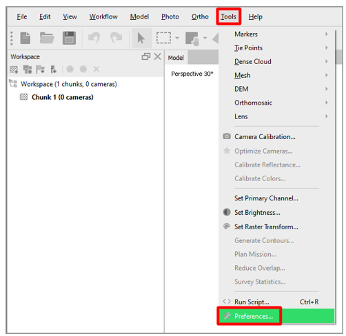
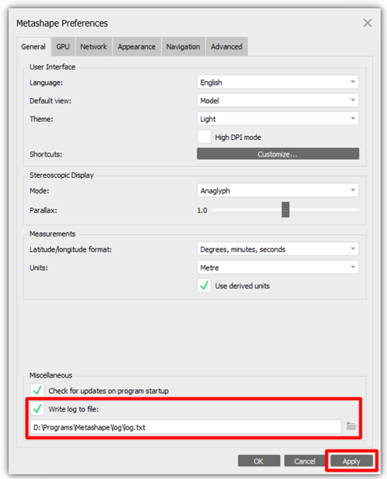
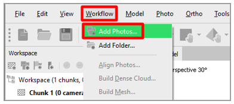
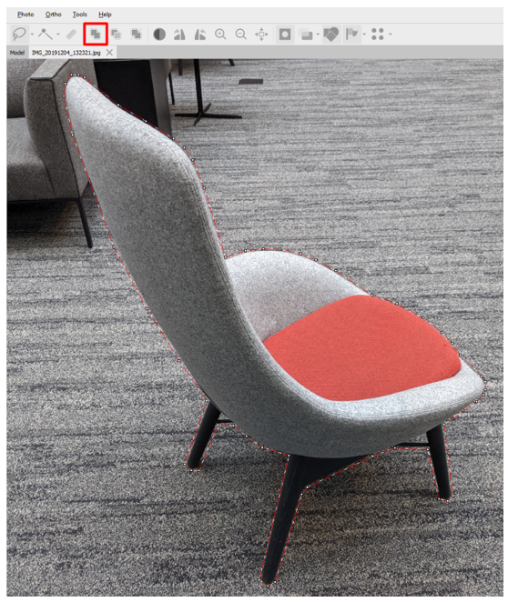
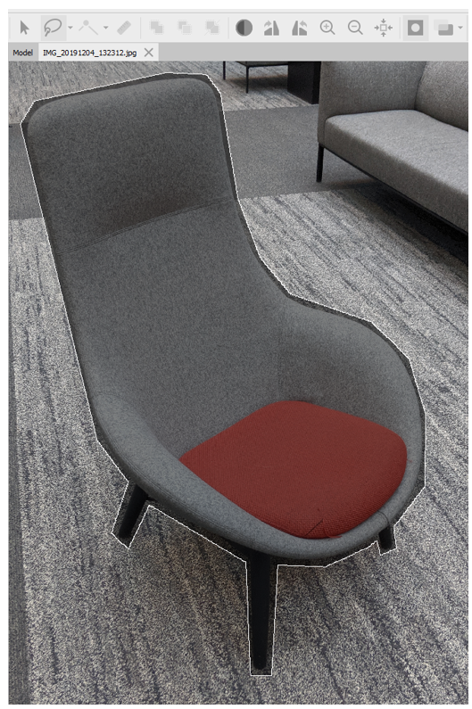
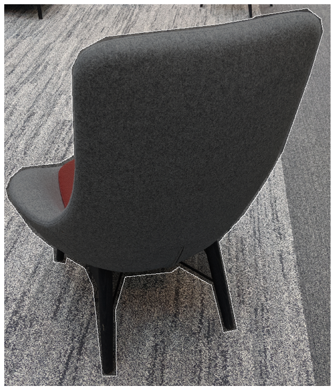
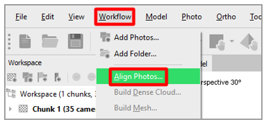
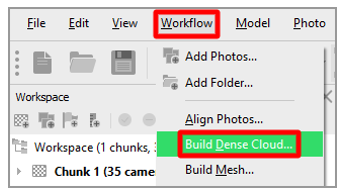
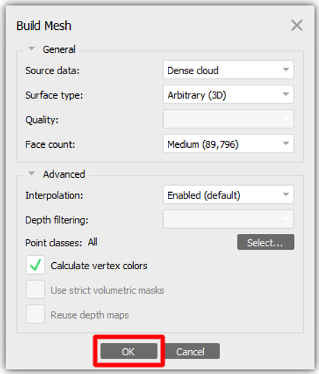

# Use Agisoft Metashape to create 3D models for use in Microsoft Dynamics 365 mixed-reality applications

This tutorial walks you through the process of using Agisoft Metashape photogrammetry software to create a 3D model that you can use in Microsoft Dynamics 365 mixed-reality applications.

This document is created strictly for informative purposes to demonstrate how Agisoft Metashape works with Dynamics 365 
mixed-reality applications. Microsoft Corporation is not affiliated with, is not a partner to, and does not endorse or sponsor 
Agisoft or any of Agisoft’s products.

## What is Agisoft Metashape?

Agisoft Metashape is a stand-alone software product that photogrammetrically processes digital images and generates 3D spatial 
data for use in Geographic Information System (GIS) applications, cultural heritage documentation, visual effects production, and indirect measurements of objects of various scales. [Learn more about Agisoft Metashape](https://www.agisoft.com/).

## Photography tips

The following tips will help you take quality photos for photogrammetry:

- If possible, take photos in a location where lighting is consistent and doesn't cast shadows.

- Try to keep your own shadow out of the picture.

- Make sure there are no moving objects in the background when you take the photos.

- If the camera you're using has a High Dynamic Range (HDR) setting, turn this feature off and try not to adjust the exposure of your photographs while capturing images.

- Take pictures about 1 meter apart while circling the object.

- If it is possible, maintain a perpendicular location to the subject while taking photos.

- If the subject is large, move in a lateral motion from one end of the object to the other, changing the height with each pass until 
you feel you've captured all surfaces.

## Set preferences

For the most part, you can use the default preferences, but there are a few changes to make before getting started.

1. On the **Tools** menu, select **Preferences**.

     

2. On the **General** tab, under **Miscellaneous**, select the **Write log to file** check box, and then enter a location and filename for your log. Select **Apply** when you're done.

    
 
3. On the **GPU** tab, select the check box for any graphics processing units (GPUs) available for processing. If you only have one GPU available, at the bottom of the dialog box, select the **Use CPU when performing GPU accelerated processing** check box. Select **Apply** when you're done.

    
 
4. On the **Advanced** tab, under **Miscellaneous**, select the **Enable fine-level subdivision** and **Enable VBO support** check boxes. If the camera you're using has extensive meta data about location, orientation, and so on, you might want to experiment with the options in the **Export/Import** section. Select **OK** to apply the changes and close the **Metashape Preferences** dialog box.

    

## Import your photos

The first thing you need to do after setting up your preferences is to import the photos that will be used to construct the 3D model.

- On the **Workflow** menu, select **Add Photos**, and then select the photos that you want to import.

    
 
## Mask your photos

You can use "mask out" irrelevant elements of your source photos that can be confusing to the program or that can lead to undesirable reconstruction results. You might want to do this from different angles in your pictures. Although it's not necessary to mask objects in every photo, the more photographs you mask, the more accurate the final result will be.

1.	Double-click an image to open it, choose a selection tool such as the **Intelligent scissors**, and then outline your 3D model subject.

    
 
2.	Select the **Add Selection** button to create the mask.

    
 
3. Repeat this step in muliple pictures from multiple angles for best results.

    

## Align the photos

Photogrammetry uses objects that are consistently present in multiple images to create a map of where it thinks the camera was when the photo was taken. You use the **Align photos** command for this part of the process.

1.	On the **Workflow** menu, select **Align Photos**.

    
 
2.	In the **Align Photos** dialog box, use the default settings shown below, or change them as you see fit.  Select **OK** when you're done.

    
 
3.	Select the **Model** menu to view the results. At this point, your model should look similar to this.

    
 
## Align the region

After aligning the photos, you can use the bounding box to trim the size of your 3D object. This step isn't required, but it speeds up the next steps.

1.	On the toolbar, select the **Resize Region** tool.

    
 
2.	Drag the spheres at the edge of the region to select the area you want to convert.

    

## Build a dense point cloud

Now it's time to build the dense point cloud.

1.	On the **Workflow** menu, select **Build Dense Cloud**.

    
 
2.	In the **Build Dense Cloud** dialog box, use the following settings. Select **OK** when you're done.

    
    
    >[!NOTE]
    >If you have a powerful computer, you can set the **Quality** setting to **High**, but for many operations the **Medium** setting produces quality results.  

## Build the mesh

Now it's time to build the mesh.

1.	On the **Workflow** menu, select **Build Mesh**.

    
 
2.	In the **Build Mesh** dialog box, use the following options.  

    
    
    >[!NOTE]
    >You may want to change the **Face count** setting to match the [performance requirements for your targeted platform](https://docs.microsoft.com/en-us/dynamics365/mixed-reality/import-tool/optimize-models#performance-targets).
    
3. Select **OK** to convert the point cloud into a 3D model.
 
4. Examine the results, and then do one of the following:

    - If you're satisfied with the results, skip to the **Export your 3D model** procedure below. 
    
    - If you want a higher level of surface detail, go to the next procedure, **Build the texture**.  
    
    - If you don't like the shape of the object, you might want to add more masks to the areas that are missing details.

## Build the texture

Adding a texture map to your 3D model can significantly increase the visual fidelity while maintaining performance. 

>[!NOTE]
>This step is optional.  

1.	On the **Workflow** menu, select **Build Texture**.

    

2.	Use the following default values. Select **OK** when you're done.

    
    
    >[!NOTE]
    >You might want to consider reducing the texture size depending on the platform you're targeting.  

## Export the 3D model

The final step is to convert the model to a GLB file format so you can use it in Dynamics 365 mixed-reality applications.

1. On the **File** menu, select **Export**, select **Export Model**, and then choose a name and location for the 3D model.

    

2. In the **Save as type** field, select **.glb**, and then select **Save**.

    
 
3. In the **Export Model** dialog box, for the **Export texture** option, select **PNG** (recommended) and leave the other default values.

    
    
4. Select **OK**.
 
    The model is done and ready to use in Dynamics 365 mixed-reality applications.
    
    
 
## View your 3D models in Microsoft Dynamics 365 Mixed Reality Applications

After preparing your 3D model, you can use it in the following applications:

[Dynamics 365 Product Visualize](https://docs.microsoft.com/dynamics365/mixed-reality/product-visualize/admin-guide#add-a-model)

[Dynamics 365 Guides](https://docs.microsoft.com/dynamics365/mixed-reality/guides/)

## More information

Screenshots in this document were taken from the Agisoft Metashape software program to provide clear instructions on how to use Agisoft software. [Learn more about Agisoft Metashape](https://www.agisoft.com/).

Microsoft Corporation is not responsible for, and expressly disclaims all liability for damages of any kind arising out of the use of Agisoft Metashape, or reliance on these instructions. This document is created only to provide general information to our customers and does not take into consideration any individualized business plans or specifications.

The use in this document of trademarked names and images is strictly for informative and descriptive purposes, and no commercial claim to their use, or suggestion of sponsorship or endorsement, is made by Microsoft Corporation. 
