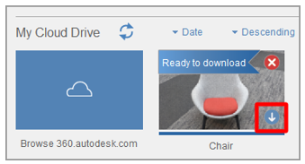
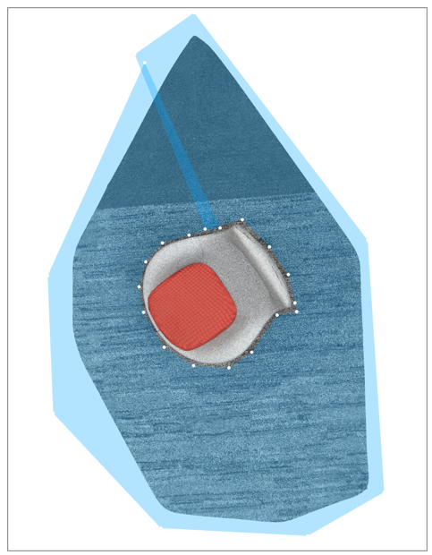
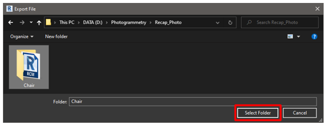
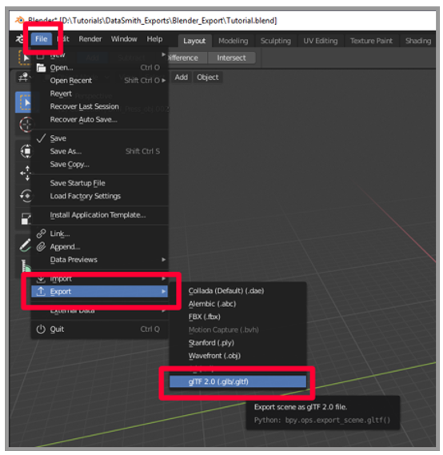

# Use Autodesk Recap Photo to create 3D models for Dynamics 365 mixed-reality applications

This tutorial walks you through the process of using Autodesk Recap Photo photogrammetry software to create 3D models that 
can be used with Microsoft Dynamics 365 mixed-reality applications.

This tutorial is created strictly for informative purposes to demonstrate how Recap Photo works with Microsoft Dynamics 365 
mixed-reality applications. Microsoft Corporation is not affiliated with, is not a partner to, and does not endorse or sponsor 
Autodesk or any of Autodesk’s products.

## What is Autodesk Recap Photo?

Autodesk Recap Photo processes photographs taken from drones to create 3D representations of current conditions of sites, objects, 
and more. [Learn more about Autodesk Recap Photo](https://www.autodesk.com/products/recap/overview).

## Photography tips

The following tips will help you take quality photos for photogrammetry:

- If possible, take photos in a location where lighting is consistent and does not cast shadows.

- Try to keep your own shadow out of the picture.

- Make sure there are no moving objects in the background when you take the photos.

- If the camera you're using has a High Dynamic Range (HDR) setting, turn this feature off and try not to adjust the exposure of your photographs while capturing images.

- Take pictures about 1 meter apart while circling the object.

- If possible, maintain a perpendicular location to the object while taking photos.

- If the object is large, move in a lateral motion from one end of the object to the other, changing the height with each pass until 
you've captured all surfaces.

## Start a new project

After launching Autodesk Recap Photo, you'll see the dashboard. 

>[!NOTE]
>You can choose **Aerial** or **Object** to create a new 3D project. This tutorial covers the **Object** workflow.

1. Under **Create 3D**, select **Object**.
 
    

2.	In the screen that appears, click anywhere, as prompted, and then add the photos you want to use to create your 3D model. After importing the photos, select **Create**.

        
    
    >[!NOTE]
    >Recap Photo uses “cloud credits” to provide photogrammetry services. This section of the menu shows you how many cloud credits you have, and how many it takes to process your photographs. [Learn more about Autodesk cloud credits](https://aka.ms/autodesk_cloud_credits). 

3. Give your project a name, and then select **Start** to process your photos. This process can take a fair amount of time, based on the number of photos you added and your internet connection speed.

    
    
    >[!NOTE]
    >The **Auto-crop** option is covered later in this tutorial.  
 
4.	After your 3D model has been processed, it appears in the **My Cloud Drive** section of the dashboard. Select the **Download 
this project from the cloud** button to download your 3D model.

    
 
5.	Choose a location to save your model to, and then select **Select Folder**.
 
    

6.	You'll see a new 3D model with the name you entered. Select the object to open it in the Editor.

    
 
    You'll see your 3D model loaded in the Editor window.
 
    

## Edit the 3D model

There are several tools on the left and bottom of the Editor window that you can use to clean up your 3D model. Play around with these tools to clean up the parts of your 3D model that you don't want to keep. In this tutorial, we'll demonstrate how to remove the floor from the model.

1.	Select the **Lasso/Fence** tool.

    
 
2.	With the **Lasso/Fence** tool, select everything but the object you want to keep. 

    
    
3. Press Enter, and then press Delete. You may have to do this a few times to remove the majority of the floor.

4.	Select the **Slice** tool to remove the rest of the floor. This creates a slicing plane that you can use to cut away geometry below a certain point. Use the **Fill** option to ??? Use the **Transform plane** option to align the plane so that the floor isn’t visible.

    
    
5. When the model looks the way you want, select **Apply**.
 
This will remove the rest of the floor from your 3D model and fill the mesh on the bottom.

## Decimate the 3D model to increase performance

After removing the parts of the mesh you don't want to keep, you can decimate it to a polygon count that meets the [performance targets for Dynamics 365 mixed-reality applications](https://docs.microsoft.com/en-us/dynamics365/mixed-reality/import-tool/optimize-models#performance-targets).

1.	Select the **Decimate mesh** tool.

    
 
2.	In the **Decimate** dialog box, choose a polygon count that balances visual fidelity with performance requirements. 

    >[!NOTE]
    >Unless precise geometry is very important to you, don't select the **Best geometry** option since it will remove your textures. The textures produced with photogrammetry add significant detail to the 3D model.

    
   
3. Select **Decimate all**.

   At this point, the 3D model is optimized and ready to export. 

   
 
## Export the 3D model as an OBJ file

To use the 3D model in a Dynamics 365 mixed-reality application, it must be in GLB file format. In this step of the tutorial, we'll export the model as an OBJ file that can then be converted to a GLB file.

1.	On the left side of the screen, select the **Export** button, and then select the **Export model** button to open the export settings.

    
 
2.	In the **Export model** dialog box, choose **OBJ** as the export file type, and then set the texture size to 4098 x 4098. You can choose a larger or smaller texture size but be aware that this will affect either performance or visual fidelity. When ready, select **Export**.  

    
 
3.	Choose a location to save your file to, and then select **Select Folder**.

    
 
    The 3D model is exported to this folder.

## Use Blender to convert the OBJ file to a GLB file

There are several applications that you can use to convert an OBJ file to a GLB file. For purposes of this tutorial, we'll use Blender.  

### What is Blender?

[Blender](https://www.blender.org/) is a free, open-source, 3D creation suite. It supports the entirety of the 3D pipeline: modeling, rigging, animation, simulation, rendering, compositing and motion tracking, and video editing and game creation.

If you use Blender to prepare your 3D models, review Blender's website and [download the latest version for Windows](https://www.blender.org/download/).

### Import your 3D model into Blender

1.	Launch Blender. A new scene is automatically created. Right-click the cube, and then select **Delete** to delete it.

    
 
2.	Select **File** > **Import** > **Wavefront (.obj)** to import the OBJ file.

    
 
3.	Under **Import OBJ**:

    a. Clear the **Object** and **Group** check boxes, and then select the **Image Search** check box.
   
      
 
    b. Select **Import OBJ** on the right side of the screen. This imports the 3D model as a single item and searches in the subfolder for any materials.
   
      
 
### Export the 3D model as a GLB file

The last step is to export the model as a GLB file so it can be used with Dynamics 365 mixed-reality apps.

1.	In Blender, select **File** > **Export** > **glTF 2.0**.

     
 
2.	On the **Export** menu, make sure that the GLB format is selected and that the **Selected Objects** check box is selected. Name your file, and then select **glTF 2.0 (.glb/.gltf)**.

     

## View your 3D model in a Dynamics 365 mixed-reality application

After preparing your 3D model, you can use it in the following Dynamics 365 apps:

- [Dynamics 365 Product Visualize](https://docs.microsoft.com/dynamics365/mixed-reality/product-visualize/admin-guide#add-a-model)

- [Dynamics 365 Guides](https://docs.microsoft.com/dynamics365/mixed-reality/guides/)

## More information

Screenshots in this document were taken from the Autodesk Recap Photo software program to provide clear instructions on how to use the Recap Photo software.

To learn more about Recap Photo and Blender, see the following:

- [Autodesk Recap Photo](https://www.autodesk.com/products/recap/overview)

- [Blender](https://www.blender.org/)

Microsoft Corporation is not responsible for, and expressly disclaims all liability for damages of any kind arising out of the use of Autodesk Recap Photo, or reliance on these instructions. This document is created only to provide general information to our customers and does not take into consideration any individualized business plans or specifications.

The use in this document of trademarked names and images is strictly for informative and descriptive purposes, and no commercial claim to their use, or suggestion of sponsorship or endorsement, is made by Microsoft Corporation. 

 

