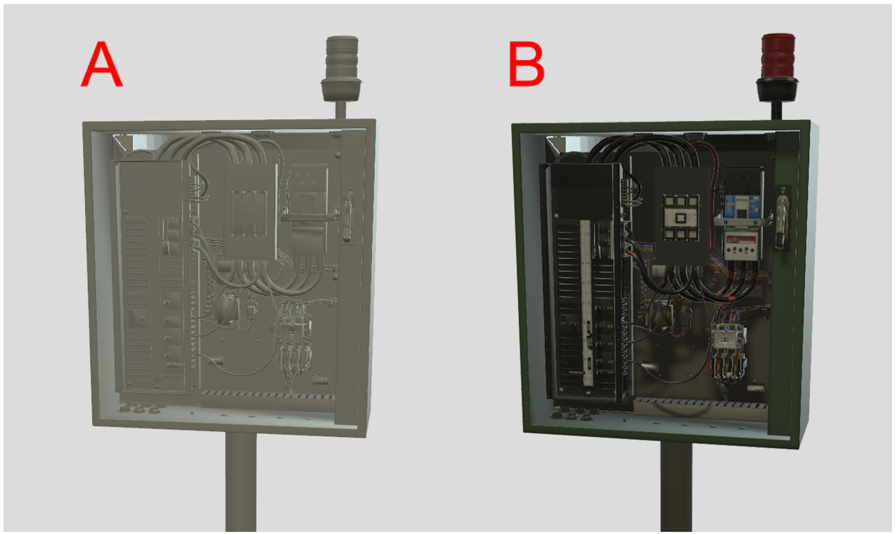
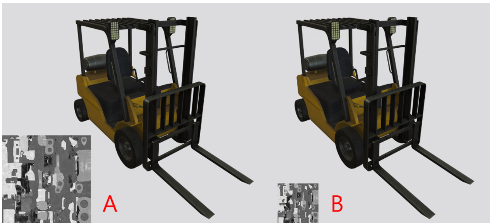
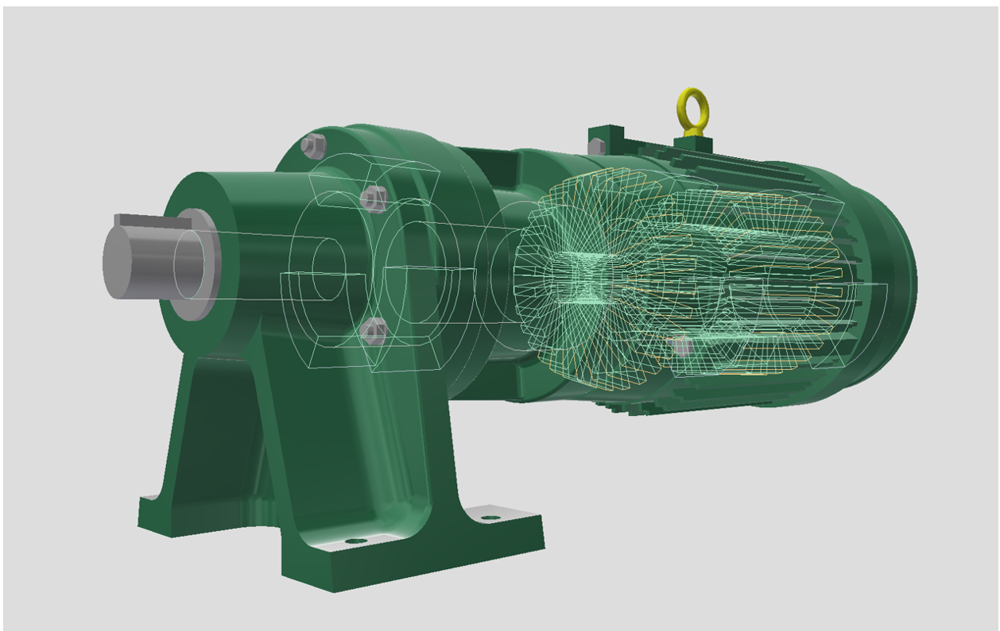
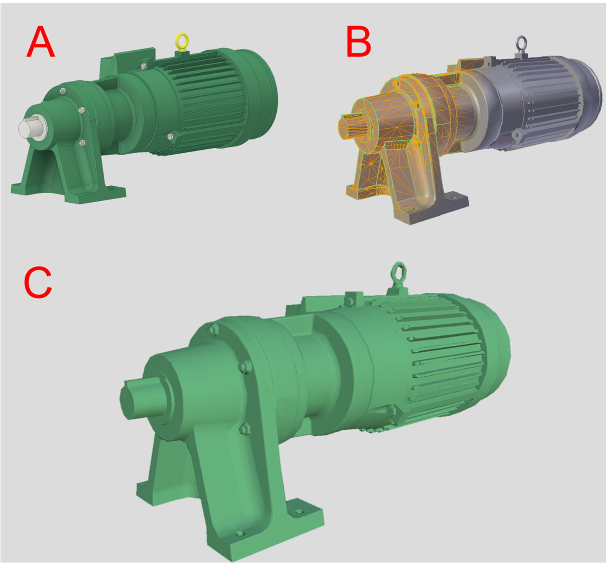
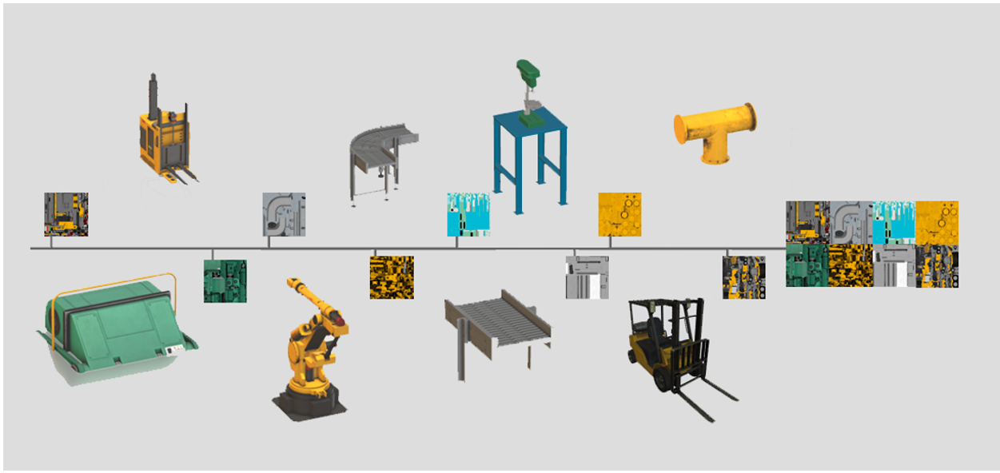
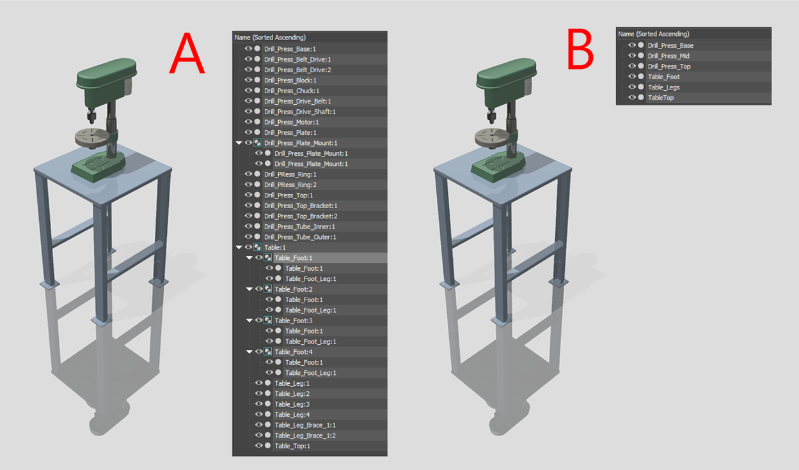
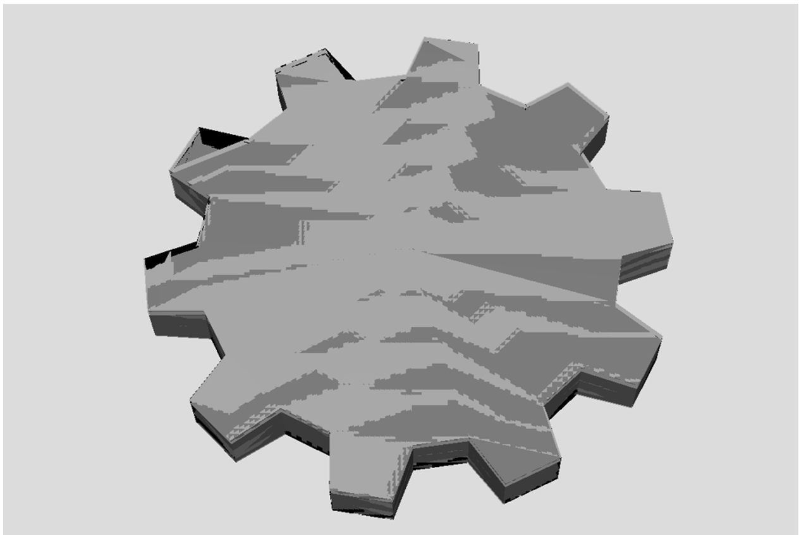
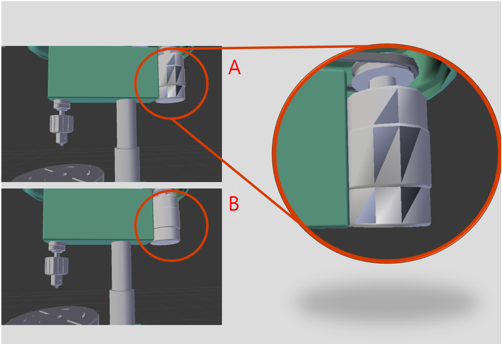
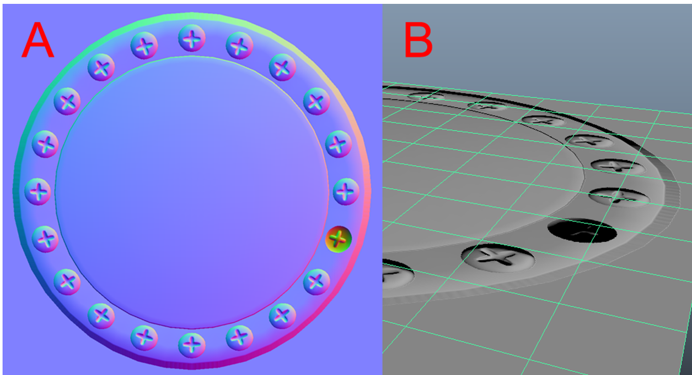

# Best practices for converting and optimizing real-time 3D models

This topic covers best practices for preparing 3D models to work with Dynamics 365 mixed reality applications.

## Reduce materials and surfacing

- Depending on the 3D model source and how you want to present the content, you may want to use the full capabilities of a physically based rendering (PBR) system. PBR systems allow for colors, roughness, and bumpiness to be visually represented by creating texture maps as opposed to having a multitude of different materials and surface complexities in the 3D model.

- If the asset only needs to be present and does not need the details provided by a PBR system, a significant increase in performance can be gained by only applying a single color. This will leave out extra texture data and surface information, like multiple colors, reflections and bumpiness.

    

   A.	High performance single color 3D model with no PBR system 
   B.	3D model using the PBR system for higher-quality representation

## Reduce textures

- You can decrease the roughness map to increase the performance of the model.

    

   A.	Model with roughness map texture of 2048 x 2048 
   B.	Model with roughness map texture of 1024 x 1024

- Reducing the resolution and the amount of textures will have the largest impact on memory consumption and file size.

- Reduce textures based on their visual impact. For example, metallic roughness maps can often be half the resolution of the base color and normal maps with no discernable quality reduction.

- JPG compression and PNG quantization will further reduce file size, but it will have no impact on the memory required at runtime when the asset is loaded.

## Remove hidden and unused data

- Be sure to remove any data that’s not required to represent your 3D models. Extra nodes, meshes, materials, and textures can add up quickly. For example, in the following 3D model, removing any hidden motor parts will lower the triangle count and simplify the hierarchy, resulting in a more performant 3D model.

    

   *Wireframe and shaded model visualized in [Autodesk Inventor](https://aka.ms/AutodeskInventorSoftware)*

## Reduce triangles

- High triangle or vertex counts can hinder performance, especially on performance-constrained devices.

- If the model usage is known ahead of time, you can make triangle reduction choices. Focus your reduction on less important areas with high mesh density to allow more detail in key areas.

- Fine geometric surface details and material colors can often be replaced by baking them into normal, color, and ORM (occlusion, roughness, and metallic) maps for large triangle savings.

    

   A.	Native CAD 3D model 
   B.	Reduced triangle count polygonal model with normal map 
   C.	Optimized model with normal map

## Reduce draw calls

- Draw calls refers to the number of graphical instructions per frame, which is the number of materials on screen. Reducing or consolidating materials on an object will help reduce draw calls.

    

   *Consolidating multiple textures into a single texture reduces draw calls from 22 to 1 for this example*

- The most common runtime performance bottlenecks can usually be attributed to a large number of draw calls. 

- Create a [texture atlas](https://aka.ms/TextureAtlas) out of multiple materials and merge the meshes together to consolidate draw calls.

## Reduce hierarchy complexity

- Grouping, parenting, and large numbers of nodes such as nulls, locators, raw curves, meshes, and joints can contribute to poor runtime performance.

- Simplify your hierarchy, remove unnecessary nodes, and combine meshes where possible.

    

   *Meshes combined to reduce draw calls. Visualized in [Autodesk 3DS Max](https://aka.ms/3dsMax)*

   A.	Original hierarchy 
   B.	Optimized hierarchy

- glTF will create one mesh per material and atlas materials together to reduce node count and draw calls.

## Increase distance between geometry faces

- Flickering can occur when geometry faces are coplanar or nearly coplanar and is especially prevalent when the model is animated or moving from position to position in applications. This means the geometric faces are perfectly overlapping, causing what’s known as [Z-fighting](https://aka.ms/Zfighting).

    
 
   *Two shapes are nearly overlapping, causing the Z-fighting effect*

- Increasing the distance between geometry faces by a small amount will resolve the flickering issues in most cases.

## Flip inverted face normals

- Inverted face normals can cause the model to be shaded incorrectly.

- Flip the normals of the incorrectly shaded faces to resolve the rendering issues.

    
	 
  *Face normals visualized in [Blender 2.8](https://aka.ms/blender2.8)*

   A.	3D model with normal flipped 
   B.	3D model with fixed normal

## Conflicting tangent basis

- A conflicting tangent basis can cause your normal maps to appear inverted.

    

   *Tangent basis visualized in [Autodesk Maya](https://aka.ms/autodeskMaya)*

   A.	Normal map baked from a 3D model with a normal-flipped screw 
   B.	The visible result of baking with a flipped normal object

- If you don’t export tangents with your model, glTF and the real-time renderer will assume right-handedness.

- Export your model with tangents if you are baking tangent space normal maps in a left-handed setup. Alternatively, you could invert the green channel (Y axis) of your normal map.

[Overview of Dynamics 365 Import Tool (Preview)](index.md) 
[Convert 3D models](convert-models.md) 
[Optimize 3D models](optimize-models.md) 
[Use the Import Tool](import-tool.md)

