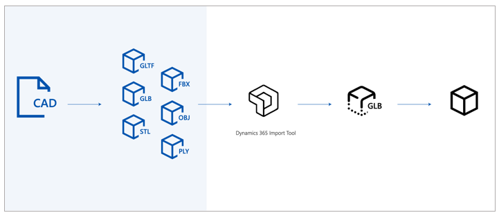

# Convert your 3D (CAD) models

 

To use your 3D models with Dynamics 365 mixed-reality applications, you need to convert them to a file format that supports real-time rasterization. The type of file you convert to depends on the option you choose in Microsoft Dynamics 365 Import Tool (Preview).

## Import Tool options and file types

The Import Tool provides two options for preparing your 3D models: 

 

The following table describes the two options and the file formats supported for each.

|Option|Description|Supported file formats|
|------------|-----------------------------------------------------------------|-----------------------------|
|Import using this PC|Use this option if you want to import self-authored models without any optimization.|GLB only|
|Send model to Microsoft|Use this option if you need Microsoft’s assistance optimizing and converting your 3D model. Microsoft uses a combination of automation and manual steps to prepare the files. |FBX, OBJ, JT, STP, and SKP|

## Tools for exporting CAD models

CAD models can be exported directly to glTF format or into intermediate formats that can be subsequently processed into glTF files. If your content-creation application does not have a glTF exporter, we recommend exporting to [FBX](https://aka.ms/FBXfileformat) or [OBJ](https://en.wikipedia.org/wiki/Wavefront_.obj_file), if available. Third-party applications are available to import FBX or OBJ files and export them as glTF/GLB files. Your use of third-party applications is subject to terms between you and the third party. Microsoft does not endorse any particular third-party application and assumes no responsibility or liability for any third-party application you elect to use.

|Content-creation package|Description|
|-----------------------------------------------|---------------------------------------------------------------|
[Blender.org Blender](https://aka.ms/Blender_2.8)|Native import/export for Blender 2.8 or later|
[Autodesk 3DS Max](https://aka.ms/BabylonJS_Max2Babylon_Installation)|Babylon.JS plug-in for Max 2015 or later|
[Autodesk Maya](https://aka.ms/BabylonJS_Maya2Babylon_Installation)|Babylon.JS plug-in for Maya 2018 or later|
[Trimble SketchUp](https://aka.ms/SketchUp_glTF_Export)|Separate extensions for [import](https://aka.ms/Sketchupimport) and [export](https://aka.ms/sketchupexport)|
|[Allegorithmic Substance Painter](https://aka.ms/SubstancePainter_glTF_Exporter)|Native exporter|
|[SideFX Houdini](https://aka.ms/Houdini_glTF_Exporter)|Native import/export|
|[Maxon Cinema 4D](https://www.maxon.net/en-us/products/cinema-4d/overview/)|Native export plug-in|

In situations where a CAD application doesn’t have an export option for FBX, OBJ, or glTF, you can export an intermediate file, such as [JT](https://aka.ms/Jtfileformat) or [STEP](https://aka.ms/STEPfileformat), and then process that file to create a glTF file. 

### See also
[Overview of Dynamics 365 Import Tool (Preview)](index.md) 
[Optimize 3D models](optimize-models.md) 
[Best practices for converting and optimizing models](best-practices.md) 
[Use the Import Tool](import-tool.md)

