# Use SideFX Houdini to turn point clouds into optimized 3D models for use in Dynamics 365 Mixed Reality applications

This tutorial provides step-by-step instructions that show you how to: 

- Convert a point cloud into a 3D model. 

- Optimize a 3D model by reducing the polygon count so that it matches [performance targets for Dynamics 365 mixed reality applications](optimize-models#performance-targets).

- Export an optimized 3D model as a .GLB file that can be used in Dynamics 365 mixed reality applications.

- Create a processing pipeline template so you can quickly optimize point clouds in the future.

This document is created strictly for information purposes to demonstrate how SideFX Houdini works with Microsoft Dynamics 365 mixed reality applications. Your use of third-party applications is subject to terms between you and the third party. Microsoft Corporation is not affiliated with, is not a partner to, and does not endorse or sponsor SideFX or any of SideFX’s products. There are several other [content-creation applications that you can use to prepare your 3D models](convert-models#tools-for-exporting-cad-models). 

## What is Houdini?

Houdini is a 3D procedural content creation tool. It uses a non-destructive node-based tool system that can be used to design process pipelines and 3D content. 

## Set up your environment

To set up your environment, you need to:

- Install SideFX Labs extension

- Set up AliceVision for Photogrammetry

### Install SideFX Labs extension

SideFX Labs is a testing ground for tools that you can use with Houdini to help you get up and running quicker with Houdini. This collection of free tools includes tools that are useful for converting point clouds into optimized 3D models. You must use Houdini 18 or later to use SideFX Labs.

SideFX provides a [tutorial video](https://www.sidefx.com/tutorials/sidefx-labs-installation/) that helps you install these tools.

1. To install SideFX Labs, select the plus sign at the top of the screen , select **Shelves**, and then select the **SideFX Labs** check box.

    
 
2. In the toolbar that appears near the top of the screen, select the **Update Toolset** button to launch the installer.

    

3. Select **Update** to install the tools. 

    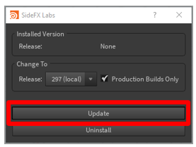

    >[!NOTE]
    > SideFX Labs is packaged with Houdini so you don't need an internet connection to install it. If you're connected to the internet, you can update the release later. If you want to install the latest build of SideFX Labs, clear the **Production Builds Only** option.

If the installation is successful, you'll see more tools on the toolbar, and can continue with this tutorial.

### Set up AliceVision for photogrammetry

[AliceVision](https://alicevision.org/) is a photogrammetric computer vision framework developed by Mikros Image that provides 3D reconstruction and camera-tracking algorithms. Learn more [about AliceVision](https://alicevision.org/#about) and the [AliceVision plug-in](https://www.sidefx.com/tutorials/alicevision-plugin/).

To install and setup up the AliceVision plug-in for Houdini, [see the SideFX tutorial](https://www.sidefx.com/tutorials/alicevision-plugin/).

## Import a point cloud into Houdini

Houdini can import point cloud files in the .PLY file format. If your file is in a .PTS file format, you can manually convert it to the .PLY format.

### Convert .PTS files to .PLY

1.  Open your .PTS file in the file editor of your choice, and then add the following header: 

    ************************
    ply 
    format ascii 1.0 
    element vertex 534993 
    property float x 
    property float y 
    property float z 
    property uchar intensity 
    property uchar red 
    property uchar green 
    property uchar blue 
    end_header 
    ************************

2. In the header, replace the **534993** value next to **element vertex** with the value that appears at the top of your .PTS file here:

   

   This value is the total number of points in your point cloud. 

3. Remove the original value after the header from your file. The following table shows a side-by-side comparison of the files before and after making the modifications. The **element vertex** count is highlighted in red:

   |Top of .PTS file|Top of .PLY file|
   |---------------------------------------------------------------|------------------------------------------------------------------|
   |||

4. Save the file with a .PLY extension.

### Import the .PLY file

1.	Open Houdini. A new scene is automatically created. In this procedure, we'll build a chain of nodes to process the point cloud into a 3D model. These nodes will be constructed in the bottom-right window pane.

    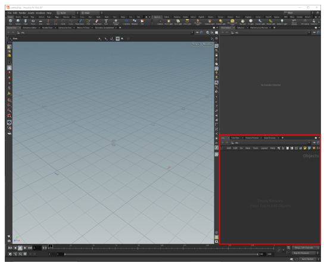

2.	Right-click the bottom-right window pane (or press TAB) to open the **TAB Menu**.

3.  On the **TAB Menu**, select **Import > File**, and then click the **Geometry** pane to place the node.

    
 
3.	Double-click the center of the **file1** icon (or press **I**) to drill down to the file selection part of this node, select the **File Chooser** button, and then choose the file you want to import.

    

4.	In the file browser that pops up, browse to the location of the file you want to import, select the .PLY point-cloud file, and then select **Accept**. 

    
 
    Now you can see the point cloud in the viewport. If you can't see it, try zooming out with the mouse wheel until you can see the entire point-cloud.

    
 
## Prepare the point cloud

### Re-orient the point cloud

Sometimes when you import a point cloud, it will have the wrong orientation. You can fix this by adding a transform node to the node tree.  

1.	To add a transform node, right-click inside the **Geometry** pane to open the **TAB Menu**, and then select **Manipulate > Transform**.

    

2.	To link the **transform1** node and the **file1** node, drag the dot on the bottom of the **file1** node to the dot on the top of the **transform1** node. Then click the right side of the **transform1** node. Doing this will turn it blue and set the **View** window to the **transform1** node so you can see your model after it has been re-oriented. 

    
 
    >[!TIP]
    >In Houdini, you can select the right side of each node to view the model during that stage of the process. This is helpful if you ever need to go back and look at your 3D model in a previous state and make changes that occurred during that state.
    
3.	To correct the rotation of your model, in the options pane above the node pane, add values to the **Rotate** row. You can often replace the **x** value with **270** to rotate the model to the correct position. If this doesn't work, try different values.

    
 
4.	To center your the point cloud over the origin, add an axis align node after the transform node. To place the node, hover your mouse over the **Geometry** pane, press Tab, and then select **Labs** > **Geo** > **Labs Axis Align**.  

    
 
5.	Connect the output of your **transform1** node to the input of your **axis_align1** node. Leave the default values to set your point cloud on top of the origin point (an ideal place).

    

### Clean up the point cloud to remove stray points

If your point cloud has stray points that you want to remove, you can select and delete individual points or groups of points.

1. To start, change the **Geometry select** method to **points** and the **Select** tool to **Lasso Picking**. 

   >[!NOTE]
   >You can use a different method if you prefer.

   

2. Select the points that you want to delete.

    
 
3. Press the **Delete** key. When you do this, a new **blast1** node appears connected to the bottom of the last node you were working with.

    
 
4. Continue removing points until you're satisfied with the results. Each deletion adds a new **blast** node that you can view or remove at any time.

    
 
## Convert the point cloud to a mesh

The next step after importing the point cloud is to convert it to a mesh. To do this, you can use the **Particle Fluid Surface** command in the **Tab Menu**. 

1. Click the **Geometry** pane, select **Fluid** > **Particle Fluid Surface**, select the node, and add it to the **Geometry** pane. 

   

2. Drag the **transform1** output node to the **particlefluidsurface1** left input node to connect the two nodes. Then click the far-right tab of the **pariclefluidsurface1** node to activate the node in the viewport.
 
   
  
    This renders the point cloud as a mesh in the viewport. The **Surfacing** tab will be open in the upper-right pane above the **Geometry** pane.

   
 
3. If the points in the point cloud have color data connected to them, you can use those color attributes by adding the letters **Cd** to the end of the **Transfer Attributes** text box. When you add this attribute, the color will come through on your mesh.

   
 
4. You might see holes in the mesh as shown below. To fix this, play with the **Particle Separation** and **Voxel Scale** sliders. 

   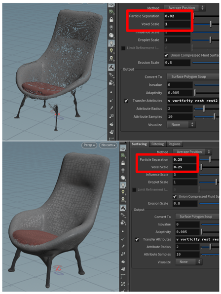
 
5. To prepare the mesh for decimation (the next step in the overall process) in the **Output** tab, change the **Convert To** value from **Surface Polygon Soup** to **Surface Polygons**. This will enable you to remesh and decimate the mesh.

   
 
6. Next add a remesh node to convert the mesh to triangles. This will enable you to decimate the 3D model to a poly count that meets your performance requirements. To do this, right-click the **Geometry** pane, and then select **Polygon** > **Remesh**.

   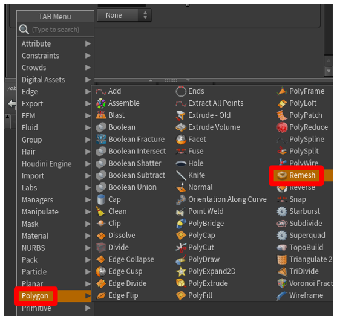

7. Connect the **particlefluidsurface1** output node to the **remesh** left input node to connect the nodes. Then click the middle of the **remesh** node to activate it in the pane above the **Geometry** pane and click the far-right tab to activate the model in the viewport. You should now be able to edit the properties of the remesh and see those edits represented in the viewport.

   
 
8. Play with the **Element Sizing** controls to get the results you want. In the **Edge Lengths** option, you can keep the default value (**Uniform**) or select **Adaptive** and adjust the **Relative Density** slider (and other options) to produce the mesh you want.

   

## Decimate the 3D model to increase performance

To reach application-specific goals, you may need to decimate your 3D model. Decimation is the process of recomputing the surface polygons of the model to create a similar shape with less polygons. This reduces visual fidelity but increases performance. The example images below show the difference between a high-quality model used for low-scene complexity on HoloLens, and a low-quality model used for high-scene complexity.

|High-polygon 3D model|	Low-polygon 3D model|
|---------------------------------------------------------------|--------------------------------------------------------------|
|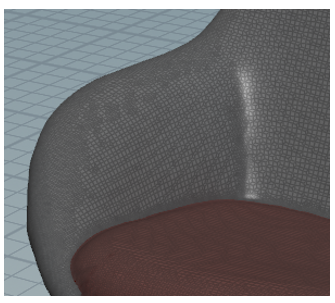 ||
|500,000 triangles|8,000 triangles|

### To decimate a model

1. In the **Geometry** pane, press the Tab key to open the **Tab Menu**, select **Polygon** > **PolyReduce** to select the PolyReduce node, and then place the node in the **Geometry** pane.

   
 
2. Connect the **remesh** output node to the top-left **polyreduce1** node. Then click the middle of the **polyreduce1** node and click the far-right tab to activate the **polyreduce1** node in the viewport.

3. In the **Reduction Amount** tab, in the **Target** list, select **Output Polygon Count**, and then adjust the polygon count to meet your performance requirements while maintaining acceptable visual fidelity.

   
 
   This converts the point cloud to an optimized 3D mesh. In the next step we'll bake a high-resolution texture onto the 3D model to recover some of the visual fidelity that existed before decimating.

## Bake a high-resolution texture onto a low-poly mesh

One downside to reducing the number of polygons in a mesh is that much of the detail might be lost. To restore some of that detail, you can capture it and apply it as a texture layered on top of the low-poly model. In this process, known as “texture baking”, you take a picture of all the surfaces from your high-poly model and stitch them into a quilt that you drape on top of the low-poly model. Doing this gives you the performance of a low-poly model while maintaining some of the finer details of the high-poly model.  

### To bake the texture

1. Add an AutoUV node to the scene by right-clicking the **Geometry** pane and selecting **Labs** > **UV** > **Labs Auto UV**.

   

2. Change the method to **UV unwrap**.

   
3. Connect the **polyreduce1** output node to the **autouv1** input node.

   

4. To view the before and after models side-by-side, select the **Viewport Layout** button, and then select **Two Views Side by Side**.

   
 
5. In the left view pane, select the drop-down, and then select **Set View > UV viewport**.

   
 
   You'll see the unwrapped UVs in the left pane and the 3D model in the right pane.

    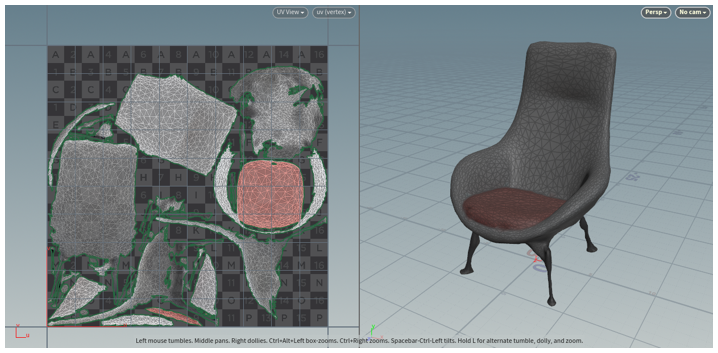

5. In the **Geometry** pane, select **Labs** > **Output** > **Labs Maps Baker (Beta)** to add a **maps_baker1** node.

    
 
6. Connect the **autouv1** output node to the **LOW Resolution input** node of the **maps_baker1** node.

    

7. Connect the **particle fluid surface1** output node to the **HIGH resolution input** node of the **maps_baker 1** node.

    
 
8. Select the **maps_baker1** node, change the **Preview Channel** option to **diffuse**, and then under **Bake Options**, set the **Diffuse Map** option to **diffuse**.

    

    >[!TIP]
    >You can save your project in a specific folder by selecting the file chooser highlighted in the image above. When you bake a texture, the .PNG texture file is output to a **render** folder created in the root folder of the saved project. Saving your project into its own folder makes the baked texture easy to find.

9. Highlight the **maps_baker1** node, and then select **Bake** in the options pane.

    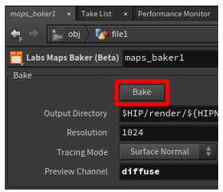
 
10. Right-click the **Geometry** pane to access the **TAB menu**, and then select **Managers** > **Material Network** to add a **matnet1** node to the scene.  

    

11. Double-click the **matnet1** node to open the **VEX Builder** pane.

    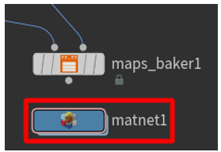
 
12.	Add a **Principled Shader** material by right-clicking the **VEX Builder** pane and selecting **Shaders > Principled Shader**.

    
 
13.	In the options pane, on the **Surface** tab, change the **Roughness** value to **0.6** and the **Metallic** value to **0.1**. (You can set these values to whatever you want, but we've found these values are a good starting point when used in conjunction with the default values.)

    

14.	On the **Textures** tab, under **Base Color**, select the **Use Texture** check box. Then select the **File Chooser** button and select the _*_color.png_ texture that we saved to the **render** folder earlier. The principled shader is now ready to use. 

    >[!NOTE]
    >Feel free to modify the material further. For purposes of this tutorial, we used this configuration.

    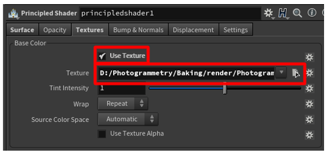

15.	Select the back arrow in the **VEX Builder** pane to go back to the **Geometry** pane.

    

16.	Place a Material node into the geometry pane by selecting **Material > Material**.

    

17.	Connect the **autouv1** output node to the **material1** input node.

    

18.	With the **material1** node selected, select the **Operator chooser** button, and then select the **Principled Shader** just created by selecting **file1** > **matnet1** > **principledshader1**.

    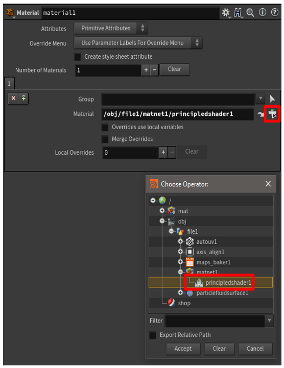

19.	Click the right side of the node to activate it in your viewport. You'll see the texture rendered on top of your low-poly 3D model.  If it looks acceptable, go to the next procedure.
 
    

## Export the model to a GLB file

In this step, we’ll export the model to a GLB file so it can be used with Dynamics 365 mixed-reality apps. 

1.	In the **Geometry** pane, right-click to open the **Tab Menu**, and then select **Export** > **ROP GLTF Output**.

    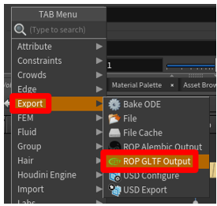

2.	Drag a connection from the **material1** output node to the **rop_gltf1** input node.

    
  
3.	In the top pane, change the **Export Type** option to **glb**. 

    
 
4.	Next to the **Output File** field, select the **File Chooser** button, and then enter a name and destination for the **GLB** file. Make sure to add **.glb** to the end of the filename.

    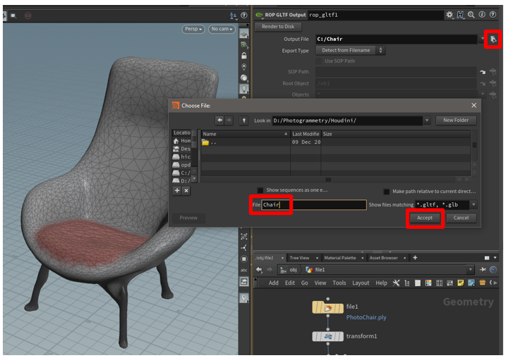

5.	Select **Render to Disk** to finalize the export and create the **GLB** file.

     

## Create a template to reuse your settings for other point clouds

To save time and effort, you can create a template to re-use the settings you create for a point cloud on other point clouds. You'll still need to select the **Bake** command and will probably need to adjust a few values, but you can automate the majority of the processing.

### To create a template

1. Replace whatever geometry is currently being used with a default geometry. This makes the template file lightweight so that it loads quickly. To do this:

   a. Select the file icon to activate the geometry **File** menu in the upper pane.
    
   b. Change the **Geometry File** field to **default.bgeo**, and then select **Reload Geometry**.
    
   c. This refreshes the geometry so that it is now a generic cube.
    
   d. Change the filename to something generic like **Template**.
    
      
 
2.	To save the file, select **File > Save**, and then enter a name you'll remember, such as **Prep_Template.**  

    

3.	Close Houdini.

### Use the template

1. Open Houdini, select **File** > **Open**, and then select the template.

   
 
2. Click the center of the geometry file node to switch to the **File** context menu, and then select the **File chooser** button to select the .PLY point-cloud file.

   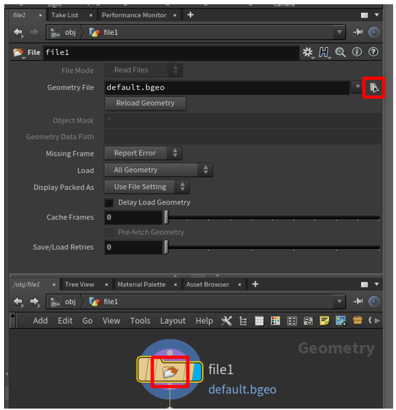
 
3. Select **Reload Geometry** to load the point cloud into the scene.

   
 
4. Go to the **maps_baker1** node and select **Bake** to bake a new texture for your 3D model.

   

5. Click the right tab of the **material1** node to view your baked model.

   

6. Do one of the following:

   - If you're satisfied with the 3D model, go to the **rop_gltfB** node and export your 3D model by selecting **Render to Disk**.  

   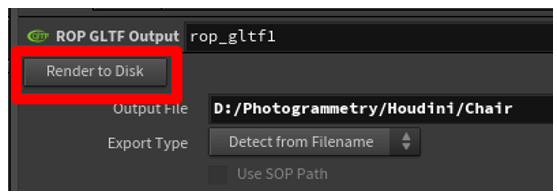

   - If you're not satisfied with how the model looks, adjust the options in the **particlefluidsurface1**, **remesh**, and **polyreduce1** nodes. When your model looks acceptable, bake your texture again and export the 3D model.

## View your 3D model in mixed reality

You can use any of the following Microsoft Dynamics 365 apps to view your 3D model in mixed reality: 

[Dynamics 365 Product Visualize](https://docs.microsoft.com/dynamics365/mixed-reality/product-visualize/) 

[Dynamics 365 Guides](https://docs.microsoft.com/dynamics365/mixed-reality/guides/) 

[Dynamics 365 Layout](https://docs.microsoft.com/dynamics365/mixed-reality/layout/index) 
 
### More information 
 
Screenshots in this document were taken from the Houdini software program in order to provide clear instructions on how to use Houdini’s software. [Learn more about SideFX Houdini](https://www.sidefx.com/tutorials/alicevision-plugin/).
 
Microsoft Corporation is not responsible for, and expressly disclaims all liability for damages of any kind arising out of the use of Houdini, or reliance on these instructions. This document is created only to provide general information to our customers and does not take into consideration any individualized business plans or specifications. 
 
The use in this document of trademarked names and images is strictly for informative and descriptive purposes, and no commercial claim to their use, or suggestion of sponsorship or endorsement, is made by the Microsoft Corporation. 

