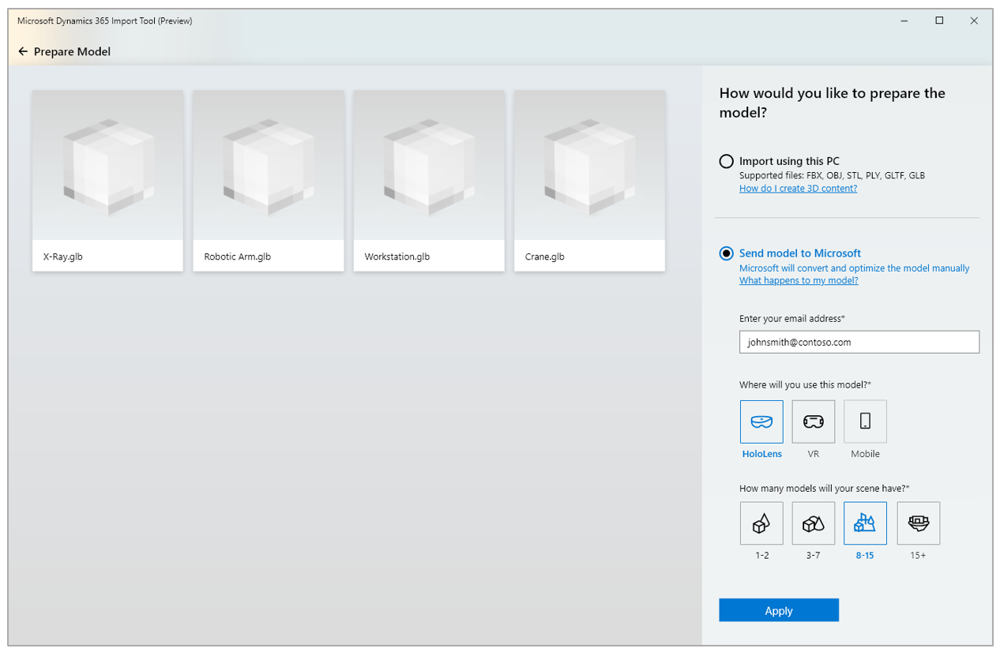

# Use the Dynamics 365 Import Tool

 

Use the Microsoft Dynamics 365 Import Tool (Preview) to prepare your 3D models to use in  Dynamics 365 mixed reality applications. 

## Two options for preparing 3D models

The Import Tool provides two options for preparing your 3D models: 

 
 
If you choose the **Import using this PC** option, you’ll need to prepare your models yourself using the instructions in these topics:

- [Convert your 3D models](convert-models.md)
- [Optimize your 3D models](optimize-models.md)
- [Best practices for 3D models](best-practices.md)

If you choose the **Send model to Microsoft** option, Microsoft will convert and optimize your model for you and will provide a download link when the model is ready.

### Import using this PC option

1.	On your PC, open the Import Tool.

2.	Select **Models** > **PC**, and then select **Add models**.

3.	Go to the folder where your models are saved, and then select the models you want to import (up to 25 at a time).

4.	Select **Open**.

5.	Select **Import using this PC**.

     

6.	Select **Apply**.

    > [!NOTE]
    > The **Import using this PC** option isn’t available if any of your source models are not in GLB file format.

### Send models to Microsoft option

1.	On your PC, open the Import Tool.

2.	Select **Models** > **PC**, and then select **Add models**.

3.	Go to the folder where your models are saved, and then select the model you want to import.

4.	Select **Open**.
 
5.	Select **Send model to Microsoft**.

    

6.	Under **Enter your email address**, enter the email address where Microsoft can contact you when the model is ready.

7.	Under **Where will you use this model?**, choose the target device. You can only choose one type of target device at this time.

8.	Under **How many models will your scene have?**, select the appropriate option for your scene complexity. 

9.	Select **Apply** to send the model to Microsoft.

    Microsoft will send you the following email notification to confirm that the model has been sent:
    
     

    Microsoft will update you on the progress of the manual optimization through email and will let you know when the model is ready to download.

## What happens to my model when I send it to Microsoft?

When you send your model to Microsoft, it’s uploaded to a secure location. Microsoft prepares the model using a combination of automated and manual steps. Microsoft will provide a download link when the model is ready. After you download it, your model is deleted from the secure storage area.  

 

## Download a model after it’s been converted and optimized by Microsoft

1.	Open the Import Tool.

2.	Right-click the model that was submitted for manual processing, and then select **Download from Microsoft**.

     

## Locate your converted assets

Files created with the Import Tool are stored locally. To find the files on your local drive:

1.	Open the Import Tool.

2.	Right-click a model, and then select **Open file location**.

    

## Provide feedback on the quality of processed 3D models

You can provide feedback on the quality of processed 3D models if you're not satisfied.

1.	Select the **Models** or **All** tab, and then select the model you want to provide feedback on.

2.	At the bottom of the **Properties** tab, under **How does the model look?**, select **Looks good** or **Looks broken** to record your feedback.

     

    > [!NOTE] 
    > You can't update feedback after you submit it.

### See also
[Overview of Dynamics 365 Import Tool (Preview)](index.md) 
[Convert 3D models](convert-models.md) 
[Optimize 3D models](optimize-models.md) 
[Best practices for converting and optimizing models](best-practices.md)

