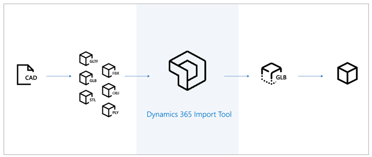
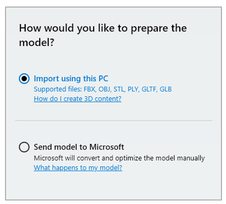
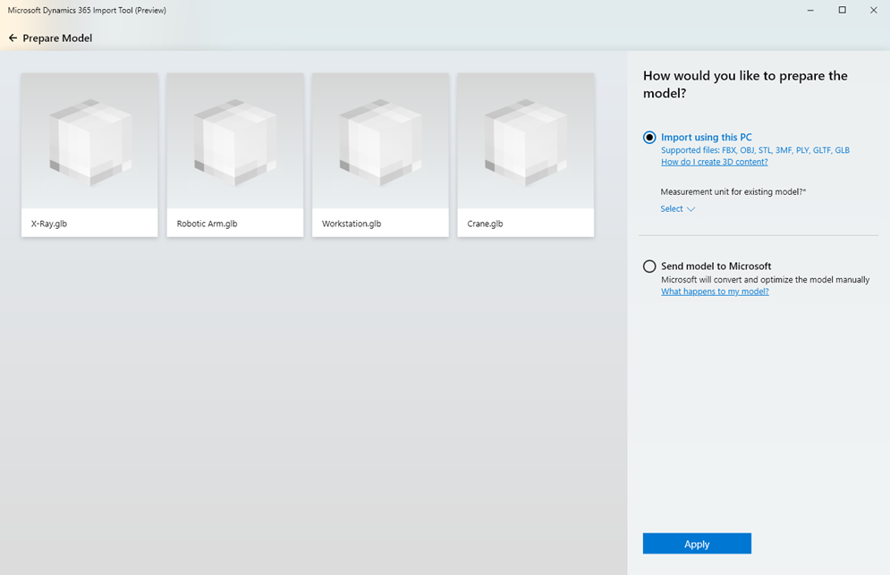
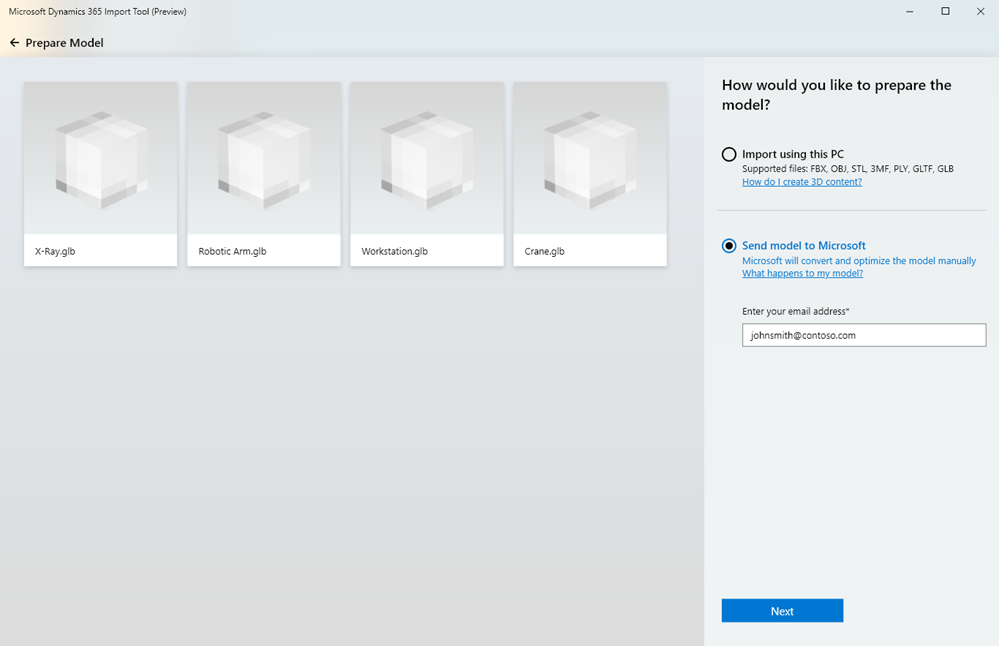
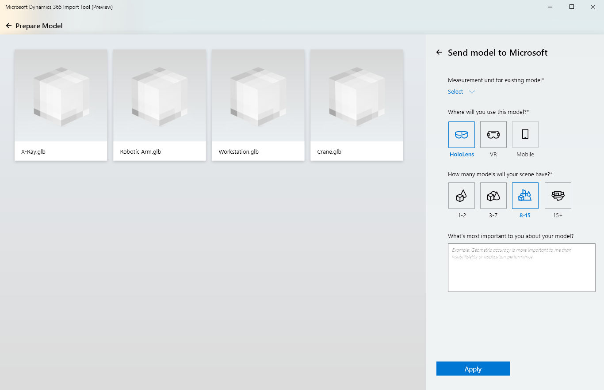
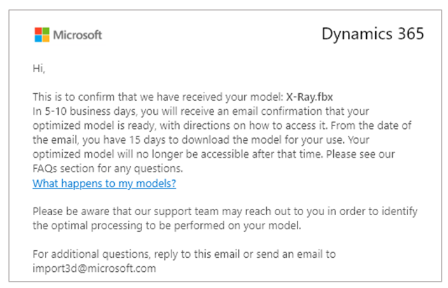
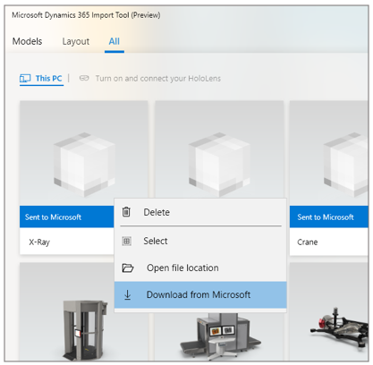
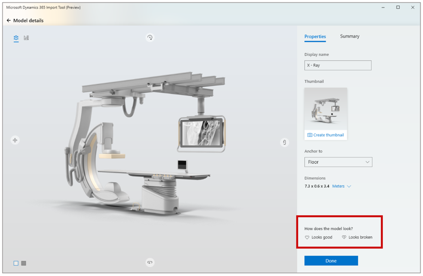

# Use Dynamics 365 Import Tool (Preview)

> [!div class="mx-imgBorder"]
>  

Use [!include[cc-microsoft](../includes/cc-microsoft.md)] [!include[pn-dyn-365-import-tool](../includes/pn-dyn-365-import-tool.md)] to prepare your 3D models to use in [!include[pn-dyn-365](../includes/pn-dyn-365.md)] mixed-reality applications. 

## Two options for preparing 3D models

[!include[pn-dyn-365-import-tool](../includes/pn-dyn-365-import-tool.md)] provides two options for preparing your 3D models: 

> [!div class="mx-imgBorder"]
>  
 
If you choose the **Import using this PC** option, you’ll need to prepare your models yourself using the instructions in these topics:

- [Convert your 3D models](convert-models.md)
- [Optimize your 3D models](optimize-models.md)
- [Best practices for 3D models](best-practices.md)

If you choose the **Send model to [!include[cc-microsoft](../includes/cc-microsoft.md)]** option, [!include[cc-microsoft](../includes/cc-microsoft.md)] converts and optimizes your model for you and will provide a download link when the model is ready.

### Import using this PC option

1.	On your PC, open [!include[pn-dyn-365-import-tool](../includes/pn-dyn-365-import-tool.md)].

2.	Select **Models** > **PC**, and then select **Add models**.

3.	Go to the folder where your models are saved, and then select the models you want to import (up to 25 at a time).

4.	Select **Open**.

5.	In the **Prepare Model** dialog box, under **How would you like to prepare the model?**, select **Import using this PC**.

    > [!div class="mx-imgBorder"]
    >  
    
6. Under **Measurement unit for existing model**, select the measurement unit the model was created with. This will preserve that unit of measurement when you import the model.

7.	Select **Apply**.

#### If you encounter file access errors when importing files

3D models sometimes reference other files in your file system, such as textures and materials files. Your imported 3D model may not look correct if Dynamics 365 Import Tool (Preview) can’t access these files, in which case, you may see this error dialog box:

> [!div class="mx-imgBorder"]
>  

There are two primary reasons why Dynamics 365 Import Tool (Preview) might not have access to these files:

- **No permissions**. For the safety and security of your files, Windows 10 does not allow all Windows Store applications full access to the files in your system. To allow Dynamics 365 Import Tool (Preview) access to your files, select **Grant permissions**, go to the folder(s) that contains the files, and then select the folder(s). This will grant access to all files in the folder. Alternatively, you can move your 3D models and all their referenced files to the **3D Objects** folder.

- **Missing files**. Dynamics 365 Import Tool (Preview) expects the files to appear in the exact file paths listed in the dialog box. If files are not there, they will be marked as missing. Move the missing files to locations indicated in the dialog box, or update the original 3D model.

### Send model to Microsoft option

1.	On your PC, open [!include[pn-dyn-365-import-tool](../includes/pn-dyn-365-import-tool.md)].

2.	Select **Models** > **PC**, and then select **Add models**.

3.	Go to the folder where your models are saved, and then select the model you want to import.

4.	Select **Open**.
 
5.	In the **Prepare Model** dialog box, under **How would you like to prepare the model?**, select **Send model to [!include[cc-microsoft](../includes/cc-microsoft.md)]**.

    > [!div class="mx-imgBorder"]
    > 

6.	Under **Enter your email address**, enter the email address where [!include[cc-microsoft](../includes/cc-microsoft.md)] can contact you when the model is ready.

7. Select **Next**.    

8. Under **Measurement unit for existing model**, select the measurement unit the model was created with. This will preserve that unit of measurement when Microsoft converts and optimizes the model.

    > [!div class="mx-imgBorder"]
    > 

9.	Under **Where will you use this model?**, choose the target device. You can only choose one type of target device at this time.

10.	Under **How many models will your scene have?**, select the appropriate option for your scene complexity. 

11. In the **What's most important to you about your model** box, provide instructions for Microsoft. For example, specify which is most important to you — visual accuracy or performance.

12.	Select **Apply** to send the model to [!include[cc-microsoft](../includes/cc-microsoft.md)].

    [!include[cc-microsoft](../includes/cc-microsoft.md)] will send you the following email notification to confirm that the model has been sent:
    
    > [!div class="mx-imgBorder"]
    >  

    [!include[cc-microsoft](../includes/cc-microsoft.md)] will update you on the progress of the manual optimization through email and will let you know when the model is ready to download.

## What happens to my model when I send it to Microsoft?

When you send your model to [!include[cc-microsoft](../includes/cc-microsoft.md)], it’s uploaded to a secure location. [!include[cc-microsoft](../includes/cc-microsoft.md)] prepares the model using a combination of automated and manual steps. [!include[cc-microsoft](../includes/cc-microsoft.md)] provides a download link when the model is ready. After you download it, your model is deleted from the secure storage area.  

> [!div class="mx-imgBorder"]
>  

## Download a model after it's been converted and optimized by Microsoft

1.	Open the [!include[pn-dyn-365-import-tool](../includes/pn-dyn-365-import-tool.md)].

2.	Right-click the model that was submitted for manual processing, and then select **Download from [!include[cc-microsoft](../includes/cc-microsoft.md)]**.

    > [!div class="mx-imgBorder"]
    >  

## Locate your converted assets

Files created with [!include[pn-dyn-365-import-tool](../includes/pn-dyn-365-import-tool.md)] are stored locally. To find the files on your local drive:

1.	Open [!include[pn-dyn-365-import-tool](../includes/pn-dyn-365-import-tool.md)].

2.	Right-click a model, and then select **Open file location**.

    > [!div class="mx-imgBorder"]
    > 

## Provide feedback on the quality of processed 3D models

You can provide feedback on the quality of processed 3D models if you're not satisfied.

1.	Select the **Models** or **All** tab, and then select the model you want to provide feedback on.

2.	At the bottom of the **Properties** tab, under **How does the model look?**, select **Looks good** or **Looks broken** to record your feedback.

    > [!div class="mx-imgBorder"]
    >  

    > [!NOTE] 
    > You can't update feedback after you submit it.

### See also
[Overview of Dynamics 365 Import Tool (Preview)](index.md) 
[Convert 3D models](convert-models.md) 
[Optimize 3D models](optimize-models.md) 
[Best practices for converting and optimizing models](best-practices.md)

