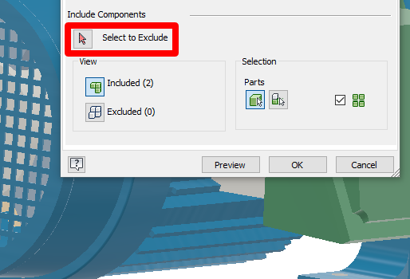
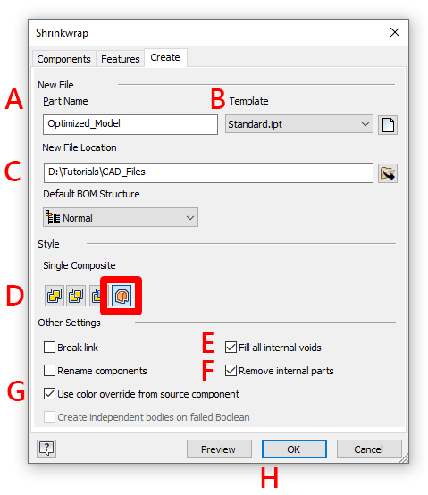
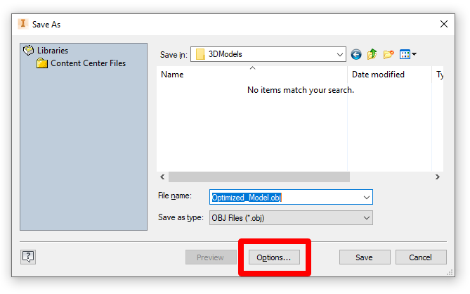
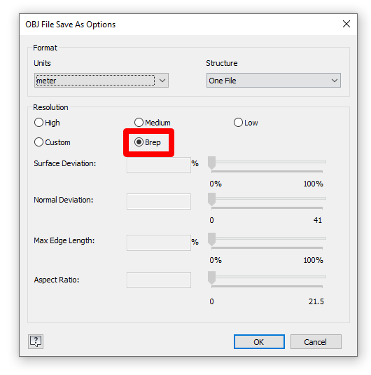

# Prepare Autodesk Inventor 3D models for use in Dynamics 365 Import Tool (Preview)

This tutorial shows how to prepare Autodesk Inventor files for use in Dynamics 365 Import Tool (Preview). Dynamics 365 Import Tool (Preview) accepts formats like OBJ and changes them to GLB, the real-time format used in Dynamics 365 mixed reality applications.  

> [!IMPORTANT]
> This document is created strictly for informative purposes to demonstrate how Autodesk Inventor works with Microsoft Dynamics 365 
mixed reality applications. Your use of third-party applications is subject to terms between you and the third party. The Microsoft 
Corporation is not affiliated with, is not a partner to, and does not endorse or sponsor Autodesk or any of Autodesk’s products. 
There are several other [content-creation applications that can be used to prepare your 3D models](https://docs.microsoft.com/dynamics365/mixed-reality/import-tool/convert-models#tools-for-exporting-cad-models). 

## What is Autodesk Inventor?

Autodesk Inventor is professional-grade 3D CAD software for product design and engineering. For more information, [see Autodesk Inventor](https://www.autodesk.com/products/inventor/overview). 

## Optimize 3D models for mixed reality

The first step is to remove any unneeded details in the 3D model. This vastly improves performance and increases the visual quality of the 3D model. Inventor has a tool called **Shrinkwrap** that can assist by removing fillets, chamfers, small parts, holes, and more.

1.	From the **Assemble** tab in Inventor, select **Shrinkwrap**.

     
    
    From here, there are several optimization options you can choose to help increase the performance of your model in Dynamics 365 mixed reality applications. 
 
2.	Select the **Remove parts by size** check box, select the mouse arrow, and then select the largest object you're willing to remove, such as a bolt. This will remove all objects (nuts, bolts, washers) that are smaller than the object you selected.

     
 
3.	If there are specific items such as grates or cooling fins that are extremely complex and you don’t need to see them, you can use the **Select to Exclude** option to remove them piece-by-piece.

     

4.	On the **Features** tab, you’ll see options to remove some or all features such as holes, fillets, pockets, and chamfers. This works the same as removing parts by size, but for features instead of entire parts. Experiment with these features to gain additional optimizations for your model. The results can be significant.

     
 
5.	On the **Create** tab:

    a.	Choose a part name for the export.
    
    b.	Use the **Standard.ipt** template.

    c.	Set the new file location.

    d.	Under **Style**, select **Single Composite**. 

    e.	Select the **Fill all internal voids** check box.

    f.	Select the **Remove internal parts** check box.

    g.	Select the **Use color override from source component** check box.

    h.	Select **OK**.
 
       
 
6.	Save your file. 

## Export the 3D model

Next, you need to export the model to a usable format that Dynamics 365 Import Tool (Preview) can read. You need to adjust settings so  the lowest density model is exported. 

1.	In the **Save as type** box, select **OBJ files (*.obj)**.
    
2.	Select the **Options** button.

     
    
      This is what the OBJ export settings look like in Inventor:
    
     
    
    We suggest using the **Brep** “boundary representation” setting, which produces the lowest poly output for Inventor files. If your model is not overly complex and you desire a higher level of detail, you can use the **Low** setting ([see Performance targets](https://docs.microsoft.com/dynamics365/mixed-reality/import-tool/optimize-models#performance-targets)).
    
## Convert your OBJ file to a GLB file

Microsoft Dynamics 365 mixed reality applications use the GLB format for 3D models. There are two options for converting your OBJ file to a GLB file.

- The first is by using Dynamics 365 Import Tool (Preview). This tool automatically converts your OBJ 3D model into a GLB 3D model.

- The second is to use a digital content creation (DCC) platform to convert your 3D models into GLBs. Using these software platforms is a manual process but provides you with more opportunities for optimization. To assist with this process, see the following tutorials:

- [Blender](blender.md)

- [Autodesk 3ds Max](3ds-max.md)

- [SideFX Houdini](houdini.md)

## View the 3D model in mixed reality

After preparing the 3D
model, you can learn more about using the following Microsoft Dynamics 365 applications to view your 3D model in mixed reality: 

[Dynamics 365 Product Visualize](https://docs.microsoft.com/dynamics365/mixed-reality/product-visualize/) 

[Dynamics 365 Guides](https://docs.microsoft.com/dynamics365/mixed-reality/guides/) 

[Dynamics 365 Layout](https://docs.microsoft.com/dynamics365/mixed-reality/layout/index) via [Dynamics 365 Import Tool (Preview)](https://docs.microsoft.com/dynamics365/mixed-reality/import-tool/import-tool)

## More information

Several screenshots in this document were taken from the Autodesk Inventor software program to provide clear instructions on how to use Autodesk’s software.  [Read more about Autodesk Inventor](https://aka.ms/Autodesk_inventor).

The Microsoft Corporation is not responsible for, and expressly disclaims all liability for damages of any kind arising out of the use of Autodesk Inventor, or reliance on these instructions. This document is created only to provide general information to our customers and does not take into consideration any individualized business plans or specifications.

The use in this document of trademarked names and images is strictly for informative and descriptive purposes, and no commercial claim to their use, or suggestion of sponsorship or endorsement, is made by the Microsoft Corporation.

