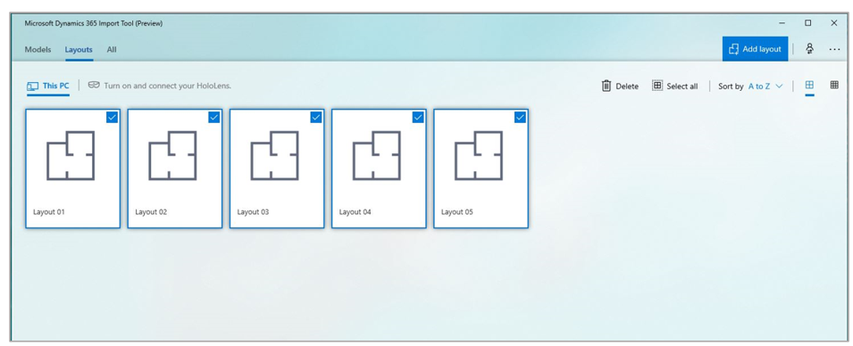

# Work with Dynamics 365 Layout

With Dynamic 365 Layout, you can work with floor plans created with Microsoft Visio or you can create the layout with HoloLens. You can use the Import Tool to make either type of layout available for immersive headsets. 

## Import a Microsoft Visio floor plan

To work with Microsoft Visio floor plan in Layout, you need to do 3 steps:

1.	Install the Visio Add-in for Layout. 

2.	Export the floor plan to Layout.

3.	Make the floor plan available for immersive headsets or HoloLens using the Import Tool.

## Install the Visio Add-in for Layout

1.	Open the Import Tool.

2.	Select **Settings**, and then select the 32-bit or the 64-bit download. Choose the one that matches your version of Visio.

     

3.	Open Visio, and then select **File** > **Options** > **Add-ins**.

4.	Next to **Manage**, select **COM Add-ins**, and then select **Go**.

5.	Select **Visio Add-in for Dynamics 365 Layout**, and then select **Add**.

## Export the floor plan to Layout

- After you’ve created the floor plan in Visio, select the **Layout** tab, select **Export**, and then save your floor plan.

## Make the floor plan available for immersive headsets or HoloLens 

1.	In the Import Tool, select **This PC** > **Add layout**, and then navigate to the floor plan.

2.	Select the floor plan, and then select **Open**.

    If you’re using an immersive headset connected to the same PC, the floor plan will show up automatically in Layout. You don’t need to do anything more.

    If you’re using HoloLens:
    
    a.	Connect your HoloLens to your PC using the USB cable.

    b.	Open the Import Tool on the PC, and then select **This PC** > **Layouts**.

    c.	Select the check box on the layouts you want to copy, and then select **Send**.
    
        
    
    d.	On HoloLens, open the Layout app. You’ll find your floor plan on the **Layouts** tab.
    
## Import layouts created with the HoloLens Layout app to use with immersive headsets

1.	Connect your HoloLens to your PC using the USB cable.

2.	Open the Import Tool on the PC, and then select **HoloLens name** > **Layouts**.

3.	Select the check boxes for the layouts you want to copy, and then select **Send**.

## Import layouts created with the immersive Layout app to use with the HoloLens Layout app

To use the layout on HoloLens, you need to move it there:

1.	Connect your HoloLens to your PC using the USB cable.

2.	Open the Import Tool on the PC, and then select **This PC** > **Layouts**.

3.	Select the check boxes for the layouts you want to copy, and then select **Send**.

4.	On HoloLens, open the Layout app. You’ll find your layouts on the **Layouts** tab.

## Import 3D models to use with HoloLens

1.	Connect your HoloLens to your PC using the USB cable.

2.	Open the Import Tool on the PC, and then select **This PC** > **Models**.

3.	Select the check boxes for the 3D models you want to copy, and then select **Send**.

4.	On HoloLens, open the Layout app. You’ll find your 3D models on the **Models** tab.

## Import 3D models to use with immersive headsets

If you used the Import Tool to import your 3D models, they’re already available for immersive headsets. You can find them in your **3D objects** folder. 

    

