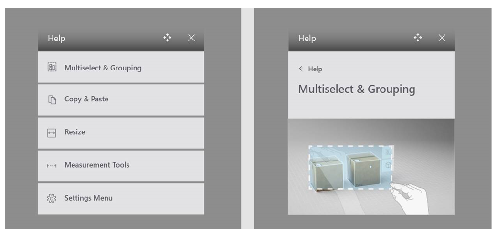
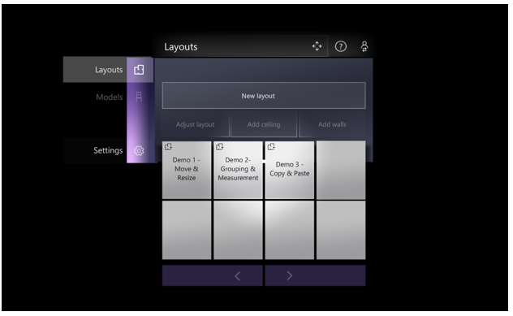
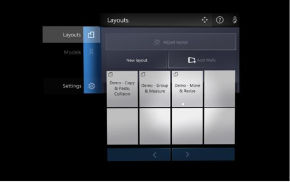
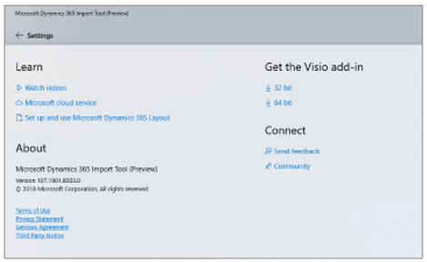
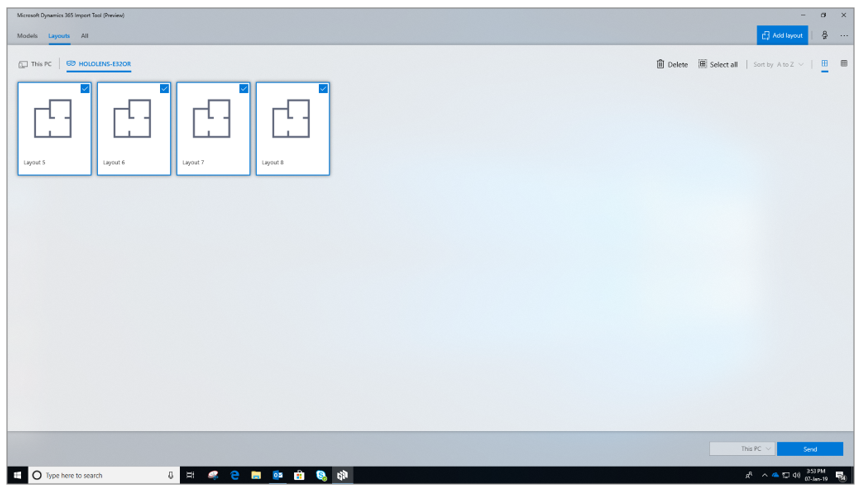
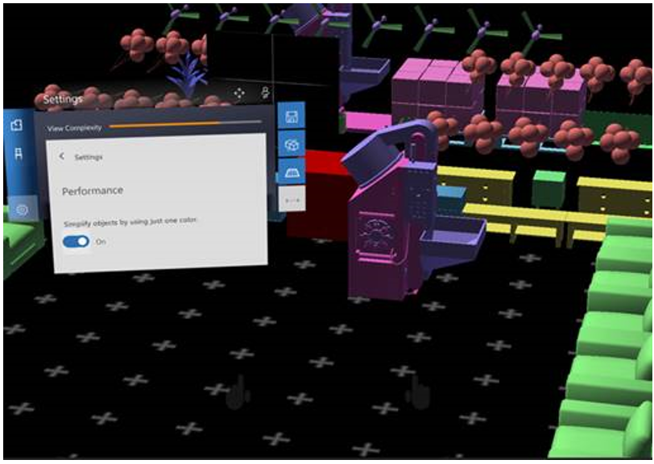
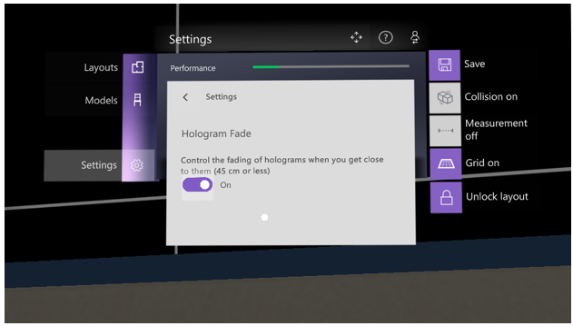

# Dynamics 365 Layout User Guide

Use [!include[cc-microsoft](../includes/cc-microsoft.md)] [!include[pn-dyn-365-layout](../includes/pn-dyn-365-layout.md)] to create and design space plans on [!include[pn-hololens](../includes/pn-hololens.md)]
or on a [!include[pn-ms-windows-short](../includes/pn-ms-windows-short.md)] Mixed Reality immersive headset. Import 3D models and design,
edit, and collaborate virtually, on a real-world scale.

Need more help? [Check out the Dynamics 365 Layout FAQ](faq.md) for answers to common questions.

[Watch how-to videos about Dynamics 365 Layout.](https://go.microsoft.com/fwlink/p/?linkid=2021489)

## What you’ll need

-   [A subscription to Dynamics 365 Layout.](../licensing/buy-and-deploy.md) The [!include[pn-layout](../includes/pn-layout.md)] subscription also includes the
    [!include[cc-microsoft](../includes/cc-microsoft.md)] [!include[pn-dyn-365-import-tool](../includes/pn-dyn-365-import-tool.md)] for PC.
    
    > [!TIP]
    > You can try Dynamics 365 Layout for free for up to 90 days. [Learn more about the free 90-day Dynamics 365 Layout trial](try-layout-free.md).

-   A [HoloLens](https://www.microsoft.com/hololens) running the [Windows 10 April 2018 Update](https://support.microsoft.com/en-us/help/12643) and/or
    a [Windows Mixed Reality immersive
    headset](https://www.microsoft.com/en-us/windows/windows-mixed-reality). 

-   A [Windows Mixed Reality-ready
    PC](https://www.microsoft.com/en-us/windows/windows-mixed-reality-devices#wmrpcs)
    running the [Windows 10 April 2018
    Update](https://support.microsoft.com/en-us/help/4028685).

-   An internet connection.

## Install the apps

How you install [!include[pn-layout](../includes/pn-layout.md)] and the [!include[pn-import-tool](../includes/pn-import-tool.md)] depends on how your administrator
chooses to distribute the apps. Your admin may have you install the app from the
[!include[cc-microsoft](../includes/cc-microsoft.md)] Store for Consumers, from your organization’s private store, through
an email link, or another method. 

The following table describes the app/tool, and how to install them from the
public store.

| **App**     | **Device**            | **Use to**                            | **To install from [!include[cc-microsoft](../includes/cc-microsoft.md)] store** |
|-------------|-----------------------|---------------------------------------------|-------------------------------------|
| [!include[pn-layout](../includes/pn-layout.md)]      | [!include[pn-hololens](../includes/pn-hololens.md)]              | <ul><li>Create layouts by scanning your surroundings </li><li>Place models in your layouts </li></ul>     | On your [!include[pn-hololens](../includes/pn-hololens.md)], go to **Start**  \> **[!include[cc-microsoft](../includes/cc-microsoft.md)] Store** , search for “[!include[pn-dyn-365-layout](../includes/pn-dyn-365-layout.md)]," and then [install the app](https://www.microsoft.com/store/apps/9N20MQ2V3XCW).      |
| [!include[pn-layout](../includes/pn-layout.md)]      | Mixed reality headset |<ul><li>Place models in layouts imported from [!include[pn-hololens](../includes/pn-hololens.md)] or [!include[cc-microsoft](../includes/cc-microsoft.md)] [!include[pn-visio](../includes/pn-visio.md)] </ul>| 1. On your PC go to **Start**  \> **[!include[cc-microsoft](../includes/cc-microsoft.md)] Store** , search for “[!include[pn-dyn-365-layout](../includes/pn-dyn-365-layout.md)]," and then [install the app](https://www.microsoft.com/store/apps/9N20MQ2V3XCW).   2. Connect your mixed reality headset to the PC and find the app on the mixed reality **Start** menu.     |
| [!include[pn-import-tool](../includes/pn-import-tool.md)] | PC                    | <ul><li>Transfer floorplans from [!include[cc-microsoft](../includes/cc-microsoft.md)] [!include[pn-visio](../includes/pn-visio.md)] to [!include[pn-hololens](../includes/pn-hololens.md)] or [!include[pn-ms-windows-short](../includes/pn-ms-windows-short.md)] Mixed Reality</li><li>Transfer layouts between [!include[pn-hololens](../includes/pn-hololens.md)] and [!include[pn-ms-windows-short](../includes/pn-ms-windows-short.md)] Mixed Reality </li><li>Process 3D models for use on [!include[pn-hololens](../includes/pn-hololens.md)] </ul>| On your PC go to **Start**  \> **[!include[cc-microsoft](../includes/cc-microsoft.md)] Store** , search for “[!include[pn-dyn-365-import-tool](../includes/pn-dyn-365-import-tool.md)]," and then [install the app](https://www.microsoft.com/store/apps/9NBF1CGB7KHX).      |

## Get started with Dynamics 365 Layout: take advantage of learning tools

[!include[pn-layout](../includes/pn-layout.md)] includes two tools (teaching moments and demo layouts) that you can use to help you learn how to do common tasks such as measuring, copying, grouping, resizing, and accessing settings.

### Teaching moments

Teaching moments provide a series of images that make it easy to understand common tasks. To access teaching moments, air tap **Help**, and then air tap the area you need help with:

### Demo layouts

Demo layouts use pre-built layouts to demonstrate how to build different parts of a manufacturing plant. There are three demos to choose from:

For example, in the Copy/paste and collision demo, learn how to complete a conveyor belt by copying and positioning sections.

To access demo layouts, pick the demo you want from the **Layouts** menu.

## Use Dynamics 365 Layout

To use [!include[pn-layout](../includes/pn-layout.md)], you create space layouts on your [!include[pn-hololens](../includes/pn-hololens.md)] or PC, and then use a
[!include[pn-hololens](../includes/pn-hololens.md)] or [!include[pn-ms-windows-short](../includes/pn-ms-windows-short.md)] Mixed Reality immersive headset to place 3D models in the
layouts. The [!include[pn-layout](../includes/pn-layout.md)] app comes with a set of preinstalled models, and you can
also add your own.

### Create a layout

There are two ways to create a layout:

-   Use [Microsoft Visio](https://products.office.com/en-us/visio/) to design a
    floor plan, and then export it to [!include[pn-hololens](../includes/pn-hololens.md)] or [!include[pn-ms-windows-short](../includes/pn-ms-windows-short.md)] Mixed Reality.

-   Use [!include[pn-layout](../includes/pn-layout.md)] on your [!include[pn-hololens](../includes/pn-hololens.md)] to scan a space.

#### Create a layout with Microsoft Visio 

**Step 1: Download and install the [!include[pn-visio](../includes/pn-visio.md)] Add-in for [!include[cc-microsoft](../includes/cc-microsoft.md)] [!include[pn-dyn-365-layout](../includes/pn-dyn-365-layout.md)]**

1.  Open the [!include[pn-import-tool](../includes/pn-import-tool.md)].

2.  Select **About**, and then select the 32-bit or the 64-bit download (choose
    the one that matches your version of [!include[pn-visio](../includes/pn-visio.md)]).
    
    > [!div class="mx-imgBorder"]
    >  

3.  Open [!include[pn-visio](../includes/pn-visio.md)], and then select **File** \> **Options** \> **Add-ins**.

4.  Next to **Manage**, select **COM Add-ins**, and then select **Go**.

5.  Select **[!include[pn-visio](../includes/pn-visio.md)] Add-in for [!include[pn-dyn-365-layout](../includes/pn-dyn-365-layout.md)]**, and then select **Add**.

**Step 2: Create your floor plan with [!include[cc-microsoft](../includes/cc-microsoft.md)] [!include[pn-visio](../includes/pn-visio.md)]**

-   When the floor plan is ready, select the **[!include[pn-layout](../includes/pn-layout.md)]** tab, select **Export**,
    and then save your floor plan.

**Step 3: Import your floor plan using the [!include[pn-import-tool](../includes/pn-import-tool.md)]**

1.  In the [!include[pn-import-tool](../includes/pn-import-tool.md)], select **This PC** \> **Add layout**, and then navigate
    to the floor plan.

2.  Select the floor plan, and then select **Open**.

    The floor plan will show up automatically in [!include[pn-layout](../includes/pn-layout.md)] on a mixed reality immersive
headset connected to the same PC.

To use the layout on [!include[pn-hololens](../includes/pn-hololens.md)], you’ll need to move it there:

1.  Connect your [!include[pn-hololens](../includes/pn-hololens.md)] to your PC using the USB cable.

2.  Open the [!include[pn-import-tool](../includes/pn-import-tool.md)] on the PC, and then select **This PC** \> **Layouts**.

3.  Select the check box on the layouts you want to copy, and then select
    **Send**.
    
    > [!div class="mx-imgBorder"]
    > 

4.  On [!include[pn-hololens](../includes/pn-hololens.md)], open the [!include[pn-layout](../includes/pn-layout.md)] app. You’ll find your layout on the **Layouts**
    tab.

#### Create a layout with HoloLens

1.  On your [!include[pn-hololens](../includes/pn-hololens.md)], open the [!include[pn-layout](../includes/pn-layout.md)] app.

2.  Select **New layout**, and then follow the instructions for scanning your
    space and creating a layout.

To move the layout to your PC so you can open it on a mixed reality immersive
headset: 

1.  Connect the [!include[pn-hololens](../includes/pn-hololens.md)] to the PC using the USB cable.

2.  Open the [!include[pn-import-tool](../includes/pn-import-tool.md)], and then select the [!include[pn-hololens](../includes/pn-hololens.md)] name.

3.  Select the check box on the layout you want to send to your PC, and then
    select **Send**.
    
    > [!div class="mx-imgBorder"]
    > 

## Place, copy, resize, rotate, and select models

On [!include[pn-hololens](../includes/pn-hololens.md)] and in [!include[pn-ms-windows-short](../includes/pn-ms-windows-short.md)] Mixed Reality, you can place, move, copy, resize, and
rotate 3D models.

### On HoloLens

| **To**       | **Do this**                                                                                                                                                                                                              |
|--------------|--------------------------------------------------------------------------------------------------------------------------------------------------------------------------------------------------------------------------|
| Place        | Select **Models**, and then gaze and air tap to select the model you want to place. Use gaze to move the model, and then air tap again to place it.                                                                      |
| Move         | Gaze at a model, and then tap and hold it. Move your hand to reposition the model, then release.                                                                                                                         |
| Copy         | Gaze and air tap to select the model, and then select **Copy**. Move the model where you want it, and then air tap to place it. Select **Done**.                                                                         |
| Resize       | Gaze and air tap to select a model, and then select **Resize**. Tap and hold any edge of the model, and then move your hand in or out.                                                                                   |
| Rotate       | Gaze and air tap to select the model. Select one of the rotation arrows to rotate 90 degrees. For more precise rotation, tap and hold the round rotation control, and then move your hand to rotate.                     |
| Multi-select | Gaze at an empty spot. Tap and hold, and then move your hand diagonally to form a rectangle around all the models you want to select. Gaze at any of the models you’ve selected to see what you can do with all of them. |

### **On an immersive headset**

| **To**       | **Do this**                                                                                                                                                                                                                                                                          |
|--------------|--------------------------------------------------------------------------------------------------------------------------------------------------------------------------------------------------------------------------------------------------------------------------------------|
| Place        | Select **Models** on the app menu. Point your controller at the model you want, and then pull and hold the trigger to pick it up. Point to where you want to place the model, and then let go of the trigger.                                                                        |
| Move         | Point at the model and pull and hold the trigger. Move your controller, and then let go of the trigger to place it.                                                                                                                                                                  |
| Copy         | Select the model, and then select **Copy**. Point your controller to where you want to place the copy, and then pull the trigger again to place it. To place multiple copies, just point and select again—no need to go back to the original. Select **Done** on the last copy.      |
| Resize       | Select the model, and then select **Resize**. Point at one edge of the object, and then pull and hold the trigger. Drag the edge, and then release the trigger.                                                                                                                      |
| Rotate       | Point and pull the trigger to select the model. Then point at one of the rotation arrows and pull the trigger to rotate the model 90 degrees. For more precise rotation, use the round rotation control: point, pull, and hold the trigger, and then move your controller to rotate. |
| Multi-select | Point your controller at an empty spot. Pull and hold the trigger and drag to form a rectangle around the models you want to select. Point at any of the models you’ve selected to see what you can do with all of them. |

## Improve performance when your models don't require texture or multiple colors

In certain scenarios, textures or multiple colors might not be important for visualizing 3D models. In these cases, to improve 
performance, you might want to turn off textures and use a single color. You can do this by using the Performance setting. 

To turn the Performance setting on or off:

- Select **Settings**, select **Performance**, and then select the **Simplify objects by using just one color** option.

> [!div class="mx-imgBorder"]
> 

## Turn off fading of holograms

By default, holograms fade when you get within 45 centimeters of them. You can use the **Hologram Fade** setting if you want to turn off this fade effect and get up close to your holograms.

Switch hologram fading back on at any time by switching the setting back to **On**.

### See also
[How-to videos](https://go.microsoft.com/fwlink/p/?linkid=2021489) 
[FAQ](faq.md) 
[Try Dynamics 365 Layout for free for up to 90 days](try-layout-free.md)
