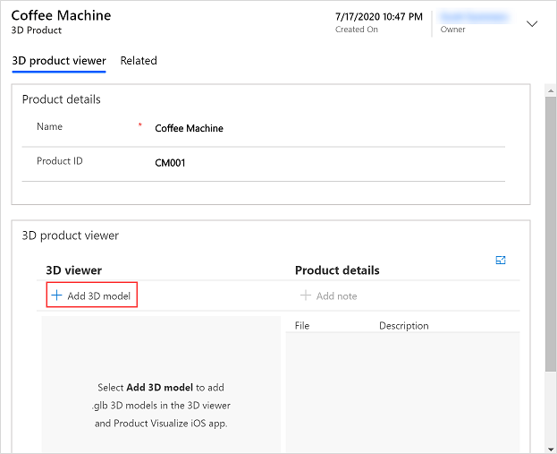
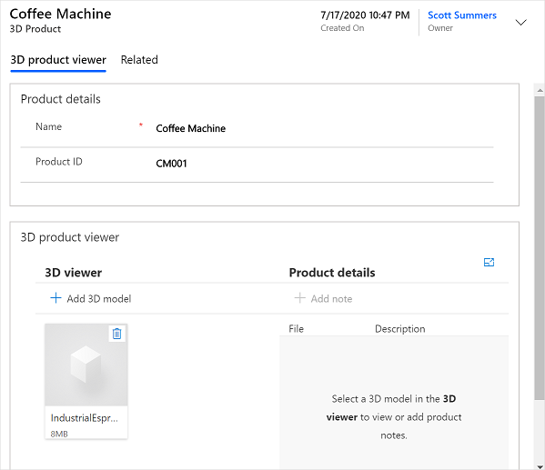
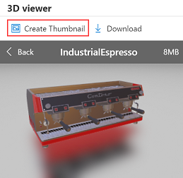
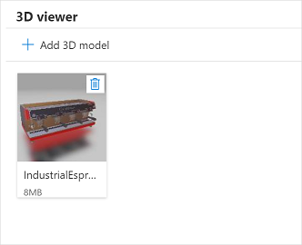

---
title: Add 3D models to a product and manage them in Dynamics 365 Product Visualize Hub
description: Instructions for adding 3D models to a product and managing them in Dynamics 365 Product Visualize Hub
ms.date: 07/17/2020
ms.topic: article
ms.service: dynamics-365-sales
author: sbmjais
ms.author: shjais
manager: shujoshi
---

# Add 3D models to a product

[!INCLUDE [cc-beta-prerelease-disclaimer](../includes/cc-beta-prerelease-disclaimer.md)]

Presenting complicated products to a customer by using traditional 2D materials is unsatisfactory, and creating physical 3D models is time-consuming and costly. Dynamics 365 Product Visualize simplifies the entire process of bringing 3D digital models into the real world.

**To add 3D models to a product**

1.  [Sign in to Dynamics 365 Product Visualize Hub](sign-in-app.md).

2.  In the left pane, select **3D product catalog**.

    

3.  On the **Active 3D Products** page, select the product to which you want to add a model.

    > [!NOTE]
    > If no products are displayed, it means you've not added any product. See [Add a 3D product](add-3d-product.md) to add a product.

4.  Under **3D viewer**, select **Add 3D model**.

    

5.  Find and select the 3D model by using your file browser. The model is uploaded and displayed under **3D viewer**.

    

6. Repeat steps 4 through 5 to add more 3D models.

## Manipulate a model

1.  [Sign in to Dynamics 365 Product Visualize Hub](sign-in-app.md).

2.  In the left pane, select **3D product catalog**.

3.  On the **Active 3D Products** page, select your product.

4.  Under **3D viewer**, select the model to you want to manipulate.

    - To zoom in on the model, hover over it and scroll up by using the mouse wheel.

    - To zoom out from the model, hover over it and scroll down by using the mouse wheel.

    - To manipulate your view of the model, click in the model and drag to change your view.

## Create a thumbnail of a model

When you add a 3D model to a product, no thumbnail is displayed for the model. It appears as shown in the following image.

When you add a thumbnail, an image of the model is displayed.

**To create a thumbnail for a model**

1.  [Sign in to Dynamics 365 Product Visualize Hub](sign-in-app.md).

2.  In the left pane, select **3D product catalog**.

3.  On the **Active 3D Products** page, select your product.

4.  Under **3D viewer**, select the model for which you want to create a thumbnail.

5.  Select **Create Thumbnail**.

    

6.  At the upper-left corner of the model, select **Back**. The thumbnail of the model is displayed.

    

## Delete a model

1.  [Sign in to Dynamics 365 Product Visualize Hub](sign-in-app.md).

2.  In the left pane, select **3D product catalog**.

3.  On the **Active 3D Products** page, select your product.

4.  Under **3D viewer**, select **Delete model**  on the model you want to delete.

### See also

[Sign in to Dynamics 365 Product Visualize Hub](sign-in-app.md) 
[Add a 3D product](add-3d-product.md) 
[Add a note to a model](add-note-model.md) 
[Create a mixed-reality session](create-mr-session.md) 
[Add a product to a mixed-reality session](add-product-mr-session.md) 
[Set up Microsoft Teams](setup-ms-teams.md)