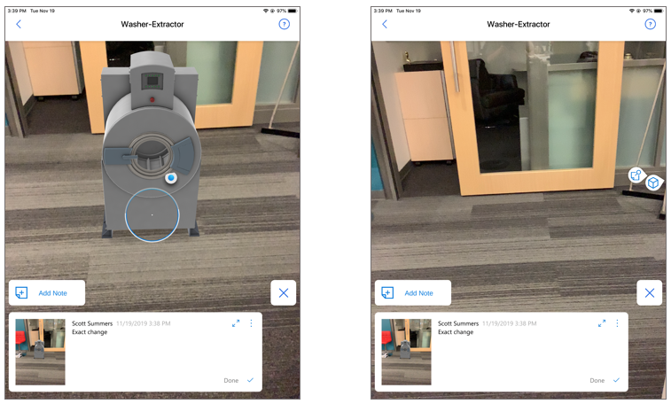
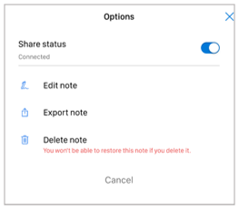

# Add a note to your 3D model in Dynamics 365 Product Visualize (in preview)

[!INCLUDE [cc-beta-prerelease-disclaimer](../includes/cc-beta-prerelease-disclaimer.md)]

You can capture notes on specific points on a 3D model and even add text or ink to the notes in Microsft Dynamics 365 Product Visualize (in preview). For example, when you’re out in the field with a customer, capture any required product changes directly on the model. 

To add a note, you tap the location of the model where you want to add the note, and then  take a picture of the model or upload a picture from your photo library to set the context.  Then you can ink on the image or add comments.  Notes you create are saved in a notes file in the Documents folder for the corresponding Dynamics 365 for Sales opportunity. 

Product Visualize includes a notes browser that makes it easy to see all the notes attached to a model. The notes appear as a card  at the bottom of the screen. You can swipe to move forward and backward between notes in the browser, or you can tap a blue dot (spatial anchor) to select any note attached to the model. If the note is off the screen, you’ll see a blue dot with an arrow that points in the direction of the note.  

## Add a note

1.	After placing a model, select **Notes** on the right side of the screen.

    
 
2.	Select **Add Note**.

    
 
3.	Tap the model where you want to place the note. 

    
 
4.	Do one of the following:

    -	To take a picture, select **Capture** on the right side of the screen. The app will take a picture of the model.
    
    -	To use a picture from your camera roll, select **Camera Roll**, and then select the picture you want.
    
        
   
5.	In the **Create Note** screen:

    - To ink on the screen, select a color and start drawing. For example, draw an arrow  to call out a particular part of the model.
    
    - To add text, tap the box at the bottom of the screen, and then enter the text you want.
    
       
 
       > [!NOTE]
       > If you’re not happy with the picture, select **Replace** to redo the capture or select a different picture from your camera roll. When you select **Replace**, any text you entered will be retained, but inking will be lost. 
    
6.	If you want to change the settings for sharing notes, in the **Create Note** screen, select **Share Settings**. By default, notes are shared in the opportunity timeline in Dynamics 365 for Sales. You can also choose to share notes in a Microsoft Teams channel, or you can turn off sharing altogether if you want. When you’re done changing settings, select **Update all**.  
 
    > [!TIP]
    > You can also access global settings for sharing notes. To do this, select the main menu button , select the **Edit** button next to the organization you’re signed in to, and then under **Sharing Notes**, select the option you want: **Dynamics 365 for Sales Opportunity Timeline** and/or **Connect Teams Channels**.
    

## View the notes attached to a model

1.	After placing the model, select **Notes** on the right side of the screen.

    
 
2.	Select **Browse**.  
 
3.	Tap a blue dot to open a specific note or swipe right or left in the notes browser at the bottom of the screen to go forward or backward between notes.

    > [!NOTE]
    > If you want to see a larger view of the notes, which is useful if you can’t see all the text in the notes card, tap the expand arrow in the upper-right corner of the notes card or flick up. Then you can use the scroll bar in the notes card to scroll the text. 
    
     
  
## Edit or delete a note

1.	Select **Notes** on the right side of the screen.
2.	Select **Browse** to open the notes browser.
3.	Select the **Overflow** menu  in the upper-right corner of the notes card.
4.	In the **Options** dialog box, select **Edit Note** or **Delete Note**.

     
  
## Change the share status of a note

By default, Product Visualize sends your notes to your Dynamics 365 for Sales timeline and any connected Microsoft Teams channel. If you turn this option off, your notes will be stored only in Product Visualize until you turn them back on again. 

To change the share status of a note:

1.	Select **Notes** on the right side of the screen.
2.	Select **Browse** to open the notes browser.
3.	Select the **Overflow** menu  in the upper-right corner of the notes card.
4.	In the **Options** dialog box, move the slider to turn **Output options** on or off.  
 
## Export a note
1.	Select **Notes** on the right side of the screen.
2.	Select **Browse** to open the notes browser.
3.	Select the **Overflow** menu  in the upper-right corner of the notes card.
4.	In the **Options** dialog box, select **Export Note**.   

### See also

[Open the app and sign in](sign-in.md) 
[Place and manipulate 3D models](manipulate-models.md) 
[Add your own 3D models](add-model.md) 
[Explore sample 3D models](explore-samples.md)
