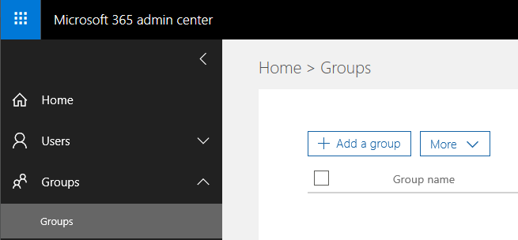
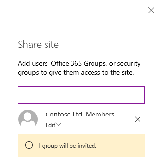
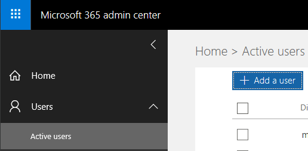
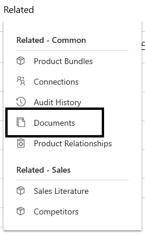

# Administrator Guide for Dynamics 365 Product Visualize (in preview)

[!INCLUDE [cc-beta-prerelease-disclaimer](../includes/cc-beta-prerelease-disclaimer.md)]

After you've completed the [setup process](setup.md) for Microsoft Dynamics 365 Product Visualize, you need to:

- Create an Office 365 user group and share your SharePoint site with that group

- Add users and assign security roles

- Add products

- Add opportunities

- Install the Product Visualize control if you want sales people to be able to open Product Visualize directly from Dynamics 365 for Sales

- Adjust permissions

This topic provides step-by-step procedures for all of the above.

## Set up a user group

You can use Office 365 Groups to choose a set of people to collaborate with and to set up a collection of shared resources. Providing access to the group saves time because that way, you don't have to provide individual SharePoint permissions. The group needs to have Read/Write permissions to the SharePoint site to make full use of Product Visualize.

### Create a user group

1. Open a new private browser window.

2. Go to [https://admin.microsoft.com](https://admin.microsoft.com) and sign in with the administrator credentials.

3. In the left navigation, select **Groups** and then select **Groups** again.

   

4. Near the top of the page, select the **Add a Group** button.

5. Give the group a name and set the Group Type to **Office 365**.

6. Add the admin user as the owner of the group by selecting the **Select Owner** button.

7. Select **Add** to finish adding the group.

### Share the SharePoint site with the group

1. Go to your trial's SharePoint site: [https://\<org name\>.sharepoint.com]().

2. In the upper-right corner of the page, select **Share Site**.

   

3. In the **Share** window, search for the group you created earlier, and then select the group name to add it to the site.

4. Grant the group Edit permission by selecting the small arrow under the group name.

   

5. Select **Share** to finish granting group access to SharePoint.

## Add users

The admin user created during the setup of your instance has full control of all aspects of your test environment. This user can administer your team's licenses, edit settings in Dynamics 365, and manage who has access to your services. The admin user can also add more users with more restrictive permissions so each salesperson can work with their own account.

New users must first be added in the Azure Active Directory, which assigns them a username and password. Then, the user must be assigned a security role in Dynamics 365 so they can access the Dynamics 365 applications.

### Add a user to your organization

1. Go to [https://admin.microsoft.com](https://admin.microsoft.com) and sign in with the administrator credentials.

2. In the left nagivation, select **Users**, and then select **Active Users**.

   

3. Near the top of the page, select the **Add a User** button.

4. In the **New User** dialog box, fill in the following fields:

    - First Name
    
    - Last Name
    
    - Display Name
    
    - Username
    
    - Location
    
5. Assign the user a role based on the resources they need to access:

    * **User** - This user won't have permissions to the Microsoft 365 admin center or any admin tasks.
    
    * **Global Administrator** - This user will have access to all features in the admin center and can perform all tasks in the Microsoft 365 admin center.
    
    * **Custom Administrator** - You can assign this user one or many roles so they can manage specific areas of Office 365.
    
6. Enable the licenses for **Dynamics 365 for Sales** and **Office 365 Enterprise**, and then select **Add**.

7. In the confirmation page, make note of the username and password before selecting **Close**.

8. Select the user you just created, and then select **Edit** next to **Group Memberships**.

   

9. Click the **Add Memberships** button, search for the user group you created earlier, and then select the group name to add the user to the group.

10. Select **Close** to finish adding the user.

    > [NOTE]
    > It may take some time for users added to your organization to show up in Dynamics 365, so it's a good idea to add all the users to your organization before continuing.

### Assign a security role to the user

1. In your private browser window, go to your Dynamics 365 URL [https://\<org name\>.crm.dynamics.com]().

2. Select the Sales Hub application in the list.

   

3. Select the **Settings** button in the upper-right corner of the page, and then select **Advanced Settings**.

4. In the **Settings** drop-down list at the top of the page, select **Security**.

   

5. In the **Security** page, select **Enabled Users**.

6. Select the name of the user you created.

7. In the **Users** page, from the menu bar near the top of the page, select **Approve Email** so the user is synced by the server.

   

8. On the menu bar, select **Manage Roles**.

   

9. Select the **Sales, Enterprise app access** and **Salesperson** options from the list, and then select **OK**.

## Add products

*Products* are the things you sell to the customer, which can be physical goods or services. Products that a customer may be interested in purchasing are added to a sales opportunity. This enables salespeople to exactly track a customer's needs to the potential revenue a sale might bring in.

Products are sold in *units*, which represent the possible quantities that are sold together. Examples of units include hours, cases, or pallets. Units are grouped into *unit groups* which keep units with a similar purpose together. If you sell services, 'time' might be a unit group containing days, hours, and minutes. 

Products may be priced differently depending on who you are selling to, when the sale is happening, and where the customer works. Prices with a similar purpose are grouped together into *Price Lists*. For example, you may have one price list for customers in Canada and another for customers in the U.S.

Individual products can be arranged into a hierarchy, as well. *Product Families* allow you to categorize similar products based on your organization's needs.

This section provides step-by-step instructions for creating a new price list, product family, and product. Dynamics 365 provides default values for units and unit groups.

### Create a price list

1. Go to the Dynamics 365 Sales Hub [https://\<org name\>.crm.dynamics.com](https://\<org\>.crm.dynamics.com).

2. In the upper-right corner of the page, select the **Settings** button, and then select **Advanced Settings**.

3. In the **Settings** drop-down list at the top of the page, select **Product Catalog**.

   

4. Select **Price Lists**.

5. Create a new price list by selecting **New** near the top-left of the page.

   

6. Give the price list a name (Default Price List), and then select **Save and Close**.

   

### Create a product family (optional)

1. Go to the Dynamics 365 Sales Hub [https://\<org name\>.crm.dynamics.com](https://\<org\>.crm.dynamics.com).

2. Open the navigation menu on the left, and then select **Products**.

   

3. Select **Add Family** to create a new product family.

   

4. Give the family a name (Product Samples) and a Product ID (PS-1), and then select **Save and Close**.

5. Select **Publish** to finish creating the product family.

   

### Create a product

1. In the left navigation, select **Products** to return to the product list. 

2. Select **Add Product** to create a new product.

   

3. Add values for **Name** and **Product ID** (use any values that you want).

4. Set the **Parent** field to the **Product Samples** (the product family created in the previous procedure).

5. Set the **Unit Group** field to **Default Unit**, and set the **Default Unit** field to **Primary Unit**.

6. Set the **Decimals Supported** to **2**.

7. Select **Save**, but don't close the product.

8. Set the **Default Price List** field to **Default Price List**.

9. Select the **Additional Details** tab, directly above the **Name** field.

10. In the **Price List Items** section, select **Add New Price List Item**.

11. Assign the price list created earlier in the **Price List** field.

12. Switch to the **Pricing Information** tab, and then fill in the **Amount** field with the price for your product.

13. Select **Save**.

## Add models

Presenting complicated products to a customer with traditional 2D materials is unsatisfactory and creating 
physical 3D models is time-consuming and costly. Product Visualize simplifies the entire process by bringing 3D digital 
models into the real-world. 

Product Visualize makes use of the widely available GL Transmission Format (glTF) to store model data. Many of the most popular 3D modeling products used by engineering and marketing teams already support this format and exporting tools exist to convert many other formats to glTF. This section provides step-by-step instructions for adding a model and thumbnail image to Product Visualize.

### Add a model

1. In the left navigation, select **Products** to go back to the **Product list** page.

2. Select a product to open it. 

3. On the **Related** tab, select **Documents**.

   

   You'll see a view of the SharePoint Document location for that product.

4. In the **Open Location** drop-down list, select **Documents on Default Site 1** to open the SharePoint location outside of Dynamics 365.

5. Drag and drop your model folder into this location. It will automatically show up in Product Visualize. Add models using the following folder structure:

    * \<Product>
      * \<Model Name> (Folder)
        * \<Model Name>.gltf
        * Thumbnails (Folder)
            * \<ModelName>.png
      *  \<Model Name> (Folder)
         * \<Model Name>.gltf
         * Thumbnails (Folder)
            * \<ModelName>.png

## Add opportunities

Opportunities represent a chance to sell your products to a customer. They capture a customer's needs, budget, and timeline, in addition to the list of products the customer is interested in buying. Salespeople can view their open opportunities directly from the Product Visualize app, but they must be added through the Sales Hub interface.

### Add an opportunity

1. Go to the Dynamics 365 Sales Hub.

2. In the left navigation, select **Opportunities**.

   

3. Select **New** at the top of the page to create a new opportunity.

4. In the **Topic** field, add a name for the opportunity.

5. Assign the **Owner** field to any user you already added (optional).

6. Select **Save**, but don't close the opportunity.

7. Open the **Product Line Items** tab. 

   

8. Set the **Price List** to the one created earlier.

9. Select the **Add New Opportunity Product** button. 

   

10. In the **Existing Product** field, select one of the products you created.

11. In the **Quantity** field, enter a quantity.

12. Select **Save and Close**.

## Install the Product Visualize Control

The Product Visualize Control is an optional enhancement that allows salespeople to open the Product Visualize app directly from Dynamics 365 for Sales on their mobile devices. The control is lightweight and can easily be updated and removed.

### Import the Product Visualize solution

1. Go to the Dynamics 365 Sales Hub.

2. Select the **Settings** button, and then select **Advanced Settings**.

3. In the **Settings** drop-down list at the top of the page, select **Solutions**.

4. Download the **Product Visualize** solution to your PC.

5. Import the solution by clicking the **Import** button and selecting the solution zip file you downloaded.

### Customize the Opportunity page

There are numerous ways you can customize your Opportunity page in Dynamics 365 for Sales. This procdrue provides suggested customizations, but feel free to adapt to your needs.

1. In the **Settings** drop-down list at the top of the page, select **Customizations**, and then select **Customize the System**.

2. In the panel on the left, select **Entities > Opportunity > Forms**.

3. Select the **Opportunity** form where the **Form Type** is set to **Main** (not the one marked **Quick Create**).

4. In the **Summary** section, on the **Insert** menu at the top of the page, insert a **One Column Tab**.

5. Double-click the newly created tab, set the **Name** and **Label** fields to **Product Visualize**, and then select **OK**.

6. Drag a **Description** field into the newly created tab from the menu on the right. You may have to clear the check box for the **Only Show Unused Fields** options to see the **Description** field.

7. Double-click the **Description** field you just placed to open the **Field Properties** dialog box.

8. On the **Display** tab, clear the check box for **Display Label on the Form**.

9. On the **Controls Page**, add the **Product Visualize** control from the list, and then select the **Web**, **Phone**, and **Tablet** options.

10. Select **OK** to finish adding the control.

11. Select **Save** to save your changes from the menu bar.

12. Select **Publish** to publish your changes and make them immediately visible on any Opportunity page.

## Accept app permissions

The Product Visualize mobile app requires permission to access the Dynamics 365 for Sales and SharePoint instances you set up earlier. As a global administrator for the trial tenant you can grant access to the entire organization so that each user doesn't have to do it individually.

1. Download the **Microsoft Dynamics 365 Product Visualize** app from the Apple App Store.

2. Open the app, select **Sign In**, and then enter the administrator credentials for the trial environment.

3. At the **Permissions Requested** prompt, select **Consent on behalf of your organization**.

4. Select **Accept** to return to the app.

## What's next?

You now have everything you need to start using Microsoft Dynamics 365 Product Visualize! New opportunities, products, and models will show up automatically in the application after they have been added to Dynamics 365 for Sales. For help or feedback, use the **Feedback** button in the Product Visualize app.

### See also

[Requirements for setting up Dynamics 365 Product Visualize](requirements.md) 
[Set up Dynamics 365 Product Visualize](setup.md) 
[User Guide](user-guide.md) 
[FAQ](faq.md) 

