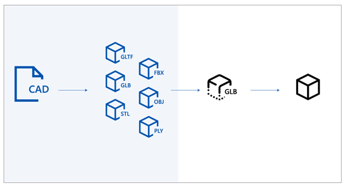

# Convert your 3D (CAD) models to use with mixed-reality applications

To use your 3D models with [!include[pn-dyn-365](../includes/pn-dyn-365.md)] mixed-reality applications, you need to convert them to a file format that supports real-time rasterization. 

 

## Tools for exporting CAD models

CAD models can be exported directly to glTF format or into intermediate formats that can be subsequently processed into glTF files. If your content-creation application does not have a glTF exporter, we recommend exporting to [FBX](https://aka.ms/FBXfileformat), [OBJ](https://en.wikipedia.org/wiki/Wavefront_.obj_file), [STL](https://en.wikipedia.org/wiki/STL_(file_format)), or [PLY](https://en.wikipedia.org/wiki/PLY_(file_format)), if available. If these formats are not available, there are third-party applications that can import many different file formats and export them as one of these supported file formats. 

Your use of third-party applications is subject to terms between you and the third party. [!include[cc-microsoft](../includes/cc-microsoft.md)] does not endorse any particular third-party application and assumes no responsibility or liability for any third-party application you elect to use.

|Content-creation package|Description|
|-----------------------------------------------|---------------------------------------------------------------|
[Blender.org Blender](https://aka.ms/Blender_2.8)|Native import/export for Blender 2.8 or later|
[Autodesk 3DS Max](https://aka.ms/BabylonJS_Max2Babylon_Installation)|Babylon.JS plug-in for Max 2015 or later|
[Autodesk Maya](https://aka.ms/BabylonJS_Maya2Babylon_Installation)|Babylon.JS plug-in for Maya 2018 or later|
[Trimble SketchUp](https://aka.ms/SketchUp_glTF_Export)|Separate extensions for [import](https://aka.ms/Sketchupimport) and [export](https://aka.ms/sketchupexport)|
|[Allegorithmic Substance Painter](https://aka.ms/SubstancePainter_glTF_Exporter)|Native exporter|
|[SideFX Houdini](https://aka.ms/Houdini_glTF_Exporter)|Native import/export|
|[Maxon Cinema 4D](https://www.maxon.net/products/cinema-4d/overview/)|Native export plug-in|

In situations where a CAD application doesn’t have an export option for FBX, OBJ, GLB, PLY, STL, or glTF, you can export an intermediate file, such as [JT](https://aka.ms/Jtfileformat) or [STEP](https://aka.ms/STEPfileformat), and then process that file to create a glTF file. 

### See also
[Optimize 3D models](optimize-models.md) 
[Best practices for converting and optimizing models](best-practices.md) 
[Tutorials for converting and optimizing 3D models](tutorials-overview.md) 

[!INCLUDE[footer-include](../includes/footer-banner.md)]