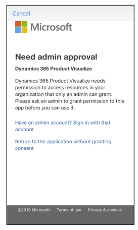

# FAQ: Dynamics 365 Product Visualize

[!INCLUDE [cc-beta-prerelease-disclaimer](../includes/cc-beta-prerelease-disclaimer.md)]

## What are the requirements for running Microsoft Dynamics 365 Product Visualize, and what platforms does it support?

For information on platforms and requirements, check out [our Requirements page](requirements.md).

## What kind of 3D content can I add?

Product Visualize supports GLB files only.

## How do I get my content in the right format?

To learn how to format your content, see the following page on the Kronos website: [Art Pipeline for glTF](https://go.microsoft.com/fwlink/p/?linkid=2083000). 

## How does Product Visualize connect with Dynamics 365 for Sales?

After you sign in with your Azure Active Directory credentials, Product Visualize displays organizations associated with your Dynamics 365 for Sales account. Opportunities and products associated with your organizations automatically show up in the app, as do 3D models attached to your products.
	
## Can I use Product Visualize to do remote sales?

At this time, Product Visualize does not support remote capabilities.

## Why is the "Need admin approval" message displayed after signing in?

This message indicates that your organization requires administrator approval before any new apps can be used to access organizational resources. Talk to your system administrator to get approval to use Product Visualize in your organization. In the meantime, you can set up a [free trial version](setup.md). 

## Why don't I see my Dynamics instances?
 
Product Visualize can connect to instances of Dynamics 365 for Sales version 9 or later. It doesn't support on-premises Dynamics 365 solutions or older instances of Dynamics 365 for Sales. Make sure your instance meets the [minimum requirements](requirements.md) for using Product Visualize. If your instance meets the requirements, make sure you're signed in to the app with the same credentials you use to access Dynamics 365 for Sales.

## Why am I getting a message that says my organization isn't set up to use Product Visualize?

This message indicates the Dynamics for Sales instance you selected doesn't meet the [minimum requirements](requirements.md) for using Product Visualize. If you have access to more than one Dynamics for Sales instance, make sure you selected the correct one.

## How do I find my opportunities?

Product Visualize helps you stay organized by focusing only on the opportunities that are important to you. From the Opportunity Selection view there are three options for viewing your opportunities:

1. **My Open Opportunities** - Open opportunities where you are listed as the owner.
2. **My Connected Opportunities** - Open opportunities where you have been added to the Sales team.
3. **My Followed Opportunities** - Open opportunities that have been marked as __Followed__.

If an opportunity doesn't show up in the application, go to the Dynamics 365 Sales Hub and ensure that at least one of these criteria is met.

## Why doesn't my model load?

Models with very high polygon counts may take a long time to load, especially over slower connections. If the model doesn't load at all,  the GLB file may not be valid. A corrupt or invalid GLB file may appear as loading but it will never actually ever load. If this happens, restart the app and try again. If, after restarting, the model still fails to load, try re-exporting the GLB from your authoring software and upload it again to SharePoint. If that doesn't work, try loading the model in a different glTF viewer like [BabylonJS Sandbox](https://sandbox.babylonjs.com/). 

Larger models may exceed the memory of the mobile device you are using. This is especially true on previous generation iPhones. To reduce the model's memory requirements, reduce the size of any textures associated with the model and decimate the model to use fewer polygons.

### See also

[Requirements for setting up Dynamics 365 Product Visualize](requirements.md) 
[Setup](setup.md) 
[Administrator Guide](admin-guide.md) 
[User Guide](user-guide.md) 
