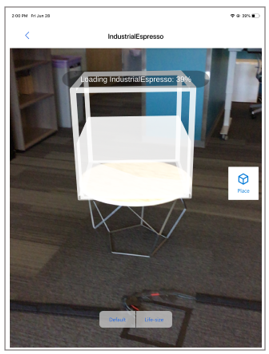
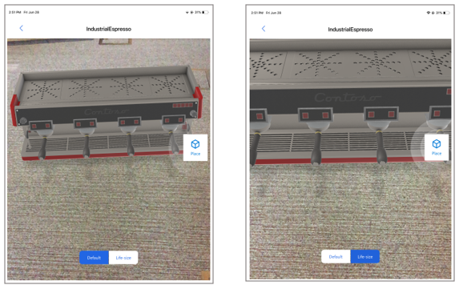
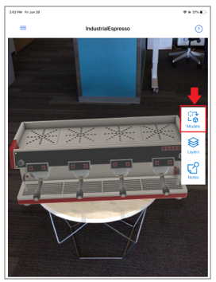

# Place and manipulate 3D models in Dynamics 365 Product Visualize (in preview)

[!INCLUDE [cc-beta-prerelease-disclaimer](../includes/cc-beta-prerelease-disclaimer.md)]

The home screen of Microsoft Dynamics 365 Product Visualize (in preview) is the **My Open Opportunities** page. Each opportunity typically has multiple products within it, and each product can have multiple 3D models. 

## View a 3D model in augmented reality 

1.	Open the opportunity you want to focus on.

2.	Select a product within that opportunity.

3.	Select the 3D model you want to view.

4.	In a brightly lit environment, point your device down toward a flat surface like the floor or a desk. Move your device around slowly to allow Product Visualize to find the surface. 

    

    After you find a suitable surface, you’ll see the model loading indicator:
    
    
 
    After the model has loaded, it will appear in the default size. You can view the model in this size or at life-size scale. 

5.	If you want to change the size of the model to life-size before you place it, select the **Life-size** button (right button at the bottom of the screen). 

    
  
6.  To place the model, select **Place** on the right side of the screen.

    

## Switch to a different model

After placing a model, if you want to view a different model, you can switch models very easily.

1.	Select **Models** on the right side of the screen.

    
 
2.	In the **Models** screen, select the model you want to view.

    
 
3.	Switch between the default size or life-size if desired (note that you can’t change the scale until the model is loaded), and then place the model as described in the previous procedure.  

## Move, rotate, or change the size of your model

Chances are, you’ll want to move, rotate, or change the size of your model in some way after you place it. You use the **Transform** button to do any of these actions after placing your model.

### Change the size of your model

When you change the size of your model, you can switch between the default size and life-size. 

1.	Select the **Transform** button on the right side of the screen.

2.	Select the **Resize** button. 

    

3.	Spread or pinch your fingers to change the size of the model.

    > [!TIP]
    > Select **Undo** if you ever need to undo your changes when you’re transforming the model.

### Rotate your model  

1.	Select the **Transform** button on the right side of the screen.

2.	Select the **Rotate** button.

    
  
3.	Drag your finger on the screen to rotate the model. 

### Move the model

1.	Select the **Transform** button on the right side of the screen.

2.	Select the **Move** button.

    
  
3.	Drag your finger on the screen to move the model.  

### Move the model up or down

1.	Select the **Transform** button on the right side of the screen.

2.	Select the **Lift** button.

    
  
3.	Drag your finger up or down on the screen. 

### See also

[Open the app and sign in](sign-in.md) 
[Add a note to your 3D model](add-note.md) 
[Add your own 3D models](add-model.md) 
[Explore sample 3D models](explore-samples.md)
