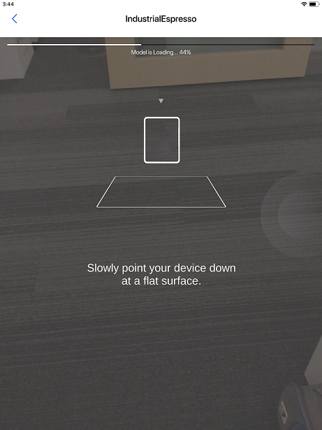
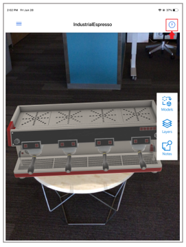

# Place and manipulate 3D models in Dynamics 365 Product Visualize

[!INCLUDE [cc-beta-prerelease-disclaimer](../includes/cc-beta-prerelease-disclaimer.md)]

The home page of Microsoft Dynamics 365 Product Visualize is the **My Open Opportunities** page. Each opportunity typically has multiple products within it, and each product can have multiple 3D models. 

> [!NOTE]
> If you're the administrator, to learn how to add 3D models to Dynamics 365 for Sales, see the [Administrator guide](admin-guide.md).

## View a 3D model in mixed reality 

1.	Open the opportunity you want to focus on.

2.	Select a product within that opportunity.

3.	Select the 3D model that you want to view.

4.	In a brightly lit environment, point your device down toward a flat surface like the floor or a desk. Move your device around slowly to allow Product Visualize to find the surface. 

    

    After you find a suitable surface, you’ll see the model-loading indicator:
    
    
 
    When the model loads, it appears in the default size. You can view the model in this size or at life-size scale. 

5.	If you want to change the size of the model to life size before you place it, select  **Life-size** (right button at the bottom of the screen). 

    
  
6.  To place the model, select **Place** on the right side of the screen.

    

## Switch to a different model

After placing a model, if you want to view a different model, you can switch models very easily:

1.	Select **Models** on the right side of the screen.

    
 
2.	on the **Models** screen, select the model you want to view.

    
 
3.	Switch between the default size or life size as needed (you can’t change the scale until the model is loaded), and then place the model as described in the previous procedure.  

## Move, rotate, or change the size of your model

Chances are, you’ll want to move, rotate, or change the size of your model in some way after you place it. You can use various gestures to do any of these actions after placing your model.

### Change the size of your model

Spread or pinch two fingers on the screen to change the size of the model. You can also double-tap to switch between the default size and life size.
When you change the size of your model, you can switch between the default size and life size. 

### Rotate your model  

Rotate two fingers on the screen to rotate the model.

### Move the model

To move the model sideways, drag one finger on the screen.

### Move the model up or down

To move the model up or down, drag two fingers up or down on the screen.

### See also

[Install, open, and sign in to the app](sign-in.md) 
[Add a note to your 3D model](add-note.md) 
[View layers of your 3D model](layers.md) 
[Explore sample 3D models](add-model.md) 

