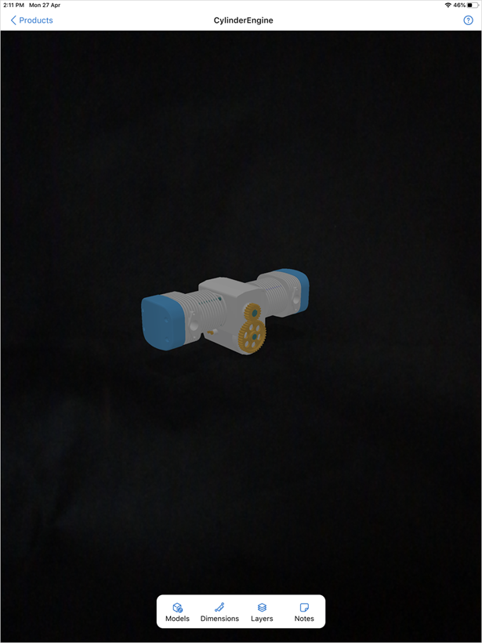

# Place and manipulate 3D models in Dynamics 365 Product Visualize

[!INCLUDE [cc-beta-prerelease-disclaimer](../includes/cc-beta-prerelease-disclaimer.md)]

The home page of Dynamics 365 Product Visualize is the **My Active Mixed Reality Sessions** page. Each session typically has multiple products within it, and each product can have multiple 3D models.

## View (place) a 3D model in mixed reality 

1.	Open the mixed-reality session you want to focus on.

2.	Tap a product within that opportunity.

    

3.	In a brightly lit environment, point your device down toward a flat surface like the floor or a desk. Move your device around slowly to allow Dynamics 365 Product Visualize to find the surface. After you find a suitable surface, you'll see the model-loading indicator and a message that a surface has been found.

    > [!div class=mx-imgBorder]
    > 

4.  To place the model, tap **Place** at the bottom of the screen. The model is placed at the surface.

    > [!div class=mx-imgBorder]
    > 
    
    > [!TIP]
    > If you want to see dimensions for the model, enable the **Product dimensions** feature. To enable this feature, see [Enable product dimensions](product-dimensions.md). After enabling the feature, tap **Dimensions** at the bottom of the screen to see the dimensions for the 3D model.  Preview features are experimental features that provide access to new innovations that the Dynamics 365 Product Visualize team is working on.  

## Manipulate your model

After you've placed your model on the appropriate surface, you're ready to manipulate it further if you need to display it to your customer.

### Scale your model

Scaling your model means to increase or decrease the model's size. To scale your model, spread or pinch using two fingers.

> [!TIP]
> - To quickly reach 100&nbsp;percent scale, double-tap the model. A second double-tap will return the model to its original scale. You can quickly switch between those two sizes by using the double-tap gesture.
> - When you're scaling the model, a notification will appear on the screen telling you what percent scale your model is. When you take your fingers off the screen, this notification will disappear. The 100&nbsp;percent scale indicates life-size or true size, based on the product specifications.
> - Be careful not to rotate your fingers as you scale, to avoid accidentally rotating the model.

> [!div class=mx-imgBorder]
> 

### Rotate your model  

To rotate your model around the vertical axis, use two fingers placed anywhere on the screen. Hold one finger in place, and twist the other around it.

> [!TIP]
> - You don't need to be touching the model to rotate it. You can touch anywhere on the screen to perform manipulations.
> - It isn't possible to rotate the model around the horizontal axis.
> - Be careful to keep your fingers the same distance apart as you rotate them, to avoid accidentally scaling the model up or down.

> [!div class=mx-imgBorder]
> 

### Move your model

To move your model left or right, away or toward you, just drag it with one finger.

> [!TIP]
> - When you drag the model farther away, it might look like you're lifting it off the selected surface, but this is just a trick of perspective.
> - If you move your model very far away from you, it might suddenly appear tiny and difficult to manipulate. Simply drag the model back toward you using one finger until it appears to be back where you originally placed it.
> - Be careful to avoid touching a second finger to the screen while you're trying to move or place your model. If the model is difficult to move or not behaving as expected, check that you aren't touching any other part of the screen at the same time that you perform the manipulation. 

> [!div class=mx-imgBorder]
> 

### Lift your model up or down

To lift your model in a vertical direction up or down, use two fingers placed side by side on the screen and slowly drag the model in the direction you want.

> [!TIP]
> - If you want to place your model onto a new surface (that is, one higher or lower than the original surface you scanned), you must go back to the **Products** page and reload the model to place it on a new surface. Moving a model to a new surface after you've lifted it can interfere with re-scanning the new surface.
> - Just as with moving your model, it's possible to lift or lower the model so far away that it suddenly appears tiny and difficult to manipulate. Simply use two fingers to drag the model back up or down until it appears to be back where you originally placed it.

> [!div class=mx-imgBorder]
> 

## Switch to a different model

After placing a model, you can easily switch to view a different model.

1.	Tap **Models** at the bottom of the screen.

    > [!div class=mx-imgBorder]
    > 
 
2.	Tap the model you want to view.

    > [!div class=mx-imgBorder]
    > 
 
3.	Place the model as [described previously](#view-place-a-3d-model-in-mixed-reality). 

### See also

[Install, open, and sign in to the app](sign-in.md) 
[Add a note to your 3D model](add-note.md) 
[Show or hide a layer in 3D model](layers.md) 
[Explore sample 3D models](explore-samples.md) 
[View 3D models stored on your device](browse-models.md) 
[Download 3D models to use offline](download-models.md) 
[Enable product dimensions](product-dimensions.md)
