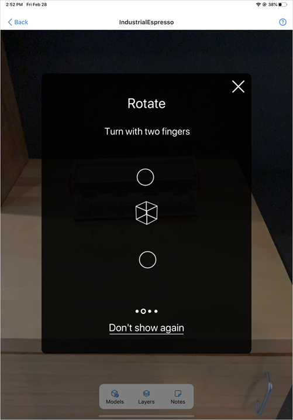
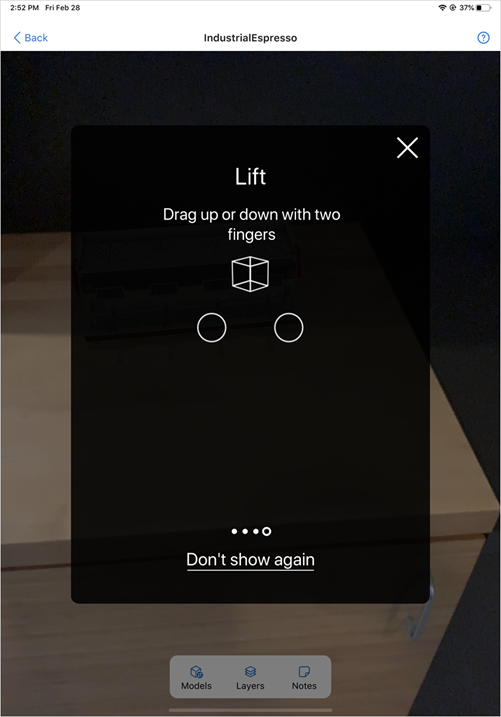
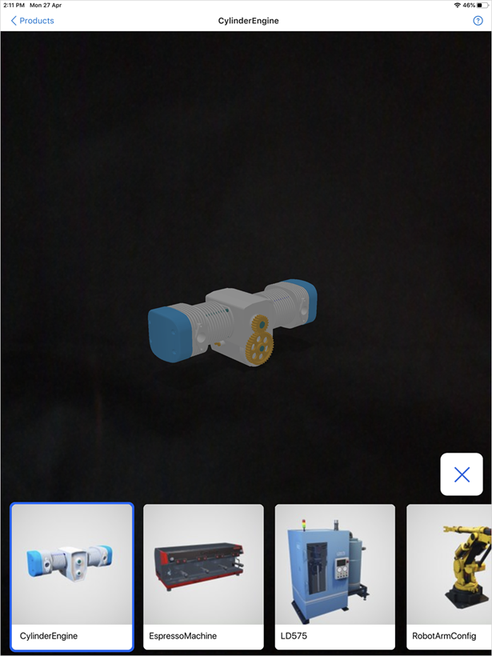

# Place and manipulate 3D models in Dynamics 365 Product Visualize

[!INCLUDE [cc-beta-prerelease-disclaimer](../includes/cc-beta-prerelease-disclaimer.md)]

The home page of Microsoft Dynamics 365 Product Visualize is the **My Open Opportunities** page. Each opportunity typically has multiple products within it, and each product can have multiple 3D models.

> [!NOTE]
> If you're the administrator, you can learn how to add 3D models to Dynamics 365 Sales through the [Administrator guide](admin-guide.md).

## View (place) a 3D model in mixed reality 

1.	Open the opportunity you want to focus on.

2.	Tap a product within that opportunity.

    
    
3.	In a brightly lit environment, point your device down towards a flat surface like the floor or a desk. Move your device around slowly to allow Dynamics 365 Product Visualize to find the surface. After you find a suitable surface, you'll see the model-loading indicator and a message that a surface has been found.

    > [!div class=mx-imgBorder]
    > 

4.  To place the model, tap **Place** on the right side of the screen. The model is placed at the surface.

    > [!div class=mx-imgBorder]
    > 
    
    > [!TIP]
    > If you want to see dimensions for the model, enable the **Product dimensions** feature. To enable this feature, see [Enable product dimensions](product-dimensions.md). After enabling the feature, tap **Dimensions** on the right side of the screen to see the dimensions for the 3D model.  Preview features are experimental features that provide access to new innovations that the Dynamics 365 Product Visualize team is working on.  

## Manipulate your model

Once you've placed your model on the appropriate surface, you're ready to manipulate it further if you need to display it to your customer.

### Scale your model

Scaling your model means to increase or decrease the model's size. To scale your model, spread or pinch using two fingers.

> [!TIP]
> - To quickly reach 100% scale, double-tap on the model. A second double-tap will return the model to whatever scale it began at and you can quickly switch between those two sizes using the double-tap gesture.
> - When you are scaling the model, a notification will appear on the screen telling you what percent scale your model is. When you take your fingers off the screen, this notification will disappear. The 100% scale indicates life size or true size based on the product specifications.
> - Be careful not to rotate your fingers as you scale to avoid accidentally rotating the model.

> [!div class=mx-imgBorder]
> 

### Rotate your model  

To rotate your model around the vertical axis, use two fingers placed anywhere on the screen, holding one finger in place and twisting the other around it.

> [!TIP]
> - You do not need to be touching the model in order to perform rotation. You can touch anywhere on the screen to perform manipulations.
> - It is not possible to rotate the model around the horizontal axis.
> - Be careful to keep your fingers the same distance apart as you rotate them to avoid accidentally scaling the model up or down in size.

> [!div class=mx-imgBorder]
> 

### Move your model

To move your model left or right, away or towards you, just drag it with one finger.

> [!TIP]
> - It may look like dragging the model farther away is lifting it off the selected surface, but this is just a trick of perspective.
> - If you move your model very far away from you, it may suddenly appear tiny and difficult to manipulate. Simply drag the model back towards you using one finger until it appears to be back where you originally placed it.
> - Be careful to avoid touching a second finger to the screen while you are trying to move or place your model. If the model is difficult to move or not behaving as expected, check that you are not touching any other part of the screen at the same time that you perform the manipulation. 

> [!div class=mx-imgBorder]
> 

### Lift your model up or down

To lift your model in a vertical direction up or down, use two fingers placed side-by-side on the screen and slowly drag the model in the direction you want.

> [!TIP]
> - If you want to place your model onto a new surface (i.e. one higher or lower than the original surface you scanned), you must go back to the **Products** page and reload the model to place it on a new surface. Lifting the model after it is placed will often not re-scan the new surface successfully.
> - Just as with moving your model, it is possible to lift or lower the model so far away that it suddenly appears tiny and difficult to manipulate. Simply use two fingers to drag the model back up or down until it appears to be back where you originally placed it.

> [!div class=mx-imgBorder]
> 

## Switch to a different model

After placing a model you can easily switch to view a different model.

1.	Tap **Models** on the right side of the screen.

    
 
2.	Tap the model you want to view.

    
 
3.	Place the model as described in the previous procedure.  

### See also

[Install, open, and sign in to the app](sign-in.md) 
[Add a note to your 3D model](add-note.md) 
[Show or hide a layer in 3D model](layers.md) 
[Explore sample 3D models](explore-samples.md) 
[View 3D models stored on your device](browse-models.md) 
[Add your own 3D model to an existing Dynamics 365 Sales product](add-model.md) 
[Download 3D models to use offline](download-models.md)

