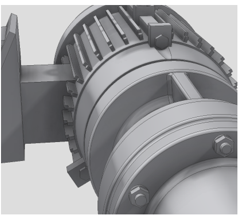
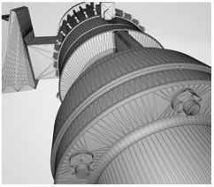
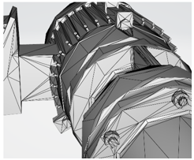

# Optimize your 3D models to use with mixed-reality applications

For best rendering and best possible real-time performance, your 3D models need to be converted and might need to be optimized. Third-party applications that convert CAD files often have tools that can optimize content as well. 

The following table lists software tools that you can use to convert and/or optimize your CAD files or intermediate files and export them as a supported file format. Your use of third-party applications is subject to terms between you and the third party. [!include[cc-microsoft](../includes/cc-microsoft.md)] does not endorse any particular third-party application and assumes no responsibility or liability for any third-party application you elect to use.

|Software|Import|Export|Convert/transcode|Optimization|
|---------------------------------|----------------------------------------|--------------------|--------------------|-------------------|
|[PiXYZ Software](https://aka.ms/Pixyz)|STEP, Catia, JT, OBJ, FBX, and more|glTF 2.0|Yes|Yes|
|[Maxon Cinema 4D](https://aka.ms/MaxonCinema4D)|SOLIDWORKS, STEP, Catia, JT, and IGES|FBX, OBJ, GLB/glTF 2.0 (beta)|Yes|Yes|
|[Simplygon Studios](https://aka.ms/Simplygonsoftware)|FBX, OBJ|FBX|No|Yes|
|[Unreal Datasmith](https://aka.ms/UnrealDatasmithsoftware)|STEP, Catia, JT, OBJ, FBX, and more|FBX, OBJ|Yes|No|
|[Autodesk Inventor](https://aka.ms/AutodeskInventorSoftware)|STEP, Catia, JT, OBJ, FBX, and more|FBX, OBJ, STL|Yes|Yes|
|[Blender](https://www.blender.org/)|Collada (DAE), FBX, PLY, OBJ, STL, glTF, GLB, and more|FBX, OBJ, glTF 2.0, and more|Yes|Yes|

 
Here are examples of CAD, converted, and optimized 3D models.  

|CAD|Converted to GLB|Optimized GLB|
|------------------------------------------|----------------------------------------------|----------------------------------------------|
||||
|Original CAD file|52,000 triangles|9,000 triangles|

## Performance targets

The [!include[pn-dyn-365](../includes/pn-dyn-365.md)] mixed-reality applications can be used on [!include[cc-microsoft](../includes/cc-microsoft.md)] [!include[pn-hololens](../includes/pn-hololens.md)], immersive headsets, and mobile devices. The goal is to provide the highest possible visual fidelity without adversely affecting performance. 

The following table lists some general conservative targets to aim for when acquiring or authoring 3D models for a range of hardware. When in doubt, target the midrange profile for a balance of fidelity and performance. 

||Low-scene complexity |Medium-scene complexity |High-scene complexity |
|--------------|---------------------------|-----------------------------------|-----------------------------------|
| HoloLens|**Objects:** 1-3 per scene  **Triangles:** <100,000  **Materials:** 1-2 per object|**Objects:** 4-10 per scene  **Triangles:** <30,000  **Materials:** 1-2 per object|**Objects:** 10+ per scene  **Triangles:** <10,000  **Materials:** 1-2 per object|
|  Immersive headsets|**Objects:** 1-3 per scene  **Triangles:** <15,000,000  **Materials:** 1-2 per object|**Objects:** 4-10 per scene  **Triangles:** <500,000  **Materials:** 1-2 per object|**Objects:** 10+ per scene  **Triangles:** <150,000  **Materials:** 1-2 per object|
|  Mobile|**Objects:** 1-3 per scene  **Triangles:** <500,000  **Materials:** 1-2 per object|Not applicable|Not applicable|

> [!NOTE]
> Transparency in materials such as glass in 3D models is not supported.

### See also
[Convert 3D models](convert-models.md) 
[Best practices for converting and optimizing 3D models](best-practices.md)
