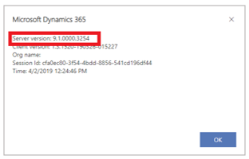
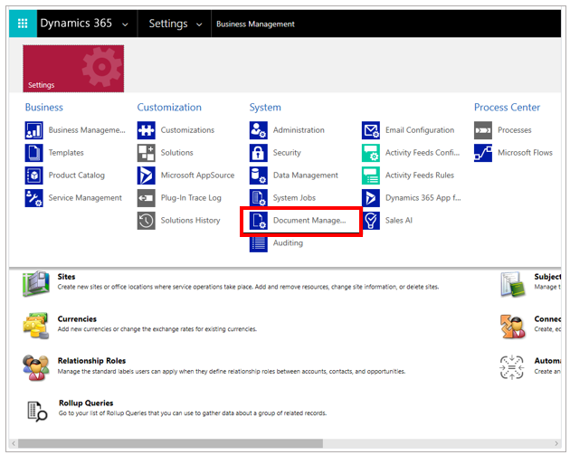
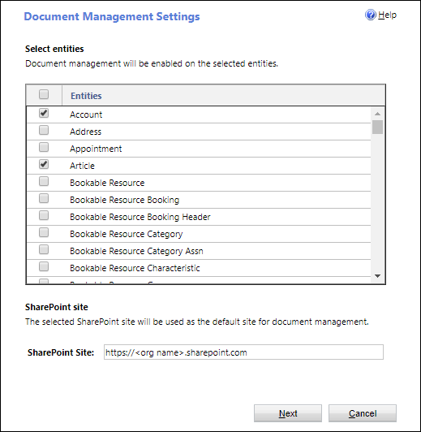
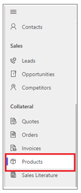
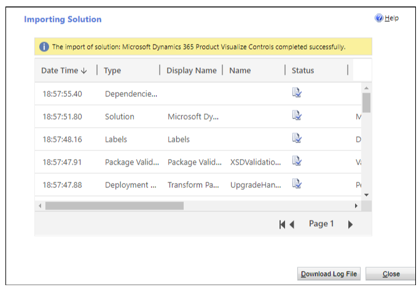

# Set up Dynamics 365 Product Visualize on an existing Dynamics 365 Sales instance

[!INCLUDE [cc-beta-prerelease-disclaimer](../includes/cc-beta-prerelease-disclaimer.md)]

You can connect Microsoft Dynamics 365 Product Visualize to a new Dynamics 365 Sales instance, or an existing instance. This topic explains how to set it up on an existing Dynamics 365 Sales instance. If you don't already have Dynamics 365 Sales, you can set up a free trial. For more information, see [Set up Dynamics 365 Product Visualize](setup.md). 

## Minimum requirements

Existing Dynamics 365 Sales instances must meet the following minimum requirements to connect to Dynamics 365 Product Visualize:

- The Dynamics 365 Sales version must be 9.0 or later.

- Server-based SharePoint document management must be enabled.

- Products associated with 3D models must be in the GLB format.

    > [!IMPORTANT]
    > Server-based SharePoint integration is the preferred method for integrating Dynamics 365 Sales with SharePoint. You can't use the SharePoint List Component with SharePoint Online. Dynamics 365 Product Visualize doesn't support existing instances that use the List Component.

### Verify the Dynamics 365 Sales version

1. In a browser window, go to your organization's Sales or Sales Hub instance [https://\<org name>.crm.dynamics.com]().

2. In the upper-right corner of the screen, select the **Settings** button, and then select **About**.

   

## Set up SharePoint document management

   > [!NOTE] 
   > If you already have server-based SharePoint integration enabled in your instance, you can skip this step.

### Enable SharePoint integration

1. In a browser window, go to your organization's Sales or Sales Hub instance [https://\<org name>.crm.dynamics.com]().

2. Select the **Settings** button in the upper-right corner of the page, and then select __Advanced Settings__.

3. In the navigation bar at the top of the page, select the down arrow next to __Settings__, and then select __Document Management__.

   

4. Select __Enable Server-Based SharePoint Integration__ to set up the connection to SharePoint.

5. Continue through the setup. When prompted, enter the URL for your SharePoint site: ([https://\<org name>.sharepoint.com]()).

   > [!IMPORTANT]
   > Be sure to enter the full URL for your SharePoint site, including `https://`.

6. When complete, return to the __Document Management__ settings page, and then select __Document Management Settings__.

7. Enter the URL for your SharePoint site if it isn't filled in by default, and then select __Next__.

   

8. Continue through setup by using the default values for the remaining options.

   SharePoint folders will automatically be created for the Dynamics 365 Sales entities.

9. Close the window when you're done.

### Grant SharePoint permission

1. Go to your trial's SharePoint site: [https://\<org name\>.sharepoint.com]().

2. In the upper-right corner of the page, select **Share site**.

   

3. In the **Share** window, search for the group you created earlier, and then select the group name to add it to the site.

4. Grant the group Edit permission by selecting the small arrow under the group name.

   

5. Select **Share** to finish granting group access to SharePoint.

## Add 3D models to your products

1. In a browser window, go to the Sales or Sales Hub application, and then in the left navigation, under **Collateral**, select **Products**.

   

2. Open a product by selecting the product name.

3. On the __Related__ tab, select __Documents__ to go to a view of the SharePoint document location for that product.

   

4. In the __Open Location__ drop-down list, select __Documents on Default Site 1__ to open the SharePoint location outside of Dynamics 365 Sales.

   

5. Drag and drop your model file (as a GLB file) into this location. It will automatically show up in Dynamics 365 Product Visualize.

   > [!IMPORTANT]
   > SharePoint folders are created when you first visit a product's documents through the Dynamics for Sales interface. After the folder has been created, you can access the folder directly from the SharePoint site.

6. Optional: SharePoint automatically provides a thumbnail for Dynamics 365 Product Visualize; however, if you want to add an optional custom thumbnail to a model, drag and drop a PNG image with the same name as the model. Example: "ModelName1.png" is a custom thumbnail for "ModelName1.glb".

## Install the Dynamics 365 Product Visualize solution

The Dynamics 365 Product Visualize solution is a package that customizes your Dynamics 365 Sales installation to support Dynamics 365 Product Visualize.

### Import the Dynamics 365 Product Visualize solution

1. [Download the **Dynamics 365 Product Visualize** solution](https://download.microsoft.com/download/F/D/E/FDEE4BA0-F7E5-4FBD-80C1-E670F9F397BA/ProductVisualize.Solution.zip).

2. Go to the Dynamics 365 Sales Hub.

2. Select the **Settings** button, and then select **Advanced Settings**.

3. In the **Settings** drop-down list at the top of the page, select **Solutions**.

5. Import the solution by selecting the **Import** button, and then selecting the solution (.zip file) you downloaded.

   
 
6. In the **Solution Information** dialog box, select **Import** to begin the import process.

   
   
    > [!NOTE]
    > Importing a solution will replace any existing versions of that solution.
    
    After the import process is complete, you'll see the **Importing Solution** dialog box:

   

7. Select **Close**.

## What's next?
You're now ready to use Dynamics 365 Product Visualize with all your sales opportunities. The Dynamics 365 Product Visualize mobile app can be downloaded from the Apple App Store. Users can sign in with the same Azure AD credentials that they use to connect to Dynamics 365 Sales.
  
### See also

[User guide](user-guide.md) 
[FAQ](faq.md)
