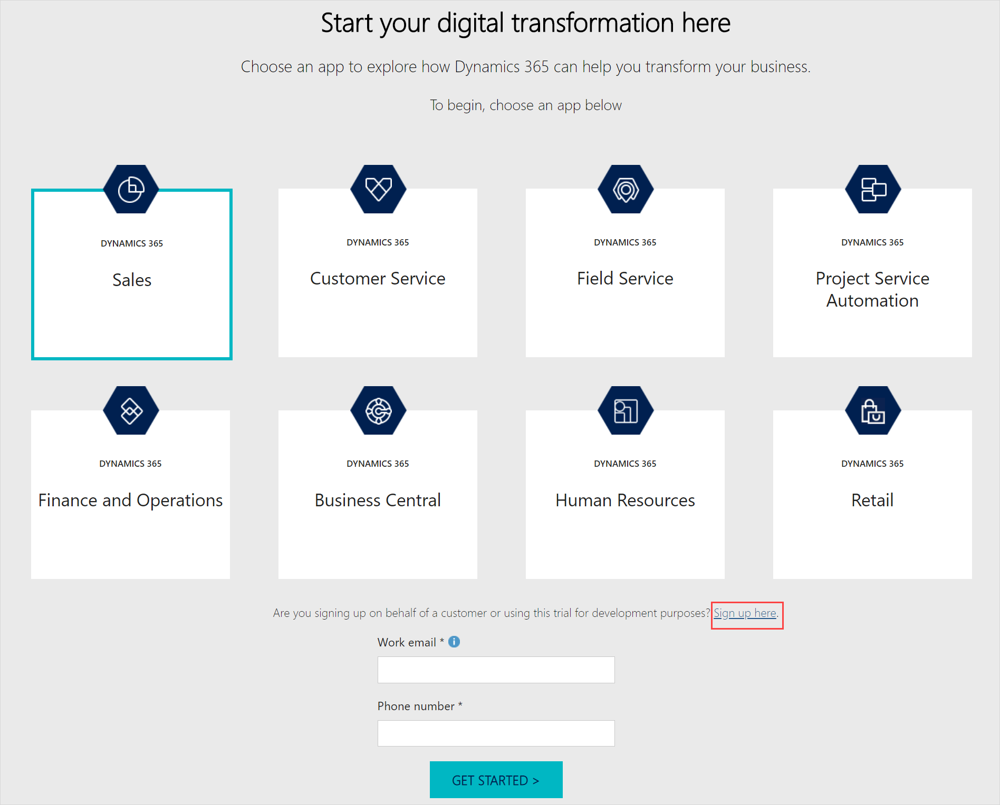
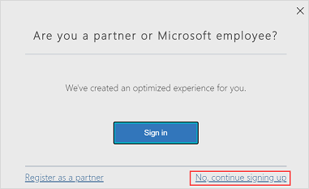
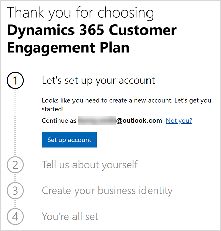
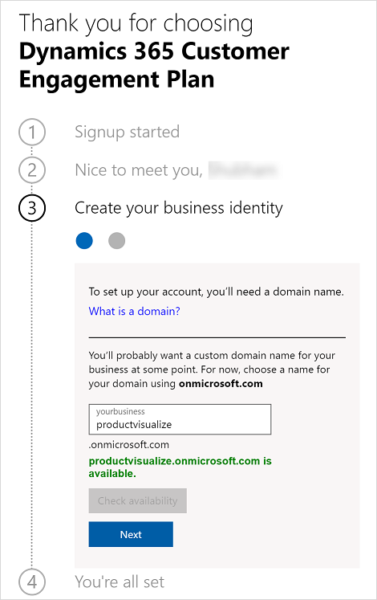
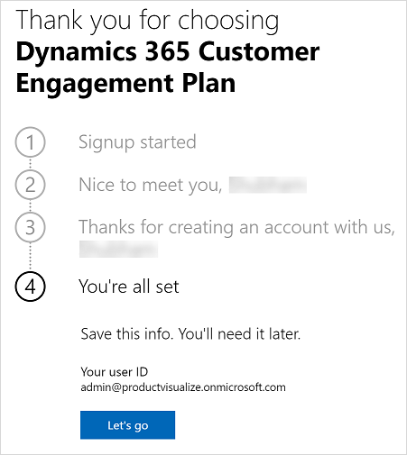
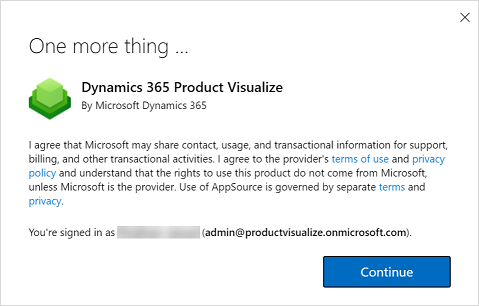

# Set up Dynamics 365 Product Visualize on a new Dynamics 365 instance

[!INCLUDE [cc-beta-prerelease-disclaimer](../includes/cc-beta-prerelease-disclaimer.md)]

Dynamics 365 Product Visualize requires an active Dynamics 365 instance. This topic provides step-by-step instructions for setting up a new Dynamics 365 trial instance and installing the Dynamics 365 Product Visualize solution.

> [!NOTE]
> If you have an existing Dynamics 365 instance, you can skip to [Step 2: Install the Dynamics 365 Product Visualize solution](#step-2-install-the-dynamics-365-product-visualize-solution) and start working with the solution immediately.

## Step 1: Get a Dynamics 365 trial instance

1. Go to [https://trials.dynamics.com/](https://trials.dynamics.com/).

2. Scroll down and select **Sign up here**.

    

3. In the pop-up window, select **No, continue signing up**.

    

4. In the **Let's set up your account** step, enter your email address, and then select **Next**.

    

5. Select **Set up account**.

    

6. In the **Tell us about yourself** step, enter your personal details and verify your phone number.

7. In the **Create your business identity** step, enter a domain name&mdash;for example, **productvisualize**&mdash;and check its availability. If the domain name is available, select **Next**.

    

8. Create a user ID and password to sign in to your account, and then select **Sign up**.

    

    > [!NOTE]
    > Store the user ID and password in a safe place; you'll need them later.

9. As soon as your account is set up, select **Let's go**.

    

10. On the **Let's get your FREE 30-day trial set up** page, select the scenarios you want, and then select **Complete Setup**.

    

    After setup is complete, you'll be redirected to your new Dynamics 365 instance. The URL is in the following format: &lt;custom\_domain\_name&gt;.crm.dynamics.com. In our example, the URL is `https://productvisualize.crm.dynamics.com`.

 > [!IMPORTANT]
 > In the following steps, you must use the credentials you created for your Dynamics 365 instance, if asked.

## Step 2: Install the Dynamics 365 Product Visualize solution

1. Go to the [Dynamics 365 Product Visualize app](https://appsource.microsoft.com/en-us/product/dynamics-365/mscrm.d365_product_visualize?tab=Overview) on Microsoft AppSource.

2. Select **Get it now**.

3. In the **One more thing...** pop-up window, select **Continue**.

    

    You'll be redirected to the `https://port.crm.dynamics.com` page.

4. Under **Add the application to Dynamics 365**, select both check boxes, and then select **Agree**.

    

    You'll be redirected to the Dynamics 365 admin center.

5. On the **Instances** tab, find the **Dynamics 365 Product Visualize** solution.

6. Check the status of the solution. If it says **Installation pending**, refresh the page until the status is changed to **Installed**.

## What's next

After you've finished the setup process, you'll have a Dynamics 365 trial instance with the Dynamics 365 Product Visualize Hub app installed. You can sign in to the Dynamics 365 Product Visualize Hub app and start adding products and 3D models, and creating mixed-reality sessions. More information: [Dynamics 365 Product Visualize Hub user guide](hub-user-guide.md)

### See also

[Dynamics 365 Product Visualize iOS app user guide](user-guide.md) 
[FAQ](faq.md)
