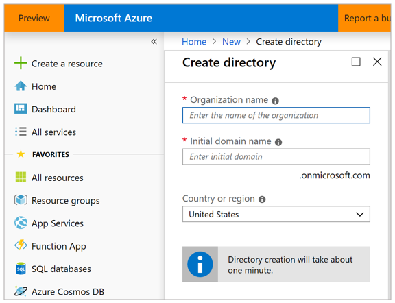
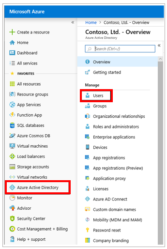
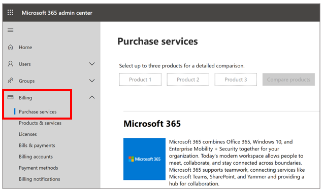
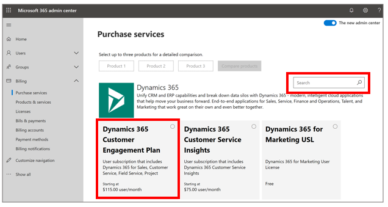
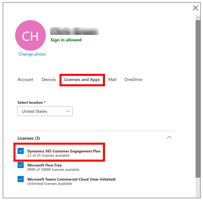
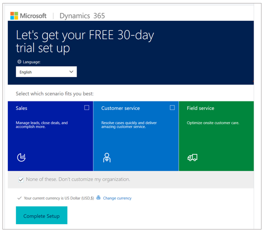

# Set up Dynamics 365 Product Visualize

[!INCLUDE [cc-beta-prerelease-disclaimer](../includes/cc-beta-prerelease-disclaimer.md)]

Microsoft Dynamics 365 Product Visualize requires an active Dynamics 365 for Sales instance that's associated with a Microsoft SharePoint site. This topic provides step-by-step procedures for setting up a new Dynamics 365 for Sales trial instance. Once the instance is running, see the [Administrator Guide](admin-guide.md) for instructions on adding users, products, opportunities, and models.

## Create a new organization
The first thing you need to do is create a new Azure Active Directory organization. This new organization provides a safe environment to try out Product Visualize that won't interfere with any existing Dynamics 365 instances. You can also use this organization to create and manage users, separate from your business organization.

   > [!NOTE]
   > If you prefer to add Dynamics 365 for Sales to an existing Azure Active Directory, skip ahead to **Add a Dynamics 365 for Customer Engagement trial.**

1. Sign in to the Microsoft Azure portal at https://ms.portal.azure.com.

2. If your organization has multiple Azure subscriptions, select **Directory & Subscription**  in the upper-right corner of the page to view the list of available subscriptions. 

3. In the left pane, select **Create a resource** > **Identity** > **Azure Active Directory**.

   

4. Under **Create directory**, give the organization a name and an initial domain name.

   

5. Select **Create**. You might need to wait several minutes while the directory is created. 

6. Select **Click here to manage your new directory**.

   

## Add an admin user

After creating the new organization, the next step is to add an admin user for the organization. The admin user is responsible for creating additional users, assigning licenses, and initializing Dynamics 365. As the creator of this organization, you could use your work account to manage the system, but we recommend creating a separate administrator account for each organization.

1. In the left pane, select **Azure Active Directory**, and then select **Users**.

   

2. Select **New User** at the top of the page, and then fill in the following fields:

    - **Name**: Enter any name.
    
    - **Username**: Enter a fully qualified username (<username>@\<tenant>.onmicrosoft.com).
    
    - **Directory Role**: Global Administrator
    
3. Select **Show Password**, and then write down the temporary password.

4. At the bottom of the page, select **Create** to finish creating the user.

## Add a Dynamics 365 for Customer Engagement trial

Product Visualize integrates directly into Dynamics 365 for Sales, which enables your salespeople to seamlessly transition from vital customer data into an engaging sales experience that changes the way customers think about your products.

1. In a private browser window, go to the Microsoft 365 admin center at [https://admin.microsoft.com](https://admin.microsoft.com).

2. Sign in with the administrator credentials you created in the previous procedure, and, if prompted, set a new password.

3. In the left pane, select **Billing**, and then select **Purchase services**.

   

4. Search for **Dynamics 365 for Customer Engagement Plan**, and then select the **Dynamics 365 for Customer Engagement Plan** panel from the results.

   

5. On the summary page, select the **Get free trial** button.

6. On the checkout page, select **Try now**. After this processes, select **Continue**. 

## Assign licenses

Before continuing, make sure the Dynamics 365 for Customer Engagement license has been assigned to the admin user.

1. Go to the Microsoft 365 Admin Center at [https://admin.microsoft.com](https://admin.microsoft.com). In the left pane, select **Users** > **Active Users**.

2. Select the name of the admin user created earlier. 

3. In **Licenses and Apps**, under **Licenses**, make sure that **Dynamics 365 Customer Engagement Plan** is checked.

   

5. Save your changes and close the dialog box.

## Set up the Dynamics 365 for Sales trial

The next step is to set up the Dynamics 365 for Customer Engagement instance. This procedure provides step-by-step instructions for manually installing Dynamics for Sales, which generates a completely empty instance of the Common Data Service. 

1. In the Microsoft 365 Admin Center at [https://admin.microsoft.com](https://admin.microsoft.com), in the left navigation, in the drop-down list for **Admin Centers**, select **All admin centers**. 

2. In the **All admin centers** page, select the **Dynamics 365** panel.

3. In the page that appears:

    - Set the language to your preferred language.
    
    - Under **Select which scenario fits you best**, select **None of these**.
    
    - Set the currency to your preferred currency.
    
4. Select **Complete Setup**, and then wait for the initial setup process to complete.

   

5. In the left pane, in the **Admin Centers** list, select **Dynamics 365 Admin Portal**.

   On the **Instances** page, you should see your newly created instance selected and some properties in a gray box on the right. Your new solution is still being set up. Wait for setup to complete before moving on to the next step.

   > [!NOTE]
   > It can take around 10 minutes for the setup process to finish. You'll know the process is complete when you see **CRM Hub** listed under **Solutions** for your instance. Refresh the page periodically to check on the status.

6. Select the small **Edit** button next to the word **Solutions** in the gray box on the right.

   

7. In the list of available solutions, find **Dynamics 365 Sales Application**, and then select **Install**.

8. Review the Terms of Service. When you're ready, select the check box that shows you approve. This starts the installation.

   > [!NOTE]
   > This process might take a while to complete. You can refresh the page to view the current status of the installation.

## Set up a SharePoint site

1. Go to the Sales Hub for your newly created Dynamics 365 instance. To do this:

    1. On the Admin Center page, select **Open** next to your organization name in the gray box.
    
    2. Select **Sales Hub** in the list of available applications.
    
2. Select **Settings** in the upper-right corner of the page, and then select **Advanced Settings**.

3. In the navigation bar at the top of the page, select the arrow next to **Settings**, and then select **Document Management**.

   

4. Select **Enable Server-Based SharePoint Integration** to set up the connection to SharePoint.

   > [!NOTE]
   > If you opted to use the automated **Sales** setup option earlier, you can skip the steps to enable server-based SharePoint integration.

5. Continue through the setup. When prompted, enter the URL for your SharePoint instance ([https://\<org name>.sharepoint.com]()).

   > [!IMPORTANT]
   > Be sure to enter the full URL for your SharePoint instance, including `https://`.

6. When complete, return to the **Document Management** settings page, and then select **Document Management Settings**.

7. Enter the URL for your SharePoint site if it isn't filled in by default, and then select **Next**.

8. Continue through setup using the default values for the remaining options.

   Dynamics 365 automatically creates SharePoint folders for Dynamics 365 entities. 

9. Close the window when done.

## What's next?
After you've finished the setup process, you'll have an Azure Active Directory organization complete with Microsoft Dynamics 365 for Customer Engagement and SharePoint. At this point, you can start adding opportunities, products, and models to Dynamics 365 for Sales. For more information, see the [Administrator guide](admin-guide.md).

### See also

[User guide](user-guide.md) 
[FAQ](faq.md)
