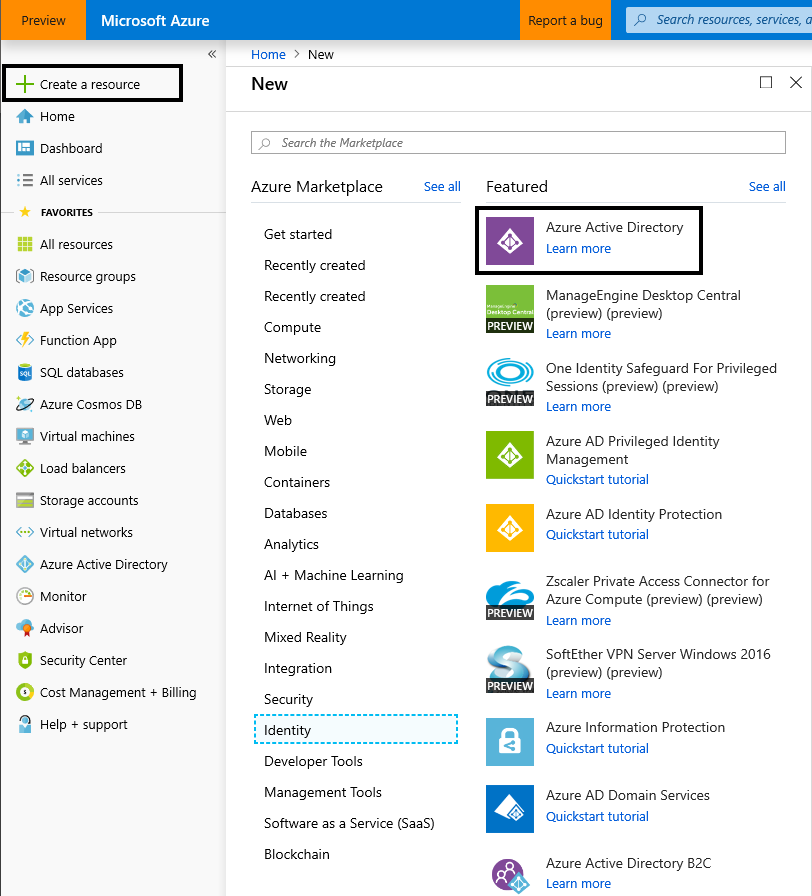
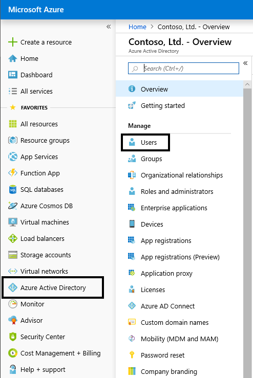
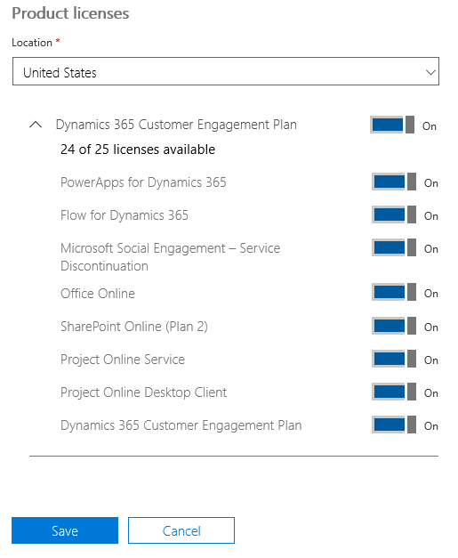
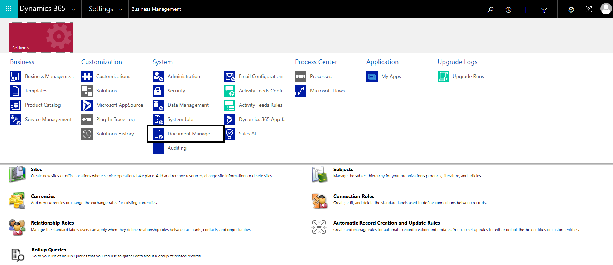

# Set up Dynamics 365 Product Visualize (in preview)

Microsoft Dynamics 365 Product Visualize (in preview) requires an active Dynamics 365 for Sales instance that's associated with a Microsoft SharePoint site. This document provides step-by-step procedures for setting up a new Dynamics 365 for Sales trial instance. Once the instance is running, see the [Administrator Guide](admin-guide.md) for instructions on adding users, products, opportunities, and models.

## Create a new organization
This section provides step-by-step instructions for creating a new Azure Active Directory organization. This new organization provides a safe environment to try out Product Visualize that won't interfere with any existing Dynamics 365 instances. You can also use the new organization to create and manage users separate from your business organization.

1. Sign in to the Azure portal at \([https://ms.portal.azure.com](https://ms.portal.azure.com)).

2. If your organization has multiple Azure subscriptions, you can select which subscription you are viewing from the **Subscriptions** drop-down in the **Directory & Subscriptions** menu in the upper-right corner of the page.

>  

The __Directory & Subscriptions__ can be accessed by selecting this icon:

3. In the left navigation, select **Create a Resource**, under **New**, select **Identity**, and then select **Azure Active Directory**.

   

4. Give the organization a name and an initial domain name.

5. Select __Create__. You may need to wait several minutes before the __Success__ message appears.

6. Select __Click here to manage your new directory__.

## Add an admin user

After creating the new organization, the next step is to add an admin user to the organization. The admin user is responsible for creating additional users, assigning licenses, and initializing Dynamics 365. As the creator of this organization, you could use your work account to manage the system, but we recommend creating a separate administrator account for each organization.

1. In the left navigation, select __Azure Active Directory__, and then select __Users__.

   

2. Select __New User__ at the top of the page, and then fill in the following fields:

    - **Name** - Enter any name
    
    - **Username** - Must be fully qualified (username@\<tenant>.onmicrosoft.com)
    
    - **Directory Role** - Global Administrator
    
3. Select __Show Password__, and then write down the temporary password.

4. At the bottom of the page, select __Create__ to finish creating the user.

## Add a Dynamics 365 Customer Engagement trial

Product Visualize integrates directly into Dynamics 365 for Sales, which enables your salespeople to seamlessly transition from vital customer data into an engaging sales experience that changes the way customers think about your products.

1. In a private browser window, go to [https://admin.microsoft.com](https://admin.microsoft.com).

2. Sign in with the administrator credentials you created in the previous procedure and, if prompted, set a new password.

3. In the left navigation, select __Billing > Subscriptions__, and then select __Add subscriptions__.

   

4. Find the __Dynamics 365 Customer Engagement Plan__ subscription, select the three dots (...) at the bottom, and then select __Start Free Trial__.

   

5. In the summary page, make sure you're signing up for a __Dynamics 365 Customer Engagement Plan__ trial, and then select __Try Now__.

6. In the confirmation page, select __Continue__.

## Assign licenses

Before continuing, you need to make sure the Dynamics 365 Customer Engagement license has been assigned to the admin user.

1. In the Microsoft Admin Portal \([https://admin.microsoft.com](https://admin.microsoft.com)), in the left navigation, select __Users > Active Users__.

2. Double-click the name of the admin user created earlier. 

3. Next to __Product Licenses__, select __Edit__.

4. Move the slider to the **On** position for the __Dynamics 365 Customer Engagement Plan__ license.

   

5. Save the changes and close the dialog box.

## Set up the Dynamics 365 for Sales trial

The next step is to set up the Dynamics 365 Customer Engagement instance. This procedure provides step-by-step instructions for manually installing Dynamics for Sales, which generates a completely empty instance of the Dynamics 365 Common Data Service for Apps. 

1. In the Microsoft Admin Portal \([https://admin.microsoft.com](https://admin.microsoft.com)), in the left navigation, in the drop-down list for __Admin Centers__, select __Dynamics 365__. It may take a minute or two for this option to appear in the __Admin Centers__ list.

> [!NOTE]
> As an option, you can select __Sales__ from this drop-down list, which allows you to skip steps 5 - 7 in this procedure. However, this will install some additional sample data that may not be relevant to your organization. 

2. In the page that appears:

    - Set the language to your preferred language.
    
    - Under __Select which scenario fits you best__, select __None of these__ (assuming you didn't select the **Sales** option above).
    
    - Set the currency to your preferred currency.
    
3. Select __Complete Setup__, and then wait for the initial setup process to complete.

   

4. In the left navigation, in the __Admin Centers__ list, select **Dynamics 365 Admin Portal**.

   In the __Instances__ page, you should see your newly created instance selected and some properties in a gray box on the right. Your new solution is still being set up. Wait for the setup to complete before moving on to the next step.

   > [!NOTE]
   > It can take around 10 minutes for the setup process to finish. You'll know the process is complete when you see __CRM Hub__ listed under __Solutions__ for your instance. Refresh the page periodically to check on the status.

5. Select the small __Edit__ button next to the word __Solutions__ in the gray box on the right.

   

6. In the list of available solutions, find __Dynamics 365 Sales Application__, and then select __Install__.

7. Review the Terms of Service, and then select the check box that shows you approve when ready. This will start the installation.

   > [!NOTE]
   > This process may take a while to complete. You can refresh the page to view the current status of the installation.

## Set up a SharePoint site

1. Go to the Sales Hub for your newly created Dynamics 365 instance. To do this:

    1. In the Admin Center page, select the __Open__ button next to your organization name in the gray box.
    
    2. Select __Sales Hub__ in the list of available applications.
    
2. Select the **Settings** button in the upper-right corner of the page, and then select __Advanced Settings__.

3. In the navigation bar at the top of the page, select the down arrow next to __Settings__, and then select __Document Management__.

   

4. Select __Enable Server-Based SharePoint Integration__ to set up the connection to SharePoint.

5. Continue through the setup. When prompted, enter the URL for your SharePoint ([https://\<org name>.sharepoint.com]()).

> [!IMPORTANT]
> Be sure to enter the full URL for your SharePoint instance, including `https://`.

6. When complete, return to the __Document Management__ settings page, and then select __Document Management Settings__.

7. Enter the URL for your SharePoint site if it isn't filled in by default. Then, select __Next__.

8. Continue through the setup using the default values for the remaining options.

   Dynamics 365 will automatically create SharePoint folders for the Dynamics 365 entities. 

9. Close the window when done.

> [!NOTE]
> If you opted to use the automated __Sales__ setup option earlier, you can skip the steps to enable server-based SharePoint Integration.

## What's next?
Once the setup process has finished, you'll have an Azure Active Directory organization complete with Microsoft Office 365 and Microsoft Dynamics 365 Customer Engagement. At this point you can start adding opportunities, products, and models to Dynamics 365 for Sales. For more information, see the [Administrator Guide](admin-guide.md).
