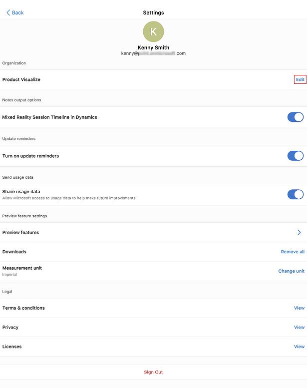

# Open and sign in to Dynamics 365 Product Visualize (in preview)

[!INCLUDE [cc-beta-prerelease-disclaimer](../includes/cc-beta-prerelease-disclaimer.md)]

Microsoft Dynamics 365 Product Visualize (in preview) works together with Dynamics 365 for Sales, so you’ll need a Dynamics 365 account to access the full power of the app. When you sign in with your Dynamics 365  for Sales account, the Product Visualize app automatically connects to your Dynamics 365 for Sales opportunities.

> [!TIP]
> If you just want to explore sample 3D content or upload your own 3D content to try it out, you don’t need to have a Dynamics 365 account. For more information, see [Explore sample 3D models](explore-samples.md).
 
## Two ways to open and sign in

You can open and sign in to Product Visualize on your iOS device in two different ways:

- Open the app on your iOS device like you would any other app, and then sign in.
- Select any 3D model (GLB file) in your Dynamics 365 for Sales opportunity.

> [!NOTE]
> At this time, Product Visualize is only available for iOS devices.

## Open the app on your iOS device and sign in for the first time

1.	On your iOS device, search for “Dynamics 365 Product Visualize”, and then open the app.

2.	In the **Welcome** screen, select **Sign in**. 

     
 
3.	In the **Sign in** screen, enter your Dynamics 365 account. When you’re done, select **Next**.  
 
     
 
    > [!NOTE]
    > After you sign in for the first time, this screen will not appear again.

4.	On your first sign in, you’ll be prompted to select your Dynamics 365 for Sales organization. You can change organizations later, if you want, through **Settings**.  

     
 
    > [!TIP]
    > If your organization isn’t set up with Dynamics 365 for Sales, you can explore sample models or go to the [Dynamics 365 for Sales website](https://trials.dynamics.com/Dynamics365/Signup/sales) to learn how to sign up.  

5.	In the **My Open Opportunities** screen, select the opportunity you want to work on.  

     
 
    Product Visualize pulls in your opportunities from Dynamics 365 for Sales by default. You can also view followed opportunities and connect opportunities.
    
## Sign in from Dynamics 365 for Sales

You can also launch Product Visualize directly from Dynamics 365 for Sales on your iOS device. This makes it easy to visualize your products in 3D as you work with your sales opportunities. 

If you haven’t already installed Product Visualize on your iOS device, you can install it from Dynamics 365 for Sales.

### Sign in from Dynamics 365 for Sales for the first time

1.	Open one of your opportunities in Dynamics 365 for Sales.

2.	Select the **Product Visualize** tab. 

3.	Select **Open Opportunity**.
 
4.	If you haven’t already installed the app, you’ll be redirected to the Apple Store. Follow the directions to install the app.

5.	After installing the app, open it, and then in the **Welcome** screen, select **Sign in**. 

    
 
6.	In the **Sign in** screen, enter your Dynamics 365 account. When you’re done, select **Next**.
 
     
 
    > [!NOTE]
    > After you sign in for the first time, this screen will not appear again.
    
7.	On your first sign in, you’ll be prompted to select your Dynamics 365 for Sales organization. You can change organizations later, if you want, through **Settings**.

     
 
8.	In the **My Open Opportunities** screen, select the opportunity you want to work on.

    
 
## Switch to a different organization

If you have access to more than one Dynamics 365 organization,  you can use this procedure to switch between organizations.

1.	Select the main menu icon .

2.	Select your account settings. 

     
  
3.	In the **Account Settings** screen, select **Edit** next to the organization you’re signed in to.
 
    > [!NOTE]
    > If you need to switch to a different user name, select **Sign out** in the previous screen, and then sign back in with a different user name.
    
### See also

[Place and manipulate 3D models](manipulate-models.md) 
[Add a note to your 3D model](add-note.md) 
[Add your own 3D models](add-model.md) 
[Explore sample 3D models](explore-samples.md)
