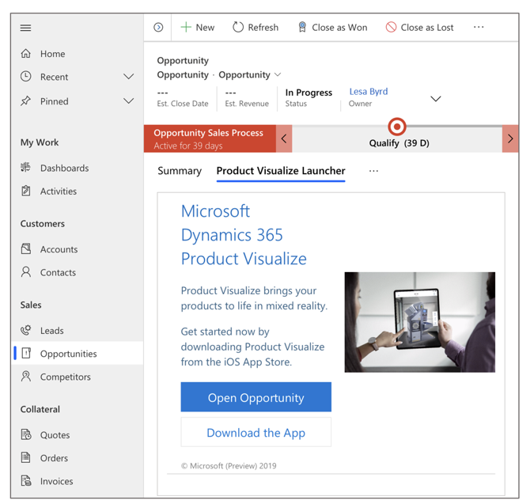
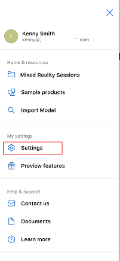

# Install, open, and sign in to Dynamics 365 Product Visualize

[!INCLUDE [cc-beta-prerelease-disclaimer](../includes/cc-beta-prerelease-disclaimer.md)]

To get the full benefits of Dynamics 365 Product Visualize, you'll need a Dynamics 365 account. When you sign in with your Dynamics 365 Sales account, Dynamics 365 Product Visualize automatically connects to your Sales opportunities.

> [!TIP]
> If you just want to explore sample 3D content, you don't need a Dynamics 365 account. More information: [Explore sample 3D models](explore-samples.md)
 
## Install the app

1. Go to the Apple App Store.

2. Search for **Dynamics 365 Product Visualize**.

3. Download and install the app.

## Two ways to open and sign in

You can open and sign in to Dynamics 365 Product Visualize on your iOS device in two different ways:

- Open the app on your iOS device as you would any other app, and then sign in.
- Select any 3D model (GLB file) in your Sales opportunity.

> [!NOTE]
> At this time, Dynamics 365 Product Visualize is available for iOS devices only.

## Open the app on your iOS device and sign in for the first time

1.	On your iOS device, search for **Dynamics 365 Product Visualize**, and then open the app.

2.	On the welcome<!--Edit okay? I don't see that the screen actually displays "Welcome." --> screen, tap **Sign in**.

    
 
3.	On the **Sign in** screen, enter your Sales account credentials. When you're done, tap **Next**.  
 
    > [!NOTE]
    > After you sign in for the first time, this screen won't appear again.

4.	When you first sign in, you're prompted to select your Sales organization. You can use **Settings** to change organizations later, if you want.  

     
 
    > [!TIP]
    > If your organization isn't set up with Sales, you can explore sample models or go to the [Sales trial website](https://trials.dynamics.com/Dynamics365/Signup/sales) to learn how to sign up.  

5.	On the **My Open Opportunities** screen, tap the opportunity you want to work on.  

    
 
Dynamics 365 Product Visualize pulls in your opportunities from Sales by default. You can also view followed opportunities and connect opportunities.

## Sign in from Sales

You can also open Dynamics 365 Product Visualize directly from Sales on your iOS device. This makes it easy to visualize your products in 3D as you work with your sales opportunities.

If you haven't already installed Dynamics 365 Product Visualize on your iOS device, you can install it from Sales.

### Sign in from Sales for the first time

1.	Open one of your opportunities in Sales.

2.	Select the **Product Visualize Launcher** tab.

    

3.	Do one of the following:

    - If the iOS app is already installed, select **Open Opportunity** to open the app.

    - If you're using an iOS device but the app isn't already installed, tap **Learn More**, follow the instructions to install the app, and then sign in to the app by using the instructions in step 4<!--Edit okay? In the markdown the sequence skipped number 4, and it does look like step 4 applies here.--> of this procedure.

    > [!NOTE]
    > If you're using a laptop or an Android device, you can't use Dynamics 365 Product Visualize at this time. You can select **Learn More** to learn more about the app.
 
4. On the Dynamics 365 Product Visualize welcome screen, tap **Sign in**.

    
 
5. On the **Sign in** screen, enter your Dynamics 365 account credentials. When you're done, tap **Next**.
 
    > [!NOTE]
    > After you sign in for the first time, this screen won't appear again.

6.  When you first sign in, you're prompted to select your Sales organization. You can use **Settings** to change organizations later, if you want.

     
 
7.	In the **My Open Opportunities** screen, select the opportunity you want to work on.

    
 
## Switch to a different organization

If you have access to more than one Dynamics 365 organization, you can use this procedure to switch between organizations.

1.	Tap **Main** , and then tap **Settings**.

    > [!div class=mx-imgBorder]
    > 
  
2.	On the **Settings**<!--Edit okay?--> screen, tap **Edit** next to the organization name you're signed in to.

    > [!div class=mx-imgBorder]
    > 
 
    > [!NOTE]
    > If you need to switch to a different username, tap **Sign out** on the previous screen, and then sign back in with a different username.

<!--note from editor: These "See also" blocks didn't originally include "Enable product dimensions," so I added it to all the individual user guide topics. If it shouldn't be there because it's a preview feature, please excuse (and perhaps delete the link to "Download 3D models" too).-->
### See also

[Place and manipulate 3D models](manipulate-models.md) 
[Add a note to your 3D model](add-note.md) 
[Show or hide layers in a 3D model](layers.md) 
[Explore sample 3D models](explore-samples.md) 
[View 3D models stored on your device](browse-models.md) 
[Add your own 3D model to an existing Dynamics 365 Sales product](add-model.md) 
[Download 3D models to use offline](download-models.md) 
[Enable product dimensions](product-dimensions.md)
