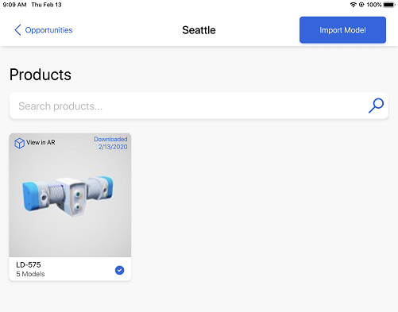
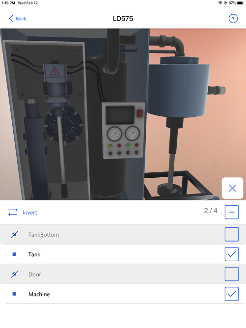

# User guide for Dynamics 365 Product Visualize

[!INCLUDE [cc-beta-prerelease-disclaimer](../includes/cc-beta-prerelease-disclaimer.md)]

Microsoft Dynamics 365 Product Visualize empowers sellers to showcase and customize products in their real-world environment. Using mixed reality, sellers can create a shared understanding between themselves and buyers to accelerate complex sales processes. Showing your customers products in 3D is more compelling than showing them flat images. Our app also gives you other capabilities that aren't available with conventional sales tools. 

> [!IMPORTANT]
> This user guide describes features available in the version 1.9 of Dynamics 365 Product Visualize. If you're using an older version of the app, [learn how to upgrade](sign-in.md).

## Steps to a successful product demonstration

**Prerequisites**: You must be signed in to the app and connected to your Dynamics 365 Sales account. This ensures that your list of sales opportunities is displayed in the app along with all your products and notes. For information on how to sign in to the app, see [Install, open, and sign in to the app](sign-in.md).

You can conduct a successful product demonstration with the Product Visualize app using the following steps:

1.	(For low or no connectivity) Download models for offline work
2.	Place your model
3.	Manipulate your model
4.	Add notes to your model
5.	Display product layers or components
6.	Enter conversation outcomes into Dynamics 365 Sales

<!-- ## Connect to Dynamics 365 Sales

Product Visualize connects directly with your opportunities and products in Dynamics 365 Sales. When you log in to the app using your Dynamics 365 Sales credentials, we automatically grab your list of sales opportunities, so you can see all your products and notes organized by customer. -->

### Download models for offline work

If you're going to be in a location with low internet connectivity, you can download your models and notes to be available offline. This way, you will never miss a beat with your clients, and your resources will always be at your fingertips. This feature gives you a way to always carry your catalog of products with you, without having to carry hundreds of pages of documents to every meeting, even when you can’t connect to the cloud.

> [!TIP]
> Once you have completed your presentation offline, you can remove the downloaded models by selecting the blue check mark next to the product's thumbnail on the **Products** page. This will free up storage space on your device.

> [!div class=mx-imgBorder]
> 

### Place your model

If you have 3D models of your products, you can show them to your client in a meeting using the Product Visualize app. Simply place the model in your space to analyze it from different perspectives and have a conversation with your client. The app uses your device's camera to read the surrounding environment, and places a 3D holographic model on a surface you select.

> [!TIP]
> - You can help the program select the best surface by scanning the surface on which you want to place your model. Scan a surface by pointing your device's camera down at a flat surface and panning it slowly right to left. 
> - If you are having trouble detecting a surface, or loading a model, make sure that the surface you are scanning is not too shiny. Lay a contrasting flat object (such as a sheet of paper) on the surface you want to select if you think it is too shiny. Re-scan the surface.

> [!div class=mx-imgBorder]
> 

> [!div class=mx-imgBorder]
> 

### Manipulate your model

Once you have placed it, you can move the model around your space, rotate and resize it, or lift and lower it. This enables you to display all sides and features of your product to clients without the need to carry heavy samples. You can also test the fit of a product in space using the Dimensions tool to display the real-life dimensions of the product on the 3D model. You can match these dimensions to the real-world space where the product would sit.

### Add notes to your model

There are many advantages of populating your model with notes. You can add product specification and marketing information directly on the model, and add notes on your model before the meeting to highlight sales points specifically for the client. If the client has a question or comment during the meeting, you can take a note to record that for a follow-up. This way, the comments are captured in context of specific points on the model, so you and your teammates can always be on the same page.

Notes capture images of your model in context, and allow you to attach text or annotate the image by drawing on it. Notes you create may be exported using Teams or email.

> [!div class=mx-imgBorder]
> 

### Display product layers or components

For complex 3D models that are built with layers, you can turn these on and off for your client. This will help them get a better understanding about the inner parts of the product or even different available configurations. You can display details or individual components of a complex model using layers.

> [!div class=mx-imgBorder]
> 

### Enter conversation outcomes into Dynamics 365 Sales

Dynamics 365 Product Visualize sends your notes to your Dynamics 365 Sales timeline by default, so you'll have your notes available in the Sales Hub app. You can also choose to export any note to share them with other apps on your device that support the iOS sharing function.

This user guide describes everything you need to know about working with the app. It shows you how to:

- [Install, open, and sign in to the app](sign-in.md) 
- [Place and manipulate 3D models](manipulate-models.md) 
- [Add a note to your 3D model](add-note.md) 
- [Show or hide layers in your 3D model](layers.md) 
- [Explore sample 3D models](explore-samples.md) 
- [View 3D models stored on your device](browse-models.md) 
- [Add your own 3D model to an existing Dynamics 365 Sales product](add-model.md) 
- [Download 3D models to use offline](download-models.md) 
- [Enable product dimensions](product-dimensions.md)

