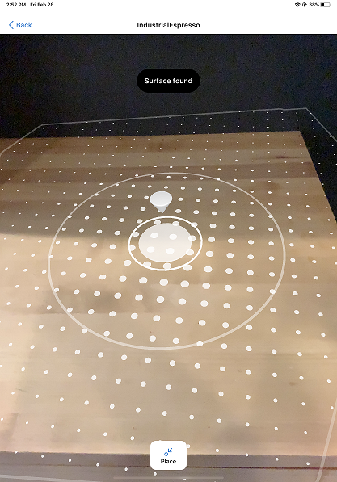
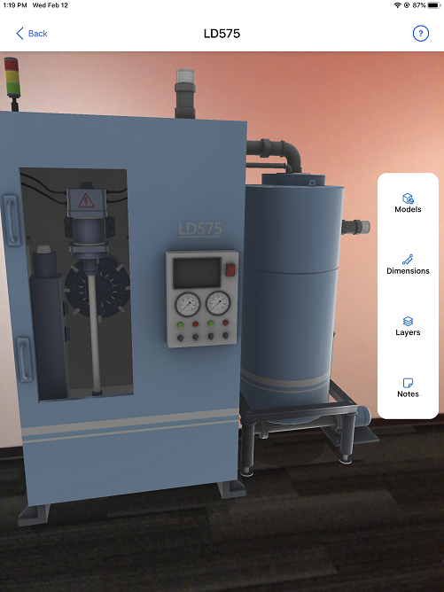
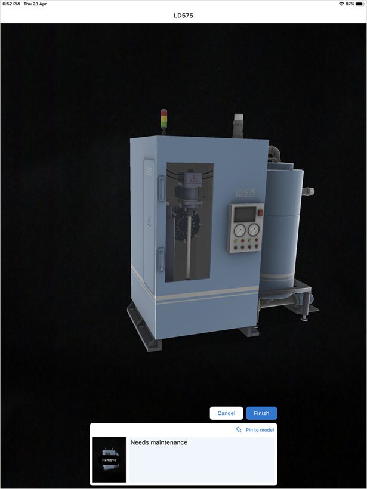
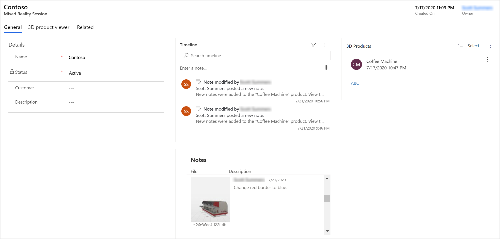

# User guide for Dynamics 365 Product Visualize

[!INCLUDE [cc-beta-prerelease-disclaimer](../includes/cc-beta-prerelease-disclaimer.md)]

Dynamics 365 Product Visualize empowers sellers to showcase and customize products in their real-world environment. Using mixed reality, sellers can create a shared understanding between themselves and buyers to accelerate complex sales processes. Showing your customers products in 3D is more compelling than showing them flat images. Our app also gives you other capabilities that aren't available with conventional sales tools. 

> [!IMPORTANT]
> This user guide describes features available in version 1.11 of Dynamics 365 Product Visualize. If you're using an older version of the app, [learn how to upgrade](sign-in.md).

## Steps to a successful product demonstration

**Prerequisites**: You must be signed in to the app and connected to your Dynamics 365 Sales account. This ensures that your list of sales opportunities is displayed in the app along with all your products and notes. For information about how to sign in to the app, see [Install, open, and sign in to the app](sign-in.md).

You can conduct a successful product demonstration with the Dynamics 365 Product Visualize app by using the following steps:

1.	[Download models for offline work](#download-models-for-offline-work) (for low or no connectivity).
2.	[Place your model](#place-your-model).
3.	[Manipulate your model](#manipulate-your-model).
4.	[Add notes to your model](#add-notes-to-your-model).
5.	[Display product layers or components](#display-product-layers-or-components).
6.	[Enter conversation outcomes into Dynamics 365 Sales](#enter-conversation-outcomes-into-dynamics-365-sales).

### Download models for offline work

If you're going to be in a location that has low internet connectivity, you can download your models and notes ahead of time so they'll be available offline. This way, you'll never miss a beat with your clients and you'll always have your resources at your fingertips. You'll take your catalog of products with you without having to carry hundreds of pages of documents to every meeting, even when you can't connect to the cloud. More information: [Download 3D models to use offline](download-models.md)

> [!TIP]
> After you've completed your presentation offline, you can remove the downloaded models by selecting the blue check mark next to the product's thumbnail on the **Products** page. This will free up storage space on your device.

> [!div class=mx-imgBorder]
> 

### Place your model

If you have 3D models of your products, you can show them to your client in a meeting by using the Dynamics 365 Product Visualize app. Simply place the model in your space to analyze it from different perspectives as you have a conversation with your client. The app uses your device's camera to read the surrounding environment and places a 3D holographic model on the surface you select. More information: [View (place) a 3D model](manipulate-models.md#view-place-a-3d-model-in-mixed-reality)

> [!TIP]
> - You can help the program select the best surface by scanning the surface on which you want to place your model. Point your device's camera down at the surface, and pan the camera slowly from right to left. 
> - If you're having trouble detecting a surface or loading a model, make sure that the surface you're scanning isn't too shiny. You can lay a contrasting flat object (such as a sheet of paper) on the surface and then re-scan it.

> [!div class=mx-imgBorder]
> 

<!--

-->

### Manipulate your model

After you've placed it, you can move the model around your space, rotate and resize it, or lift and lower it. This enables you to display all sides and features of your product to clients, and you didn't have to carry heavy samples to show them. You can also test the fit of a product in space by using the Dimensions tool to display the real-life dimensions of the product on the 3D model. You can match these dimensions to the space in the real world where the product might sit. More information: [Manipulate your model](manipulate-models.md#manipulate-your-model)

### Add notes to your model

There are any number of uses for adding notes to your model. Notes capture images of your model in context, and you can attach text or annotate the image by drawing on it. You can add product specification and marketing information directly on the model, and you might add notes on your model before a meeting to highlight sales points specifically for the client. If the client has a question or comment during the meeting, you can record that in a note to follow up on later. This way, you capture comments in context on specific points of the model, so you and your teammates can always be on the same page.

Notes you create can be exported by using Teams or email. More information: [Add a note to a 3D model](add-note.md#add-a-note)

> [!div class=mx-imgBorder]
> 

### Display product layers or components

When you work with complex 3D models that were built by using layers, you have the option of turning layers on and off for your client. This can give them a better understanding about the inner parts of the product or even different available configurations. You can display details or individual components of a complex model by using layers. More information: [Show or hide layers in a 3D model](layers.md)

> [!div class=mx-imgBorder]
> 

### Enter conversation outcomes into Dynamics 365 Sales

Dynamics 365 Product Visualize sends your notes to your Dynamics 365 Sales timeline by default. This means that any notes you create to capture the results of your conversations with customers will be available in the Sales Hub app. You can also choose to export any note to share it with other apps on your device that support the iOS sharing function. More information: [Export a note](add-note.md#export-a-note)

> [!div class=mx-imgBorder]
> 

The topics in this user guide describe everything you need to know about working with the app. They show you how to:

- [Install, open, and sign in to the app](sign-in.md).
- [Place and manipulate 3D models](manipulate-models.md).
- [Add a note to your 3D model](add-note.md).
- [Show or hide layers in your 3D model](layers.md).
- [Explore sample 3D models](explore-samples.md).
- [View 3D models stored on your device](browse-models.md).
- [Add your own 3D model to an existing Dynamics 365 Sales product](add-model.md).
- [Download 3D models to use offline](download-models.md).
- [Enable product dimensions](product-dimensions.md).

