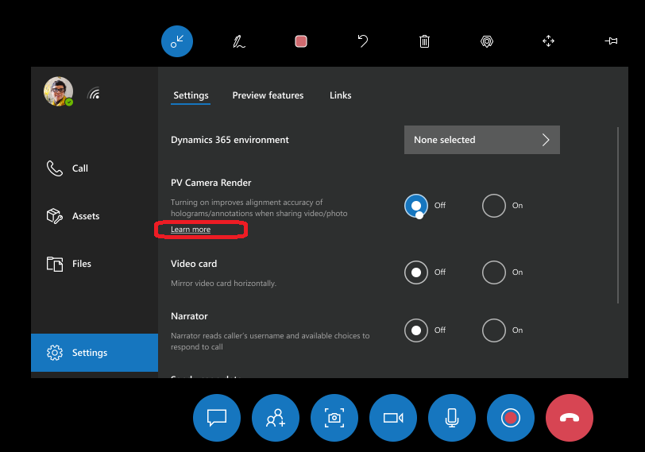

# Add annotations in Dynamics 365 Remote Assist on HoloLens

Once a video call has connected, the Microsoft Teams user will see everything the HoloLens user sees in their space – including holograms. 

Annotations are useful for pointing out different parts of your space, including parts that may be difficult or dangerous to reach. All call participants can see each others’ additions, and can make annotations of their own. Once an annotation is placed, it will remain anchored in your space until the person who placed the annotation deletes it. Adding annotations to files works the same way.

The gestures for adding arrows or drawing are the same for HoloLens and HoloLens 2.

> [!Note]
> Multiple Teams users (desktop or mobile) can join but only Teams desktop users can add annotations in a Dynamics 365 Remote Assist call, regardless of whether the Dynamics 365 Remote Assist user is using HoloLens, HoloLens 2, or mobile.
>
> In other words, the following calls are supported:
>
> - One-to-one calls with one Dynamics 365 Remote Assist HoloLens/HoloLens 2 user and one Teams desktop user
> - One-to-one calls with one Dynamics 365 Remote Assist HoloLens/HoloLens 2 user and one Teams mobile user
> - One-to-one calls with one Dynamics 365 Remote Assist HoloLens/HoloLens 2 user and one Dynamics 365 Remote Assist mobile user
> - Group calls with one or more Dynamics 365 Remote Assist HoloLens/HoloLens 2 users and one or more Teams desktop or mobile users
> - Meetings with one or more Dynamics 365 Remote Assist HoloLens/HoloLens 2 users and one or more Teams desktop or mobile users

## Add an arrow 

Select the **Arrow** (seen here: ). 

To position the arrow in space:

- If you're using HoloLens, use your gaze cursor to position the arrow. You'll see a ghost arrow on your gaze cursor.  
- If you're using HoloLens 2, use your hand ray to position the arrow. You'll see a ghost arrow at the end of your hand ray.

To control the direction of the arrow, air tap, hold, and move your hand in a circle until the ghost arrow appears at the desired direction. Release the air tap to place the arrow.

To use voice commands, select the arrow tool by saying "Remote Assist, Arrow." Then say "Remote Assist, Place arrow" to place the arrow. You won't be able to use voice commands to rotate the arrow before placing it.

Once you place the arrow, you can't adjust its location or direction. To redo, select **Undo** (or say "Remote Assist, Undo") and place the arrow again.

<iframe src="https://www.microsoft.com/videoplayer/embed/RE2F9qy" frameborder="0" allowfullscreen=""></iframe>

The previous video shows how to place an arrow using HoloLens gestures. If you’re using HoloLens 2, remember that you can select the **Arrow** tool by touching it directly, and you position your arrow in space using your hand ray. 

## Draw in your space

Select the **Ink tool** (as shown here: ).

To determine where you start drawing,
- If you're using HoloLens, use your gaze cursor to determine where to start drawing.
- If you're using HoloLens 2, use your hand ray to determine where to start drawing.  

Then, air tap, keep your index finger and thumb together, and start drawing in space. Release the air tap to stop drawing. 

To use voice commands, select the ink tool by saying "Remote Assist, Ink." Then use "Remote Assist, Start inking" and "Remote Assist, Stop inking" to start and stop inking with head gaze. 

<iframe src="https://www.microsoft.com/videoplayer/embed/RE2F9qs" frameborder="0" allowfullscreen=""></iframe>

The previous video shows how to draw using HoloLens gestures. If you’re using HoloLens 2, remember that you can select the **Ink tool** by touching it directly, and you determine where you start your drawing using your hand ray. 

## Change arrow or ink color

Select Colors  (or say “Remote Assist, colors”), and then select the color you want (or say “Remote Assist, Red”). The next annotation you place will be that color.

## Edit annotations

To erase all the arrows and ink you’ve added during a video call, select **Erase all** (as seen here: ) at the top of the call window (or say "Erase all").

To undo your most recent action, including **Erase All**, select **Undo**  at the top of the call window (or say "Undo").

## PV camera render

Enabling the PV camera render setting will improve the alignment accuracy of annotations as seen by Microsoft Teams users in a Dynamics 365 Remote Assist session. This will ensure that annotations placed by the HoloLens 2 Remote Assist user are represented accurately in their environment for the remote expert. When this setting is turned off, the Microsoft Teams user may notice the annotations placed by the HoloLens 2 user to be slightly out of place.

.

In order to accommodate the additional system resources required for utilizing the PV camera render, turning on the PV camera render setting will limit the maximum outgoing video resolution of the HoloLens 2 to 720p. Turning off the PV camera render setting will allow the maximum outgoing video resolution to be 1080p.

More information on [Render from the PV Camera](https://docs.microsoft.com/windows/mixed-reality/develop/platform-capabilities-and-apis/mixed-reality-capture-for-developers#render-from-the-pv-camera-opt-in)
