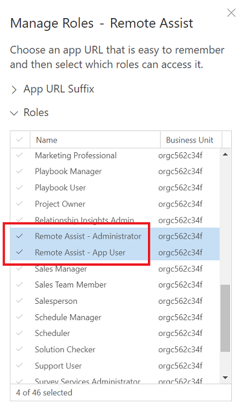

# Add users to the Asset Capture preview

Learn how to add users to the asset capture public preview so they can access the model-driven app and use the HoloLens 2 to capture asset data.

In this tutorial, you assign users a Remote Assist license and security roles.

## Prerequisites

To complete this article, you need:

- **A Dynamics 365 Remote Assist subscription**, which enables you to assign licenses to the intended set of Remote Assist users.
- **Ability to manage user licenses in Microsoft Admin center**. To manage user licenses, you need to have an admin role for the Microsoft Admin center.
- **Admin access to the environment Remote Assist is installed in**. You'll be managing security roles for users in the environment. A system administrator role is required in the environment you are managing.

## Assign Remote Assist licenses

Anyone who will be using Remote Assist on HoloLens 2 or accessing the Remote Assist model-driven app to review captured data will need a Remote Assist license. If these users already have a Remote Assist license, you can skip this step.

1. Sign in to the [Microsoft Admin center](https://admin.microsoft.com) as an admin (User admin or Global admin).
2. Go to **Billing** > **Licenses**.
3. Select **Dynamics 365 Remote Assist**.
4. Select **Assign licenses**.
5. In the assign licenses to users pane, begin typing a name, and then choose it from the results to add it to the list. You can add up to 20 users at a time.
6. When you're finished, select **Assign**, then select **Close**.

For more detailed documentation on managing user licenses, refer to the docs here: [Assign licenses to users](https://docs.microsoft.com/microsoft-365/admin/manage/assign-licenses-to-users?view=o365-worldwide)

## Assign Dynamics 365 security roles

Security roles define how different users, such as service technicians, access different types of records. To enable asset capture, security roles must be assigned to each user.

1. Sign in to the [Power Platform Admin center](https://admin.powerplatform.com) as an admin (Dynamics 365 service admin, Global admin, or Power Platform service admin).
2. Select **Environments**, find the environment Remote Assist is installed in, and select the three-dots (ellipses) icon for **More environment actions**.
3. Select **Settings**, then select **Users + permissions** > **Users**.
4. From the top toolbar, select **Manage users in Dynamics 365**.
5. Using the checkboxes on the left, select all the users who will be using Remote Assist. Then select **Manage Roles** from the top toolbar.
6. Select the **Common Data Service User** and **Remote Assist - App User** roles. When you're finished, select **OK**.

## Manage app roles

Security roles must be assigned to apps to ensure users with those roles can access the app. The **Remote Assist - App User** role must be enabled for the Dynamics 365 Remote Assist app.

1. Sign in to the [Power Platform Admin center](https://admin.powerplatform.com) as an admin (Dynamics 365 service admin, Global admin, or Power Platform service admin).
2. Select **Environments**, find the environment Remote Assist is installed in, and select the dots for **More environment actions**.
3. Select **Open environment**.
4. If you see a list of **Published Apps**, proceed to step 5. Select **Settings** from the top-right toolbar, then **Advanced Settings** and select the dropdown next to **Settings** > **My Apps**.

5. Select the **More options** menu on the Remote Assist app tile and then select **Manage Roles**.

6. From the right side panel, select the **Remote Assist - App User** role from the list and then select **Save**.

## Next steps

In this tutorial, you learned how to assign security roles and enable the app for Remote Assist users. To learn how to create asset records and import your existing asset catalog, use the following link!

> [!div class="nextstepaction"]
> [Create assets](./asset-capture-create-asset.md)
