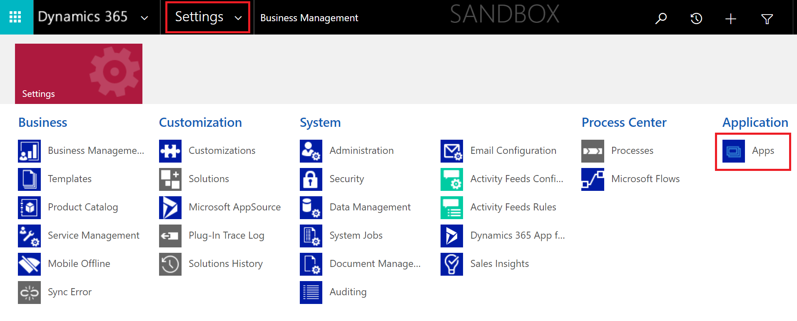

# Add users to the asset capture preview

Learn how to add users to the asset capture public preview so they can access the model-driven app and use the HoloLens to capture asset data.

In this tutorial, you assign users a Dynamics 365 Remote Assist license and security roles.

## Prerequisites

To complete the steps in this tutorial, you need:

- **A Dynamics 365 Remote Assist subscription**, which enables you to assign licenses to users you want to give access to Dynamics 365 Remote Assist.
- **The ability to manage user licenses in the Microsoft 365 admin center**. To manage user licenses, you need to have an admin role for the Microsoft 365 admin center.
- **Admin access to the environment Dynamics 365 Remote Assist is installed in**. You'll be managing security roles for users in the environment. A system administrator role is required in the environment you're managing.

## Assign Dynamics 365 Remote Assist licenses

Anyone who will be using Dynamics 365 Remote Assist on HoloLens or accessing the Dynamics 365 Remote Assist model-driven app to review captured data will need a Dynamics 365 Remote Assist license. If these users already have a Dynamics 365 Remote Assist license, you can skip this step.

1. Sign in to the [Microsoft 365 admin center](https://admin.microsoft.com) as an admin (User admin or Global admin).
2. Go to **Billing** > **Licenses**.
3. Select **Dynamics 365 Remote Assist**.
4. Select **Assign licenses**.
5. In the **Assign licenses to users** pane, begin typing a name, and then choose it from the results to add it to the list. You can add up to 20 users at a time.
6. When you're finished, select **Assign**, and then select **Close**.

More information: [Assign licenses to users](https://docs.microsoft.com/microsoft-365/admin/manage/assign-licenses-to-users?view=o365-worldwide)

## Assign Dynamics 365 security roles

Security roles define how different users, such as service technicians, access different types of records. To enable asset capture, security roles must be assigned to each user.

1. Sign in to the [Power Platform admin center](https://admin.powerplatform.com) as an admin (Dynamics 365 service admin, Global admin, or Power Platform service admin).
2. Select **Environments**, find the environment that Dynamics 365 Remote Assist is installed in, and then select **More environment actions** .
3. Select **Settings**, and then select **Users + permissions** > **Users**.
4. From the top toolbar, select **Manage users in Dynamics 365**.
5. Select the check boxes to the left of the names of users who will be using Dynamics 365 Remote Assist, and then select **Manage Roles** from the top toolbar.
6. Select the **Common Data Service User** and **Remote Assist - App User** roles. When you're finished, select **OK**.

## Manage app roles

Security roles must be assigned to apps to ensure that users who have those roles can access the app. The **Remote Assist - App User** role must be enabled for the Dynamics 365 Remote Assist app.

1. Sign in to the [Power Platform admin center](https://admin.powerplatform.com) as an admin (Dynamics 365 service admin, Global admin, or Power Platform service admin).
2. Select **Environments**, find the environment that Dynamics 365 Remote Assist is installed in, and then select .\
3. Select **Open environment**.
4. If you see a list of **Published Apps**, proceed to step 5. Otherwise, select **Settings** from the upper-right toolbar, select **Advanced Settings**, and then select the drop-down menu next to **Settings** > **My Apps**.

5. On the Dynamics 365 Remote Assist app tile, select **More options**, and then select **Manage Roles**.

6. From the right side panel, select the **Remote Assist - App User** role from the list, and then select **Save**.

## Next step

In this tutorial, you learned how to assign security roles and enable the app for Dynamics 365 Remote Assist users. In the next tutorial, you'll learn how to create asset records and import your existing asset catalog.

> [!div class="nextstepaction"]
> [Create assets](./asset-capture-create-asset.md)
