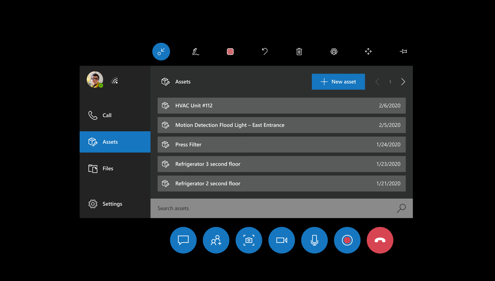
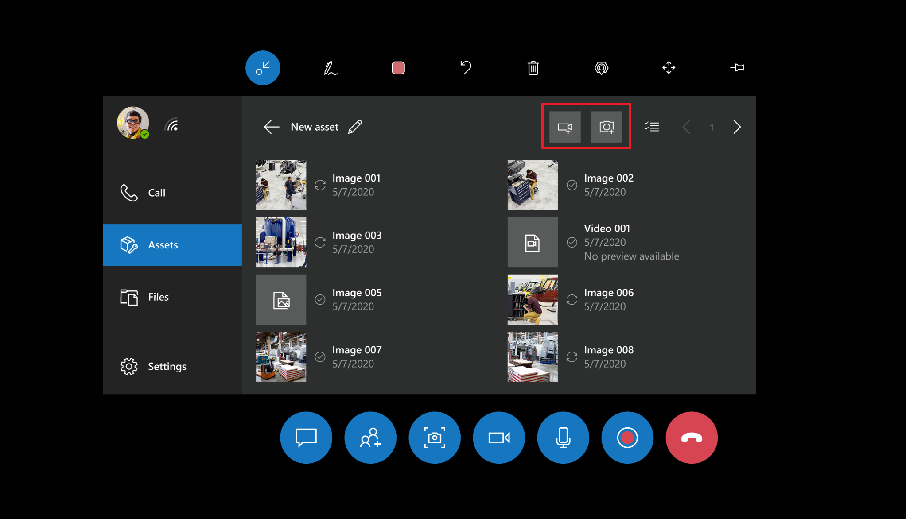
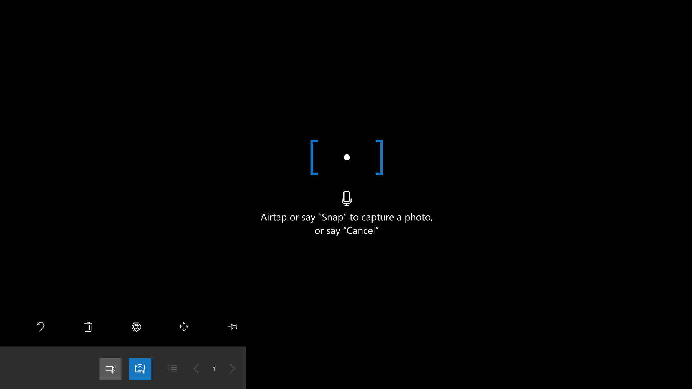

# Capture asset conditions with spatial markup in HoloLens 2

Remote Assist can be used to capture procedures and defects during jobs such as an inspection or while performing a repair. As an example, a technician can use Remote Assist on the HoloLens to capture photos of the equipment they are inspecting to highlight defects like wear and corrosion. The photos can then be viewed and downloaded from the Remote Assist model-driven app by stakeholders within the organization, such as a service manager or site superintendent.

In this article, you will learn how to use the HoloLens 2 to view asset records created from the Remote Assist model-driven app and capture photos of assets with spatial markup.

## Prerequisites

To complete this article, you need:

- **HoloLens 2**. The public preview requires a HoloLens 2 with Remote Assist installed. Ensure you have downloaded the latest update to Remote Assist through the Microsoft Store.
- **Access to the environment Remote Assist is installed in**. The account you sign into Remote Assist with needs access to the environment created in the first step and an active Remote Assist license.

## Capture asset conditions

### Enable the public preview

From Remote Assist, select **Settings** > **Preview Features**, and toggle the Asset Capture feature on. This step requires you to restart Remote Assist by closing the live tile and relaunching the app.

> [!IMPORTANT]
> Enabling the public preview replaces the snapshot tool available from the in-call toolbar with the Asset Capture capabilities. This means photos taken in Remote Assist will be saved to Common Data Service and accessible through the Remote Assist model-driven app vs. OneDrive for Business. You can disable the preview on the HoloLens at any time by returning to Settings.

### View the asset list

Select the **Assets** tab. The list of assets entered through the Remote Assist model-driven app are displayed in descending order by the last created date. At the bottom of the window, there is a search bar to search for assets by the **Name** field.

> [!NOTE]
> The **Assets** tab is also accessible during a call. As an example, while performing a real-time remote inspection, photos of the asset(s) being inspected can be captured to the asset record from the **Assets** tab.

### Capture photos with spatial markup

1. Select the **Assets** tab and then select an asset from the list. You can also use the search bar at the bottom of the window.

2. Select the ink or arrow tools to markup the asset in your environment. As an example, circling an area of corrosion on a pipe.
3. Enable the **Camera** tool to start capturing photos. The camera tool will remain enabled after taking a photo.

4. **Airtap** or say the **Snap** voice command to take a picture of the asset with the spatial markup. The photo will preview for several seconds and then be saved to Common Data Service.

Any existing photo can be selected in the asset view to preview in the HoloLens environment. If the current user took the photo, they can also delete that photo in the preview window.

> [!NOTE]
> Captured photos are saved both locally to the HoloLens and to Common Data Service (CDS) where they're viewable from the Remote Assist model-driven app.

## Next steps

In this tutorial, you learned how to view assets in the HoloLens and capture photos to the asset record with spatial markup. To learn how to review the captured data from the Remote Assist model-driven app, see:

> [!div class="nextstepaction"]
> [Review asset captures](./asset-capture-review.md)

## Troubleshooting

### There are no assets when I select the Assets tab

1. Ensure the environment you are using has asset records created in it. See [Create asset records](./asset-capture-create-asset.md).
2. Try selecting **Retry** if prompted in the Assets tab.
3. If you added the asset records from the model-driven app while Remote Assist was already open on the HoloLens, close the app on HoloLens and relaunch it to pull the latest updates.

### Remote Assist says to contact my IT admin in the Assets tab

1. Ensure the app was installed to the desired environment. More info: [Install Dynamics 365 Remote Assist model-driven app](./asset-capture-setup-environment.md#install-dynamics-365-remote-assist-model-driven-app).
2. The user must have the **Remote Assist - App User** role and **Common Data Service User** security roles assigned. More info: [Assign Dynamics 365 security roles](./asset-capture-add-users.md#assign-dynamics-365-security-roles).
3. After validating these steps, close the app and the live tile, and then relaunch.

### The asset records I see are not what I expect to see

The user account may have access to more than 1 environment with Remote Assist installed. In this case, you need to select the desired environment to use.

1. Select **Settings** > **Links** > **Switch Dynamics Instance**.
2. Select the desired environment from the list.
3. Select the **Assets** tab. You may need to select **Retry** if prompted.
