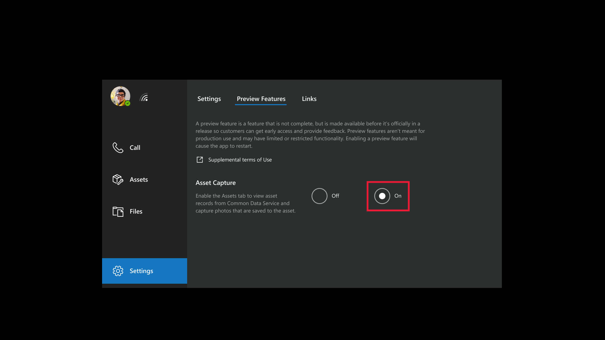

# Capture asset conditions with spatial markup in HoloLens

You can use Dynamics 365 Remote Assist to capture procedures and defects during jobs such as an inspections or repairs. For example, a technician can use Dynamics 365 Remote Assist on HoloLens to capture photos of the equipment they're inspecting, to highlight defects like wear and corrosion. The photos can then be viewed and downloaded from the Dynamics 365 Remote Assist model-driven app by stakeholders within the organization, such as a service manager or site superintendent.

In this tutorial, you'll learn how to use HoloLens to view asset records created from the Dynamics 365 Remote Assist model-driven app and capture photos of assets with spatial markup.

## Prerequisites

To complete this tutorial, you need:

- **HoloLens**. The public preview requires HoloLens 1 or HoloLens 2 with Dynamics 365 Remote Assist installed. Ensure you have downloaded the latest update to Dynamics 365 Remote Assist through the Microsoft Store.
- **Access to the environment Dynamics 365 Remote Assist is installed in**. The account you used to sign in to Dynamics 365 Remote Assist needs access to the environment created in the first step and an active Dynamics 365 Remote Assist license.

## Capture asset conditions

### Enable the public preview

From Dynamics 365 Remote Assist, select **Settings** > **Preview Features**, and then turn on the **Asset Capture** toggle. This step requires you to restart Dynamics 365 Remote Assist by closing the live tile and reopening the app.

> [!IMPORTANT]
> Enabling the public preview replaces the snapshot tool available from the in-call toolbar with asset capture capabilities. This means that photos taken in Dynamics 365 Remote Assist will be saved to Common Data Service and will be accessible through the Dynamics 365 Remote Assist model-driven app versus OneDrive for Business. You can disable the preview on HoloLens at any time by returning to **Settings**.

### View the asset list

Select the **Assets** tab. The list of assets entered through the Dynamics 365 Remote Assist model-driven app are displayed in descending order by the last-created date. At the bottom of the window, you can search for assets by using the **Name** field.

> [!NOTE]
> The **Assets** tab is also accessible during a call. For example, while performing a real-time remote inspection, you can capture photos of the assets being inspected to the asset record from the **Assets** tab.

### Capture photos with spatial markup

1. On the **Assets** tab, select an asset from the list. You can also use the search bar at the bottom of the window.

2. Select the ink or arrow tools to mark up the asset in your environment. For example, you can circle an area of corrosion on a pipe.
3. Enable the **Camera** tool to start capturing photos. The camera tool remains enabled after you take a photo.

4. Air-tap or say the **Snap** voice command to take a picture of the asset with the spatial markup. The photo will be previewed for several seconds, and then saved to Common Data Service.

Any existing photo can be selected in the asset view to preview in the HoloLens environment. If the current user took the photo, they can also delete that photo in the preview window.

> [!NOTE]
> Captured photos are saved both locally to HoloLens and to Common Data Service, where they're viewable from the Dynamics 365 Remote Assist model-driven app.

## Next step

In this tutorial, you learned how to view assets in HoloLens and capture photos to the asset record with spatial markup. In the next tutorial, you'll learn how to review the captured data from the Dynamics 365 Remote Assist model-driven app.

> [!div class="nextstepaction"]
> [Review asset captures](./asset-capture-review.md)

## Troubleshooting

### No assets appear when I select the Assets tab

1. Ensure that the environment you're using has asset records created in it. More information: [Create asset records](./asset-capture-create-asset.md)
2. Try selecting **Retry** if you're prompted to on the **Assets** tab.
3. If you added the asset records from the model-driven app while Dynamics 365 Remote Assist was already open on HoloLens, close the app on HoloLens and reopen it to pull the latest updates.

### Dynamics 365 Remote Assist says to contact my IT admin on the Assets tab

1. Ensure the app was installed to the right environment. More information: [Install Dynamics 365 Remote Assist model-driven app](./ra-webapp-install.md#install-dynamics-365-remote-assist-model-driven-app)
2. Verify that the user has the **Remote Assist - App User** role and **Common Data Service User** security roles assigned. More information: [Assign Dynamics 365 security roles](./asset-capture-add-users.md#assign-dynamics-365-security-roles)
3. After following these steps, close the app and the live tile, and then reopen it.

### The asset records I see aren't what I expected to see

The user account might have access to more than one environment with Dynamics 365 Remote Assist installed. If this is the case, you need to select the environment you want to use.

1. Select **Settings** > **Links** > **Switch Dynamics Instance**.
2. Select the environment you want from the list.
3. Select the **Assets** tab. You might need to select **Retry**, if prompted.
