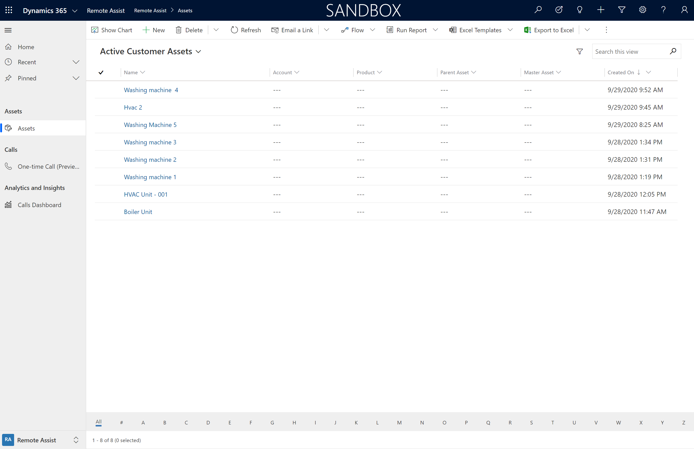
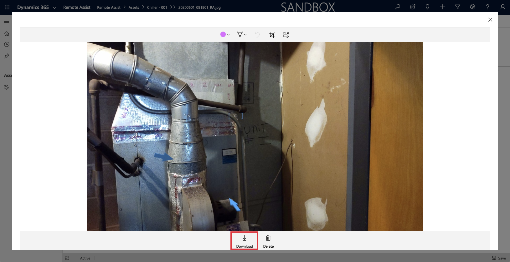
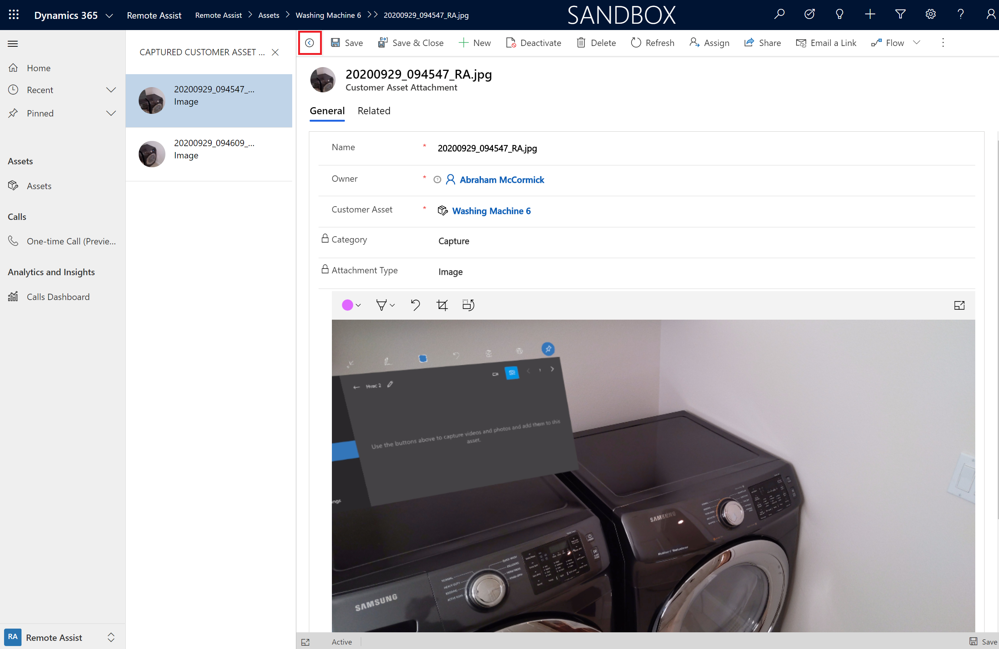

# Review asset captures in Remote Assist model-driven app

Captured asset data from the HoloLens is saved to Common Data Service (CDS) and viewable from the Remote Assist model-driven app for validating work performed by technicians in the field, generating reports, and downloading artifacts like photos for use in other application.

In this article, you will learn how to access captured asset data through the Remote Assist model-driven app and download that data to your computer.

## Prerequisites

To complete this article, you need:

- **Access to the environment Remote Assist is installed in**. You will access the Remote Assist model-driven app to view asset data.

## View asset captures

1. From the main menu of your environment, select **Remote Assist** > **Assets** > and select the asset used in the previous tutorial.

2. Select the **Captures** tab on the asset form to view the list of captures.

3. Select a capture record from the captures subgrid.

4. Scroll down to view the image preview. The image can be expanded by selecting the **Full-screen view** button in the top right of the image preview control.

5. The image can be annotated by drawing directly on the image with your mouse. This is helpful for calling attention to objects or defects in the scene.

6. Captures can be downloaded by selecting **Download** below the image preview control.

7. Quickly switch between captures by selecting the **Open Record set** button to the left of the **Save** button. The captures related to the asset appear on the left.

## Next steps

In this tutorial, you learned how to view asset captures in the Remote Assist model-driven app. To learn how to use Power Automate Flows to automate your business processes like generating reports with asset captures or sending an email notification when new asset data is captured, see:

> [!div class="nextstepaction"]
> [Automate asset capture data](./integrate-power-automate.md)

## Troubleshooting

### Can't find the Remote Assist model-driven app

1. Check to see if you are accessing the right environment by checking the environment name in the URL.
2. Ensure the app was installed to the desired environment. More info: [Install Dynamics 365 Remote Assist model-driven app](./asset-capture-setup-environment.md#install-dynamics-365-remote-assist-model-driven-app)
3. The user must have the **Remote Assist - App User** role and **Common Data Service User** security roles assigned. More info: [Assign Dynamics 365 security roles](./asset-capture-add-users.md#assign-dynamics-365-security-roles)
4. The app must be enabled for the **Remote Assist - App User** role. More info: [Manage app roles](./asset-capture-add-users.md#manage-app-roles)
