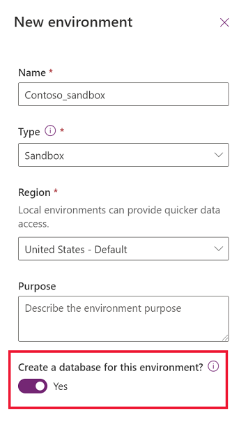
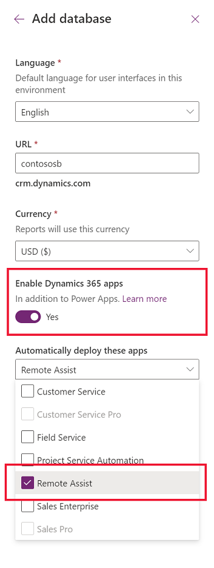
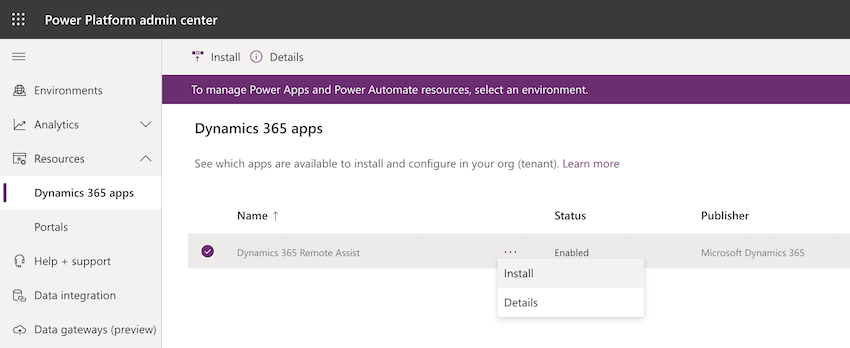

# Set up an environment to use asset capture in Dynamics 365 Remote Assist

This tutorial is the first of a series. As you progress through the series, you'll learn how to<:

1. Create an environment, and install the app.
2. Add users to the environment.
3. Import and create asset records.
4. Capture pictures with spatial markup.
5. Review the captured pictures from the Dynamics 365 Remote Assist model-driven app.
6. Create Power Automate flows to automate business processes with captured asset data.

## Prerequisites

To complete the steps in this tutorial, you need:

- **A Dynamics 365 Remote Assist subscription** to create environments and install the app.
- **The ability to manage environments in the Power Platform admin center**. This tutorial covers creating Dynamics 365 environments and installing apps. Admin access is required (Dynamics 365 service admin, global admin, or Power Platform service admin).
- **Available database capacity**. If you're creating a new environment for Dynamics 365 Remote Assist, you'll need at least 1 GB of available database capacity. Paid subscriptions of Dynamics 365 Remote Assist provide default tenant capacity. More information: [New Common Data Service storage capacity](https://docs.microsoft.com/power-platform/admin/capacity-storage)

> [!IMPORTANT]
> Trial subscriptions of Dynamics 365 Remote Assist can be used for the public preview if your organization has existing Dynamics 365 subscriptions such as Field Service, Customer Service, or paid Power Apps plans. The in-app 90 day virtual trial isn't compatible with this preview.

## Install Dynamics 365 Remote Assist model-driven app

You can install the Dynamics 365 Remote Assist app in two ways:

- Create an entirely new Dynamics 365 environment for Dynamics 365 Remote Assist.
- Use an existing environment to install the Dynamics 365 Remote Assist app in. This environment must be Dynamics 365 apps&ndash;enabled.

### Create a new environment

1. Sign in to the [Power Platform admin center](https://admin.powerplatform.com) as an admin (Dynamics 365 service admin, Global admin, or Power Platform service admin).
2. In the left pane, select **Environments**, and then select **New**.
3. Enter a name, choose **Production** or **Sandbox**, and choose **Yes** for **Create a database for this environment**. Select **Next**.

4. Select **Yes** for **Enable Dynamics 365 apps**, select **Remote Assist** from the drop-down menu, and then select **Save**. This will create an environment and automatically install the Dynamics 365 Remote Assist app. If you encounter an issue, see [the troubleshooting](#troubleshooting) section in this article.

More information: [Create and manage environments in the Power Platform admin center](https://docs.microsoft.com/power-platform/admin/create-environment#create-an-environment-in-the-power-platform-admin-center)

### Use an existing environment

1. Sign in to the [Power Platform admin center](https://admin.powerplatform.com) as an admin (Dynamics 365 service admin, Global admin, or Power Platform service admin).
2. In the left pane, select **Resources** > **Dynamics 365 apps**.
3. Find the Dynamics 365 Remote Assist app, select the ellipsis button , and then select **Install**.

4. Select an environment, review the packages to be installed, agree to the terms of service, and then select **Install**. This process might take a while.

> [!IMPORTANT]
> The environment selected must be Dynamics 365 apps&ndash;enabled (for example, you can't use the default environment). If it isn't compatible, the installation will fail. Choose another environment that's compatible, or create a new environment with Dynamics 365 apps enabled.

## Next step

You've installed the Dynamics 365 Remote Assist app! You can get to the app by opening the environment and selecting the Dynamics 365 Remote Assist app or from [https://home.dynamics.com/](https://home.dynamics.com). More information: [About Unified Interface for model-driven apps in Power Apps](https://docs.microsoft.com/power-platform/admin/about-unified-interface)

The next tutorial goes into detail about adding users to the preview so they can interact with data and enable the preview in HoloLens.

> [!div class="nextstepaction"]
> [Add users to the preview](./asset-capture-add-users.md)

## Troubleshooting

### Can't enable Dynamics 365 apps

If you aren't able to turn on the **Enable Dynamics 365 apps** toggle switch when you create an environment, ensure that you have an active Dynamics 365 Remote Assist subscription. Subscriptions can be viewed in the [Microsoft 365 admin center](https://www.admin.microsoft.com).

### Not enough capacity to create environments

Environment creation requires at least 1 GB of available database capacity. Paid subscriptions of Dynamics 365 Remote Assist provide a default tenant entitlement of 10 GB of database capacity (if Dynamics 365 Remote Assist was your first Dynamics 365 subscription). If you're on a trial and don't have any existing Dynamics 365 subscriptions that grant database capacity, you won't be able to evaluate the preview. More information: [New Common Data Service storage capacity](https://docs.microsoft.com/power-platform/admin/capacity-storage)

### The Dynamics 365 Remote Assist app isn't showing up in the Power Platform admin center

1. Check to ensure that you have an active Dynamics 365 Remote Assist subscription.
2. Try assigning a Dynamics 365 Remote Assist license to your account from the [Microsoft 365 admin center](https://admin.microsoft.com) to force a license sync to occur. Wait five minutes and see whether the app appears in the [Power Platform admin center](https://admin.powerplatform.com).
3. If the steps above don't resolve the issue, file a support request by going to the [Power Platform admin center](https://admin.powerplatform.com) > **Help + support** > **New support request**.

### The Dynamics 365 Remote Assist model-driven app failed to be installed because of missing dependencies

This will occur if you try installing Dynamics 365 Remote Assist in an environment that isn't enabled for Dynamics 365 apps. Try installing the app in an environment where other Dynamics 365 apps&mdash;such as Field Service or Sales&mdash;are installed, or create a new environment that's enabled for Dynamics 365 apps. More information: [Create a new environment](#install-dynamics-365-remote-assist-model-driven-app)
