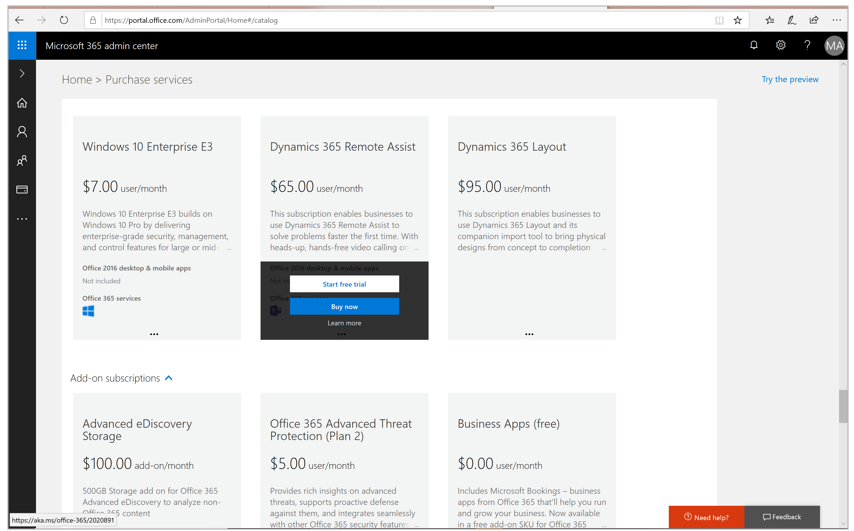
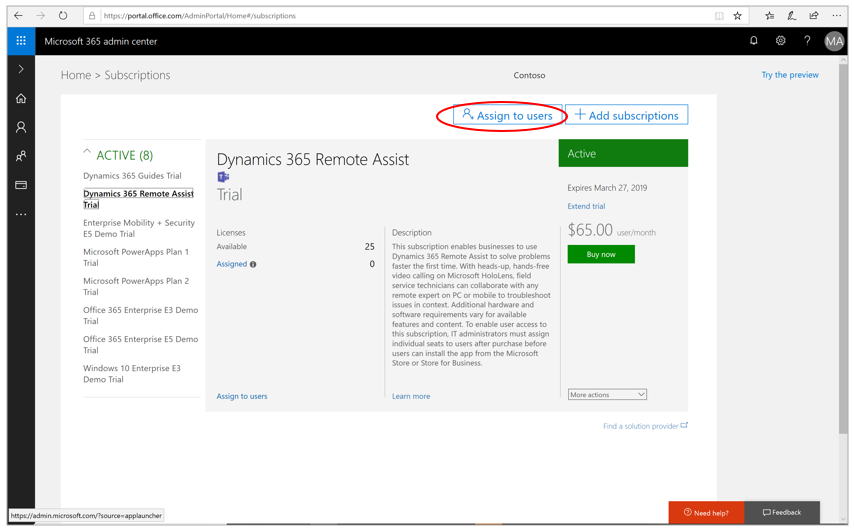
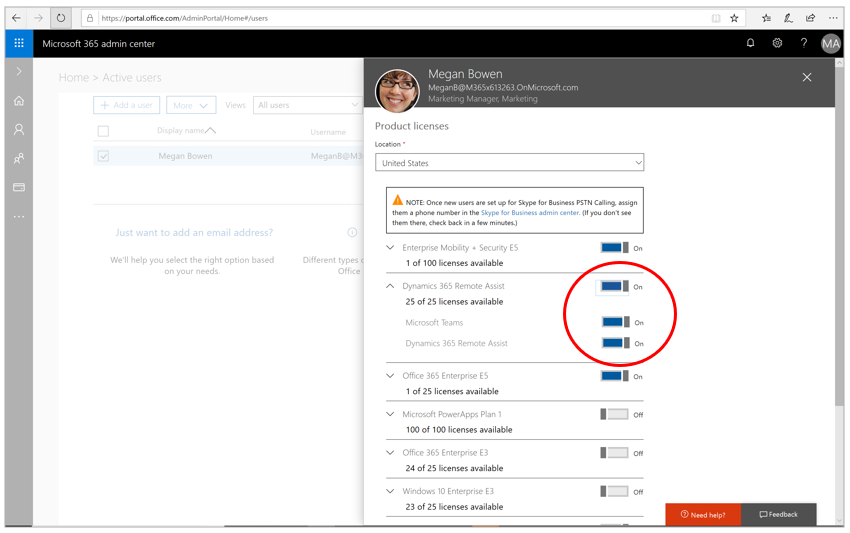

# Buy Dynamics 365 Remote Assist Licenses for HoloLens and Mobile

IT Admins can buy Dynamics 365 Remote Assist licenses for HoloLens 1, HoloLens 2, and mobile devices to each worker in your organization to complete crucial tasks faster, safer, and more efficiently.

> [!NOTE]
> There are two users for D365 Remote Assist or D365 Remote Assist Attach: Field service technicians and Remote experts. Field service technicians require D365 Remote Assist or D365 Remote Assist Attach licenses **and** a Microsoft Teams license. Experts require a Microsoft Teams license only. You can find out more information of how to buy a Microsoft Teams license here. This document only explains how to buy D365 Remote Assist or D365 Remote Assist Attach for field service technicians. 

In this topic, we’ll walk through the two D365 Remote Assist licenses that IT Admins can buy for their organization: 
- Dynamics 365 Remote Assist licenses 
- Dynamics 365 Remote Assist Attach license (for Dynamics 365 Field Service customers only) 

## Prerequisites 

1. Your organization must have a Microsoft 365 or Office 365 administrator account. Learn more about admin permission here. 

## Option 1: Remote Assist license 

Buy Remote Assist licenses through your Microsoft 365 or Office 365 administrator portal. 

1.	Log into the M365 or O365 Administrator Portal using your organization’s admin account: https://www.microsoft.com/en-us/microsoft-365/business/office-365-administration
 
2.	Make sure the “Try the new admin center” toggle is turned off.
  
3.	In the left navigation bar, select **Billing > Purchase Services**. 
 
4.	A list of services will populate the screen. Search for or scroll down until you find **Dynamics 365 Remote Assist**.
5.	Hover over the plan and two options will appear: Start free trial or Buy now. Select **Buy now**. Follow the next steps of the payment process. 
 
6.	Next, add and assign licenses to users in your organization here. 

## Option 2: Dynamics 365 Remote Assist Attach license (for Dynamics 365 Field Service customers only)

If you’re a Dynamics 365 Field Service customer, you can buy Remote Assist Attach license through your Microsoft 365 or Office 365 administrator portal. 

1.	Log into the M365 or O365 Administrator Portal: https://www.microsoft.com/en-us/microsoft-365/business/office-365-administration
 
2.	Make sure the “Try the new admin center” toggle is turned off.
  
3.	In the left navigation bar, select **Billing > Purchase Services**. 
 
4.	A list of services will populate the screen. Search for or scroll down until you find **Dynamics 365 Remote Assist Attach**.
5.	Hover over the plan and two options will appear: Start free trial or Buy now. Select **Buy now**. Follow the next steps of the payment process. 
6.	Next, add and assign licenses to users in your organization here. 

Learn more about how to try Remote Assist for free here. 
Learn more about how to deploy your Remote Assist licenses to the workers of your organization here. 

# Buy and deploy Dynamics 365 Remote Assist

With [!include[cc-microsoft](../includes/cc-microsoft.md)] [!include[pn-dyn-365-remote-assist](../includes/pn-dyn-365-remote-assist.md)], you can bridge the gap between the real and digital worlds to complete crucial tasks faster, safer, and more efficiently, and create new ways to connect with customers and partners.

## Subscribe to Dynamics 365 Remote Assist

> [!TIP]
> Did you know you can try [!include[pn-dyn-365-remote-assist](../includes/pn-dyn-365-remote-assist.md)] for free for up to 90 days? [Learn more about the free 90-day trial](try-remote-assist-free.md).

You can subscribe to [!include[pn-dyn-365-remote-assist](../includes/pn-dyn-365-remote-assist.md)] in any of the following ways:

-   Contact a [!include[cc-microsoft](../includes/cc-microsoft.md)] representative by: 
    - Calling us at 1-888-477-7989, or
    
    - Requesting to be contacted at https://aka.ms/getRemoteassist.
    
-   Through the [Microsoft 365 Admin Center](https://admin.microsoft.com/AdminPortal/Home#/catalog). Step-by-step instructions for logging in to the [!include[pn-microsoft-365-admin-center](../includes/pn-microsoft-365-admin-center.md)] and subscribing are provided below.

-   [Enterprise agreements (Volume Licensing Portal)](https://www.microsoft.com/licensing/servicecenter/default.aspx)

-   [Cloud Service Provider (Partner Center Portal)](https://partner.microsoft.com/cloud-solution-provider/csp-partner)

## Subscribe through the Microsoft 365 Admin Center

1. Go to https://admin.microsoft.com/AdminPortal/Home#/catalog.

   
   
2. Log in under your company's admin account.

3. If you don't know who your admin is, contact the IT help desk at your company to find out. [Get more advice on admin accounts](https://support.office.com/article/office-365-admin-overview-c7228a3e-061f-4575-b1ef-adf1d1669870?ui=en-US&rs=en-US&ad=US).

4. Under **Billing** in the left navigation, select **Purchase services**.
   
5. Scroll down to the **Other plans** section.

   
   
6. Find the product card for [!include[pn-dyn-365-remote-assist](../includes/pn-dyn-365-remote-assist.md)].

   
           
7. To subscribe, select **Buy now**.

   > [!NOTE]
   > If you're not ready to buy yet, you can sign up for a free 30-day trial on your organization's tenant by selecting **Start free trial**. The 30-day free trial includes access to [!include[cc-microsoft](../includes/cc-microsoft.md)] Teams for [!include[pn-HoloLens](../includes/pn-HoloLens.md)] users. 
   
8. Assign licenses to users as described in the next procedure.

## Assign licenses to users

After subscribing (or signing up for a free 30-day trial), you’ll need to assign licenses to users in the [!include[pn-microsoft-365-admin-center](../includes/pn-microsoft-365-admin-center.md)] or [Partner Center](https://partner.microsoft.com/cloud-solution-provider/csp-partner). Each user you
assign a license to will need an [!include[pn-azure-active-directory](../includes/pn-azure-active-directory.md)] ([!include[pn-azure](../includes/pn-azure.md)] AD) account.

### Assign a license to a user in the Microsoft 365 Admin Center

1. In the [!include[pn-microsoft-365-admin-center](../includes/pn-microsoft-365-admin-center.md)], under **Billing** in the left navigation, select **Subscriptions**, and then select **Assign to users**.

   
   
2. Select the users you'd like to assign the trial or subscription to, and then in the **Bulk actions** menu on the right side of the screen, select **Edit product licenses**. 

   
   
3. In the **Assign products** screen, select the **Add to existing product license assignments** option, and then select **Next**.

   
   
4. Select the licenses you want to enable for the selected users, and then select **Add**.

   

## Make the Dynamics 365 Remote Assist app available to your users

After you’ve subscribed and assigned licenses to your users through the [!include[pn-microsoft-365-admin-center](../includes/pn-microsoft-365-admin-center.md)] or Partner Center, you can make the [!include[pn-dyn-365-remote-assist](../includes/pn-remote-assist.md)] app available through one of the following:

-   [!include[cc-microsoft](../includes/cc-microsoft.md)] Store for Consumers
-   [!include[cc-microsoft](../includes/cc-microsoft.md)] Store for Business

If you use the [!include[cc-microsoft](../includes/cc-microsoft.md)] Store for Business, you can have users install the app
in any of the following ways:

-   From your organization’s private store
-   From an email link that you send
-   Through mobile device management (MDM)

### Install Dynamics 365 Remote Assist from the Microsoft Store for Consumers

For information on installing the [!include[pn-dyn-365-remote-assist](../includes/pn-dyn-365-remote-assist.md)] app from the [!include[cc-microsoft](../includes/cc-microsoft.md)] Store for Consumers, see the [Dynamics 365 Remote Assist user guide](../remote-assist/user-guide.md). 

> [!NOTE]
> When users launch the [!include[pn-dyn-365-remote-assist](../includes/pn-dyn-365-remote-assist.md)] app, they’ll need to use the same [!include[pn-azure](../includes/pn-azure.md)] AD account that the admin assigned in the [!include[pn-microsoft-365-admin-center](../includes/pn-microsoft-365-admin-center.md)].

### Distribute the app through the Microsoft Store for Business

1.  Go to the [Store for Business](https://businessstore.microsoft.com/store).

2.  [Acquire the app](https://docs.microsoft.com/microsoft-store/acquire-apps-microsoft-store-for-business).

3.  Choose one of the following distribution methods:

    -   [Private store](https://docs.microsoft.com/microsoft-store/distribute-apps-from-your-private-store)
    -   [Email link](https://docs.microsoft.com/microsoft-store/assign-apps-to-employees)
    -   [Mobile device management](https://docs.microsoft.com/microsoft-store/configure-mdm-provider-microsoft-store-for-business)

### See also
[Try Dynamics 365 Remote Assist for free for up to 90 days](try-remote-assist-free.md) 
[Overview of Dynamics 365 Remote Assist](../remote-assist/index.md) 
[Dynamics 365 Remote Assist user guide](../remote-assist/user-guide.md) 

