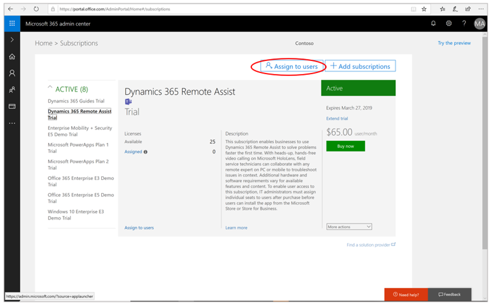
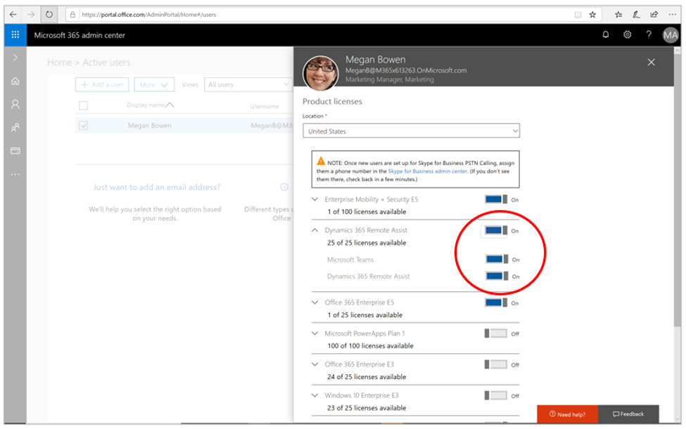

# Deploy Dynamics 365 Remote Assist

After you acquire either the 30-day Dynamics 365 Remote Assist trial license, Dynamics 365 Remote Assist subscription, or Dynamics 365 Remote Assist Attach subscription for **HoloLens 1**, **HoloLens 2**, and **mobile device**, IT Admins can assign licenses to users in their organization and then users in their organization can deploy Dynamics 365 Remote Assist on their devices.

> [!NOTE]
> There are two users for D365 Remote Assist or D365 Remote Assist Attach: Field service technicians and Remote experts. Field service technicians require D365 Remote Assist or D365 Remote Assist Attach licenses **and** Microsoft Teams license. When you buy D365 Remote Assist or D365 Remote Assist Attach licenses, it includes Micrsoft Teams licenses. On the otherhand, experts require a Microsoft Teams license only. You can find out more information on how to deploy Microsoft Teams licenses for experts in your organization [here](https://docs.microsoft.com/en-us/dynamics365/mixed-reality/remote-assist/use-microsoft-teams-with-remote-assist).

In this topic, we’ll walk through the ways you can deploy Dynamics 365 Remote Assist or Dynamics 365 Remote Assist Attach (for D365 Field Service customers only): 
-	Assign licenses to users in your organization (for IT Admins only)
-	Deploying D365 Remote Assist on your device (for individuals in an organization) 

## Prerequisites for IT Admins 
- Your organization must have a Microsoft 365 or Office 365 [administrator account](https://www.microsoft.com/en-us/microsoft-365/business/office-365-administration). Learn more about admin permissions [here](https://docs.microsoft.com/en-us/office365/admin/admin-overview/admin-overview?redirectSourcePath=%252farticle%252foffice-365-admin-overview-c7228a3e-061f-4575-b1ef-adf1d1669870&view=o365-worldwide). 
- Your organization must acquire the 30-day Dynamics 365 Remote Assist trial license, Dynamics 365 Remote Assist subscription, or Dynamics 365 Remote Assist Attach subscription. Obtain the 30-day D365 Remote Assist trial licenses [here](try-remote-assist.md) or buy D365 Remote Assist licenses [here](buy-remote-assist.md). 
- Make sure that users in your organization have the required licensing and device before setting up your device. Licensing and Product requirements can be found [here](https://docs.microsoft.com/en-us/dynamics365/mixed-reality/remote-assist/requirements).

## Add and assign licenses to users in your organization (for IT Admins only)

After you have acquired a 30-day Dynamics 365 Remote Assist trial license, Dynamics 365 Remote Assist subscription, or Dynamics 365 Remote Assist Attach subscription, you can now **add and assign licenses** to *individual users* or a *group of users* in your organization through using the Microsoft 365 or Office 365 administrator portal. 

1.	Log into the M365 or O365 Administrator Portal using your organization’s admin account: https://www.microsoft.com/en-us/microsoft-365/business/office-365-administration

2.	Make sure the **Try the new admin center** toggle is turned off.
###

3.	In the left navigation bar, select **Billing > Subscriptions**. 
###

4.	Select **Assign to users**. 

5.	You can **add individual users** to your 30-day Dynamics 365 Remote Assist trial license, Dynamics 365 Remote Assist subscription, or Dynamics 365 Remote Assist Attach subscription. Select **Add a user**. You can find more information about adding users [here](https://docs.microsoft.com/en-us/office365/admin/add-users/add-users?view=o365-worldwide).
###

6.	Fill out the users in your organization that you would like to add and be sure to provide them with Dynamics 365 Remote Assist and Microsoft Teams licenses under the **Product licenses** section. If you were using a Dynamics 365 Remote Assist Attach license, you would do the same actions. 

7.	You can also **add multiple users** to your 30-day Dynamics 365 Remote Assist trial license, Dynamics 365 Remote Assist subscription, or Dynamics 365 Remote Assist Attach subscription. Select **More > Import multiple users**. Fill out the CSV file, set user options, and view your results. 

8.	After you have added individual users or multiple users to your 30-day Dynamics 365 Remote Assist trial license, Dynamics 365 Remote Assist subscription, or Dynamics 365 Remote Assist Attach subscription, you can now **assign licenses** to them through the Microsoft 365 or Office 365 administrator portal through instructions [here](https://docs.microsoft.com/en-us/office365/admin/manage/assign-licenses-to-users?view=o365-worldwide).

9. The users in your organization can now set up Dynamics 365 Remote Assist on their device. Instructions below. 

## Prerequisites for deploying Dynamics 365 Remote Assist on your device (for individuals in an organization)
- The IT Admin of your organization must add you as a user and assign you the 30-day Dynamics 365 Remote Assist trial license, Dynamics 365 Remote Assist subscription, or Dynamics 365 Remote Assist Attach subscription **and** Microsoft Teams license in the Microsoft 365 or Office 365 administrator portal, instructions are above. 
- A [Microsoft Teams account](https://teams.microsoft.com/start). Learn how to set up your Microsoft Teams account [here](https://docs.microsoft.com/en-us/dynamics365/mixed-reality/remote-assist/use-microsoft-teams-with-remote-assist). 
- A HoloLens 1, HoloLens 2, or mobile device. Licensing and Product requirements can be found [here](https://docs.microsoft.com/en-us/dynamics365/mixed-reality/remote-assist/requirements).

## Deploying Dynamics 365 Remote Assist on your device (for individuals in an organization)

After your IT Admin of your organization assigned you the 30-day Dynamics 365 Remote Assist trial license, Dynamics 365 Remote Assist subscription, or Dynamics 365 Remote Assist Attach subscription that includes Microsoft Teams licenses, users can start using the app on their HoloLens 1, HoloLens 2, or mobile devices. 

### Steps for HoloLens 1 and 2
1.	If you’re using the HoloLens, go to the Start menu and then select Microsoft Store. 
2.	Search for and download Dynamics 365 Remote Assist and launch the app.
3.	Sign into Dynamics 365 Remote Assist with your Microsoft Teams account. 
4.	If you are trying a free trial, it will prompt you to start your **Free Trial of Dynamics 365 Remote Assist**. Select **Continue**. Afterwards, you will be taken to your Contacts page.  
5.	If you already bought your D365 Remote Assist or D365 Remote Assist Attach that includes Microsoft Teams licenses, you will be taken to your Contacts page.  
6.	You can now use Dynamics 365 Remote Assist on your HoloLens 1 or 2! Learn how to make calls to a remote expert on Microsoft Teams (desktop and mobile) [here](user-guide.md). 

### Steps for Mobile
1.	If you’re using a mobile device, go to the appropriate iOS and Android app store.
2.	Search for and download Dynamics 365 Remote Assist and launch the app.
3.	Sign into Dynamics 365 Remote Assist with your Microsoft Teams account. 
4.	If you are trying a free trial, it will prompt you to start your **Free Trial of Dynamics 365 Remote Assist**. Select **Continue**. Afterwards, you will be taken to your Contacts page.  
5.	If you already bought your D365 Remote Assist or D365 Remote Assist Attach licenses that includes Microsoft Teams licenses, you will be taken to your Contacts page.  
6.	You can now use Dynamics 365 Remote Assist on your mobile device! Learn how to make calls to a remote expert on Microsoft Teams (desktop and mobile) [here](mobile-app/make-calls.md).

## Next steps
- Learn how to use Dynamics 365 Remote Assist on [HoloLens 1](user-guide.md). 
- Learn how to use Dynamics 365 Remote Assist on [HoloLens 2](user-guide.md). 
- Learn how to use Dynamics 365 Remote Assist on [mobile devices](mobile-app/remote-assist-mobile-overview.md). 
