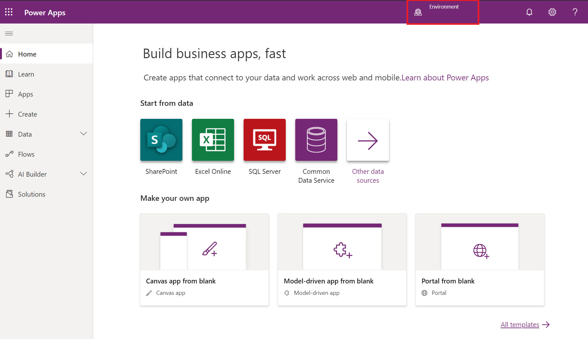
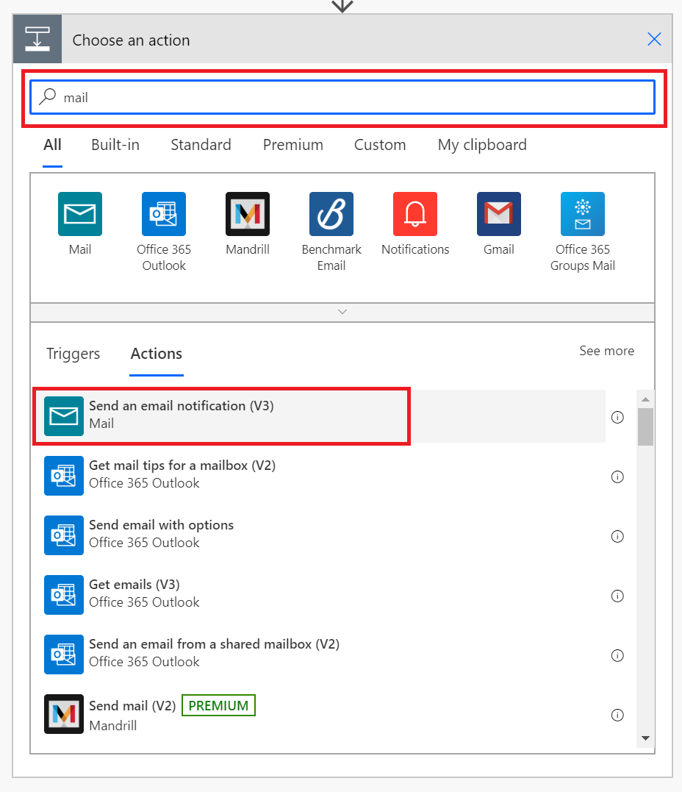
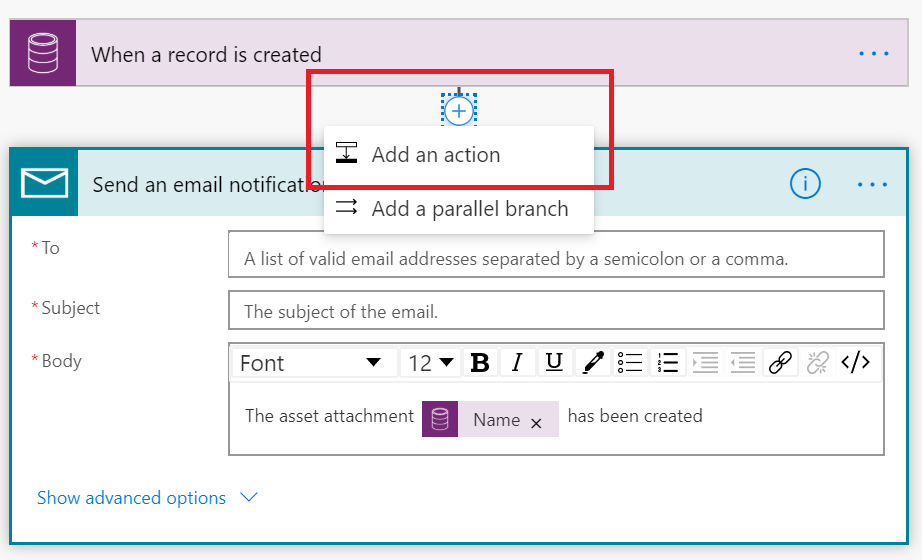
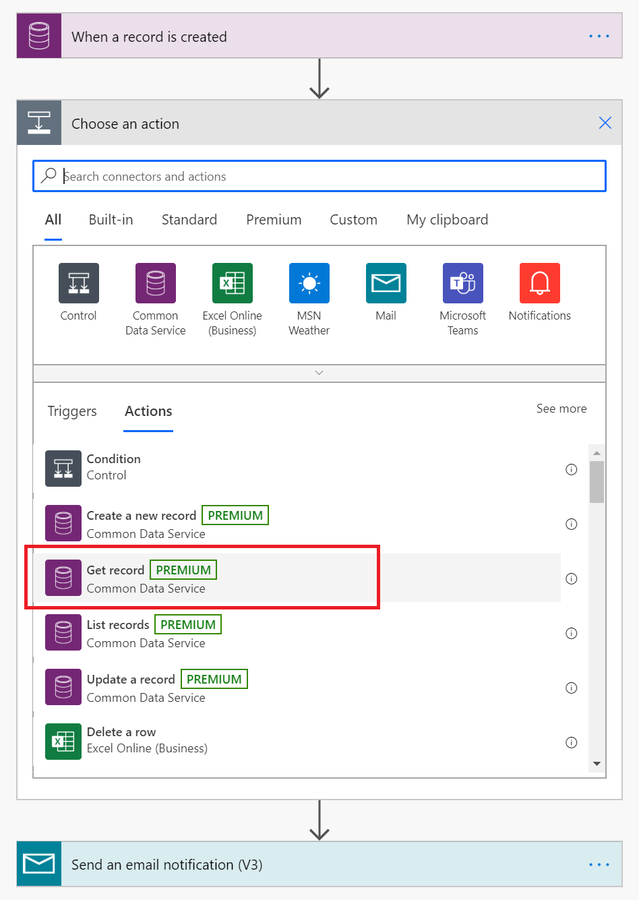
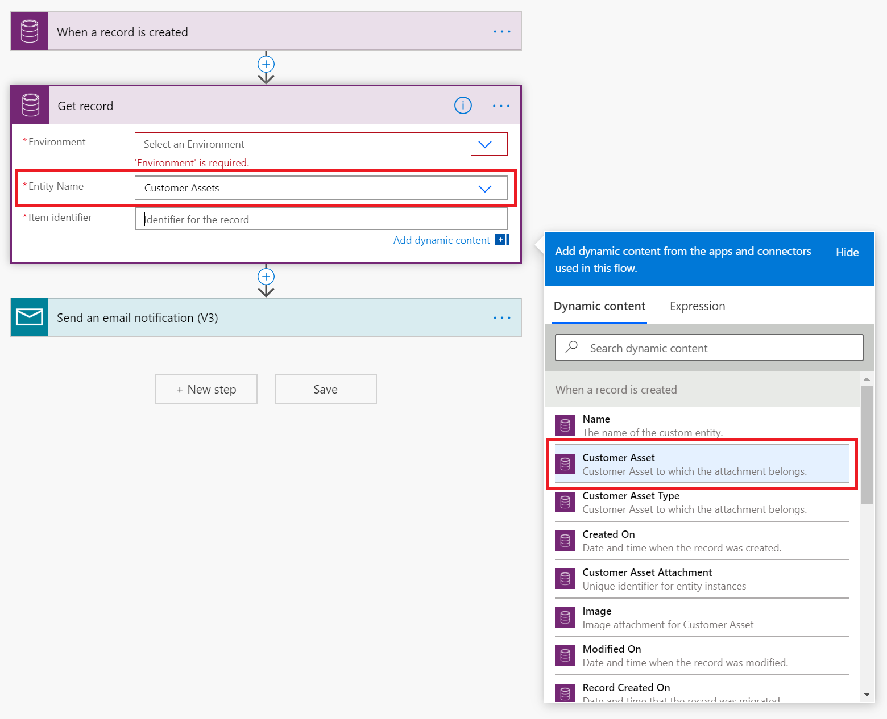
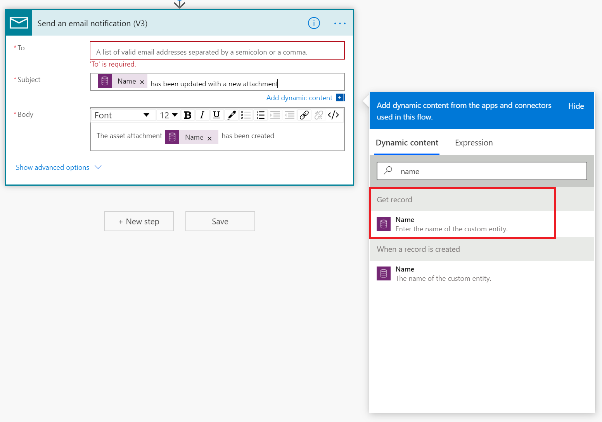
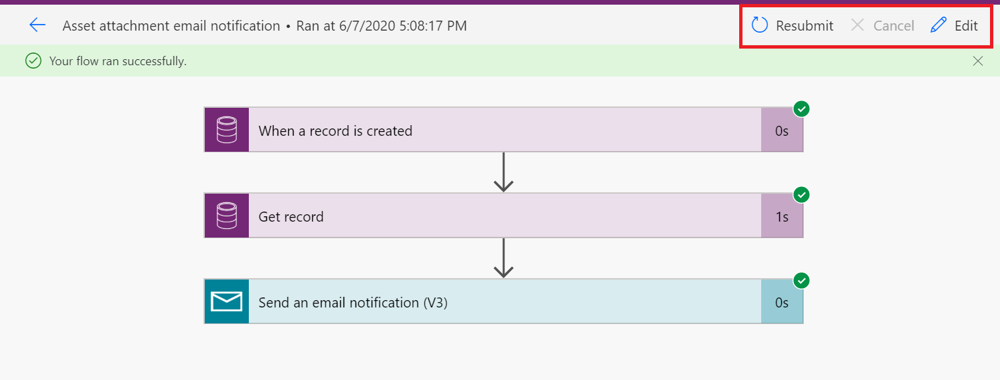

# Integrate with Power Automate

The Asset Capture feature leverages the Common Data Service (CDS) platform. This enables you to create Power Automate flows based on this data to streamline various processes, including getting notifications, modifying other data entities, and generating reports. In this article, you will create a flow to get a simple email notification whenever a new asset attachment is created.

## Prerequisites

To complete this article, you need:

- **Access to the environment Remote Assist is installed in**
- **License and access to [Power Automate](https://docs.microsoft.com/power-automate/)**

## Create Flows with Power Automate

1.	Go to make.powerapps.coms and sign in
2.	Select the appropriate environment where you installed the Remote Assist model-driven app

3.	Select Flows from the left navigation. Click on **+ New** to start creating a new flow. Select **“Automated-from blank”**

4.	To begin creating a new automated flow, you must select a trigger which initiates the flow. In this case, search for and select the **“When a record is created”** trigger from Common Data Service. You may also name your flow on this screen. After filling out all the details, select **Create**.

5.	Provide the details of the trigger. Here, we will select the environment and scope in which the flow will apply. For the entity name, search for and select **Customer Asset Attachment**. After that, click on **+ New Step**.

6.	In the **“Choose an action”** dialog box, search for mail and select the **“Send an email notification”** action.

7.	Enter the email address you want to send the notification to. In the body, Dynamic content within Power Automate allows us to easily craft a message including the name of the Customer Asset attachment entity whose creation triggered the flow.

8.	In the subject, we want to include the name of the Customer Asset entity with which the Asset Attachment is associated. To get the attributes (such as name) associated with the asset entity, first we’ll have to fetch that entity. Click on the + between the trigger and the email notification action. Then select **“Add an action”**.

9.	Select **“Get Record”** from CDS from the actions. Select the appropriate environment and the **Customer Assets** entity. Now in the item identifier, the Dynamic content and CDS relationship helps you pick the Customer Asset associated with attachment.

10.	Now we can go back to the **“Send an email notification”** step. This time, when searching for name in the dynamic content, we have the option of selecting the customer entity name, because we fetched the associated customer entity in the previous step. Go ahead and include that in the subject. Click on Save. Your flow is now complete.

11.	You can use the **“Flow Checker”** and **“Test”** buttons to validate your newly created flow.

## Test your flow
1.	Follow the steps in **[capture asset conditions](./asset-capture-photos.md)** to create a new asset capture entity record.
2.	Go to the Flows page again to select the flow you created. On this page, you can see recent runs of the flow. Click on the most recent run to see its details.

3.	If there are errors in the flow, you can click edit to modify the flow. You can then resubmit the previous run to test your flow again, without having to create a new asset capture entity.
