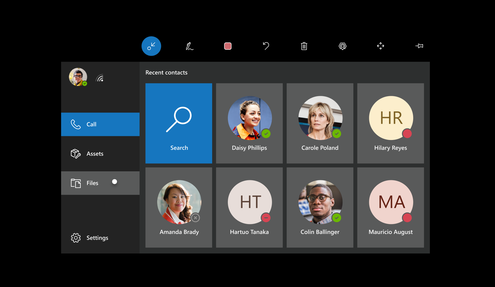
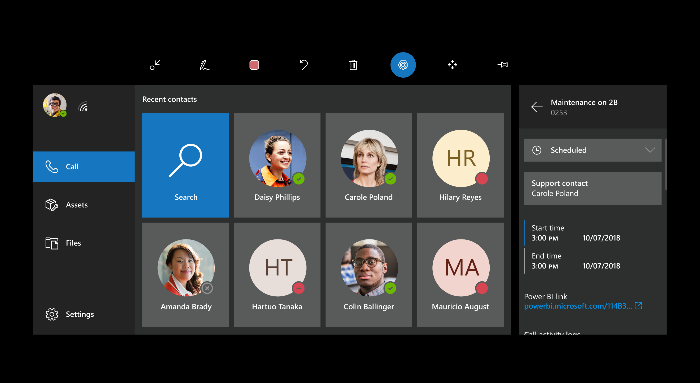

# Make or take calls in Dynamics 365 Remote Assist on HoloLens

With Microsoft Dynamics 365 Remote Assist, you can make or take the following types of calls:  

- **One-to-one call**. A one-to-one call includes two participants. For example, if you're repairing a machine and need help on-the-go, you can make a one-to-one call to a remote collaborator who uses Microsoft Teams.

- **Group call**. A group call includes three or more participants. For example, if you're inspecting an asset in a one-to-one call but need a third person's expertise, any participant can add the third person to the call to form a group call.  

- **Meeting**. A meeting is a scheduled call using Teams or Outlook. Meetings can include any number of participants. For example, if you want to have a weekly inspection with your team, you can create a meeting so that everyone receives notifications about the meeting and can join the meeting.

## Supported scenarios

The following scenarios are supported when using Dynamics 365 Remote Assist on HoloLens:

* You can collaborate with a Teams desktop user in a one-to-one call, group call, or meeting scheduled using Microsoft Teams or Outlook
* You can collaborate with a Dynamics 365 Remote Assist mobile user in a one-to-one call or group call
* You can collaborate with a Teams mobile user in a one-to-one call

> [!NOTE]
> The mixed-reality toolbar will not appear if the Dynamics 365 Remote Assist user joins the call from two different devices.

## Make a one-to-one call to a contact in your company

When you open Dynamics 365 Remote Assist, you'll see your recent contacts list in the **Call** tab. To call one of the contacts you see, select the contact.

If your organization has enabled integration with Dynamics 365 Field Service, you can view and call the contact assigned to your Field Service booking. Select the Dynamics 365 Field Service icon (or say, "Remote Assist, Dynamics"), go to your instance and booking, then select the **Support Contact** listed.

If you don't see the contact you want, select Search and then use the holographic keyboard to enter a name or email address. 

>[!Note]
> After the intended contact pops up, select the contact to call them.  

## Make a one-to-one call to a Teams user outside your tenant

You can search, call, and receive a call from a Dynamics 365 Remote Assist user in another tenant if your tenant is federated with that tenant. To call a federated user, open the app, select **Search**, and then use the holographic keyboard to enter their full email address. You won't see any search results if you enter just a name or a partial email address. After you call them once, they will appear in your recent contacts list, so you will not have to search for them again.

>[!Note]
> If you're not able to find the contact you're looking for, it might be because Teams federation (that is, "[Teams external access](/microsoftteams/manage-external-access)") has not been enabled. Contact your administrator for help.

## Make a group call

A group call can include Dynamics 365 Remote Assist HoloLens or HoloLens 2 users with Dynamics 365 Remote Assist mobile users and Teams desktop users. You can also switch between participants' video feeds and mute participants as needed. Learn more about joining group calls with Dynamics Remote Assist mobile users and Teams desktop users [here](./mobile-app/group-calling.md).

Start by calling one person, and then select **Open Participants** (as seen here: ).

You'll see the first person you called on the left side of the video card, and a list of participants on the right side of the video card. On the bottom of the video card is a text field. Select it, and a holographic keyboard will pop out. A list of your recent contacts will appear. If the person you'd like to call isn't on the list, enter a name or email address using the holographic keyboard, and then select a name in the search results to start the call.

To mute a participant, select **Open Participants** or say "Remote Assist, Open Participants." Tap on a participant to see a video feed of them. Tap on a participant's mute button next to their name to mute them. A muted participant is the only one who can unmute themselves.

> [!Note]
> Learn more about the number of participants that can join a Microsoft Teams call [here](/MicrosoftTeams/limits-specifications-teams#meetings-and-calls). However, with a large number of participants, you may experience some performance issues, such as delays in viewing annotations and lower video resolution.
>
> You can't mute another participant in a one-to-one call. You can only mute and unmute yourself.

## Accept a call

Select **Video** (or say "Remote Assist, Video") to accept the call as a video call or **Audio** (or say "Remote Assist, Audio") to accept it as a voice-only call. To decline the call, select **Ignore** (or say "Remote Assist, Ignore").

> [!Note]
> To receive calls when you're using other apps on HoloLens, first open the Dynamics 365 Remote Assist app. Then use the **Start** gesture to go to the start menu, and select another app to use. This keeps Dynamics 365 Remote Assist running in the background.
>
> You'll get a notification if a Dynamics 365 Remote Assist call comes in, and you'll be able to select **Accept** to initiate an audio call, **Video** to initiate a video call, and **Ignore** to ignore the call.
>
> In other words, you can receive a call in two scenarios – if Dynamics 365 Remote Assist is the app you have open and if it's running in the background.

When you join the call, remote collaborators will be able to see what you see in your space—including holograms.

## End a call

To end a call, select **End Call** (as seen here: ), or say "Remote Assist, End Call."

### Learn more 
- View documentation on group calls between Dynamics 365 Remote Assist mobile, Dynamics 365 Remote Assist HoloLens, and Teams desktop [here](./mobile-app/group-calling.md).

[!INCLUDE[footer-include](../includes/footer-banner.md)]
