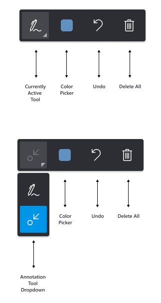
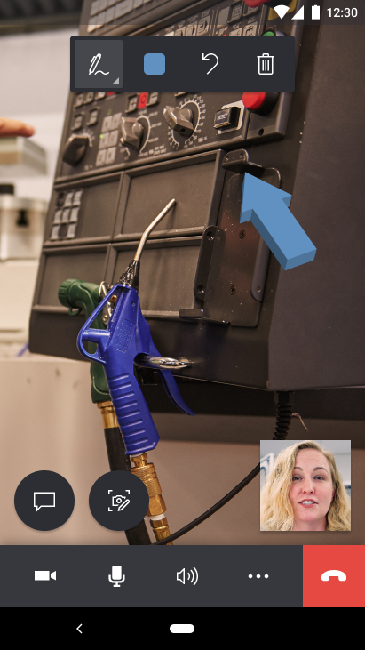
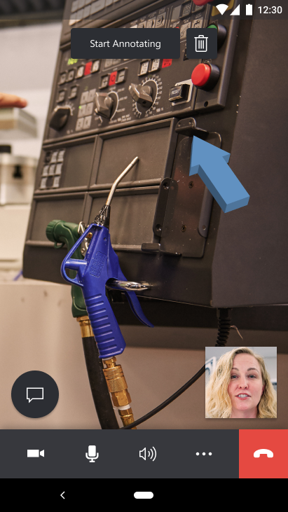
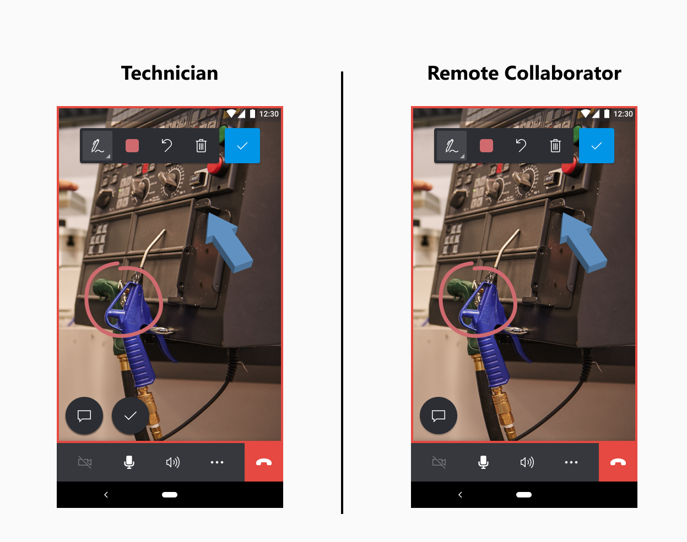

# Annotate the technician's shared environment

In Dynamics 365 Remote Assist mobile, mixed reality annotations enable technicians and remote collaborators to visually specify an area or particular asset in their environment to look at or manipulate. During a Remote Assist mobile video call, the technicians will share their environment with the remote collaborator through their rear-facing camera. The technician can instantly place mixed reality annotations on their shared environment. However, the remote collaborator must place mixed reality annotations on a frozen frame of the technician's shared environment.  

## Annotating for technicians using Remote Assist mobile

1. The annotation toolbar allows technicians to place **Arrows** and **Drawings** into their environment. The **Color picker** changes the color of your annotations. The **Undo** icon allows technicians to remove the last annotation that they placed in their environment. The **Delete All** icon allows technicians to remove all annotations that they placed in their environment (they cannot remove the expert's annotations).

2. Place your annotations to your shared environment. The remote collaborator will see your annotations in real time on Microsoft Teams.

## Annotating for remote collaborators using Remote Assist mobile

1. To add annotations, you must select **Start Annotating**.

> [!TIP]
> To delete annotations you added during this editing session, select **Delete All**.

2. You will enter a **frozen frame** of the technician's environment and then you can add your annotations onto the frozen frame.

3. To stop adding annotations to the snapshot, you must select **Check Mark**. You will return to the technician's live video feed and your annotations will automatically appear on the technician's environment.

## Annotating for remote collaborators using Teams desktop/mobile

1. The annotation toolbar allows remote collaborators to place **Arrows** and **Drawings** into their environment. The **Color Picker** changes the color of your annotations. The **Undo** icon allows remote collaborators to remove the last annotation that they placed in their environment. The **Delete All** icon allows remote collaborators to remove all annotations that they placed in their environment (they cannot remove the technician’s annotations).

2. To add annotations, you must select **Start editing**.

3. You will enter a **frozen frame** of the technician's environment and then you can add your annotations onto the frozen frame.

4. To stop adding annotations to the snapshot, you must select **Stop editing**. You will return to the technician's live video feed and your annotations will automatically appear on the technician's environment.

