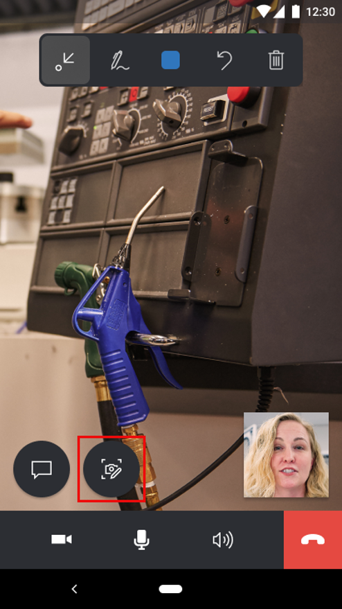

# Capture and annotate snapshots 

Snapshots are critical in situations where a still image might help communicate what a technician is looking at and the addition of placing 2D annotations on snapshots provide emphasis on specific elements in the technicians' environment. These snapshots can be used later for reference or work validation, and can provide relief in low-bandwidth scenarios where live video just isn't cutting it; learn more about using snapshots in low-bandwidth scenarios [here](https://docs.microsoft.com/en-us/dynamics365/mixed-reality/remote-assist/mobile-app/poor-network-connectivity). 

Remote Assist mobile now provides technicians with the ability to **capture and annotate still snapshots** of their environment during a call. These snapshots can either be **discarded** or be **saved to the technicians' mobile device's Photo Gallery**, **shared to the in-call text chat**, and **both**. 

If the technician is a **Dynamics 365 Field Service** customer, the snapshot can be automatically posted to an associated work order, learn more [here](https://docs.microsoft.com/en-us/dynamics365/mixed-reality/remote-assist/mobile-app/fs-integration).

## How it works

1.	During a Remote Assist mobile call, select the **Snapshot** icon to snap your photo. 

2. The snapshot is shared to the remote collaborator's screen on Microsoft Teams.

3. If the technician wants to capture a snapshot of their environment without annotations, you can skip to Step 5.

4. Both the technician and remote collaborator can place 2D annotations to the snapshot. 

5.	After both the technician and remote collaborator are finished annotating on the snapshot, the technician selects the **Check Mark** to **save** or **discard** the snapshot.  

6.	The technician is prompted with the options to **discard** the snapshot or **save** the snapshot to either the **mobile device's Photo Gallery**, **Remote Assist mobile's text chat**, or **both**. Select your choice(s) and then select **Save.**

7. The technician is notified when the snapshot has been **successfully saved** or **failed**. If the snapshot has not been saved, then you can try taking another snapshot and saving it again. 

8. Afterwards, the technician is taken back to the live video call and can select the snapshot icon again to take more snapshots. 
>[!NOTE] Annotations added on a still snapshot will **not** appear in the technician's environment after it has been saved or discarded. 

9. If the technician successfully saved the snapshot, then the snapshots can be viewed in the **mobile device’s Photo Gallery** and/or **Microsoft Teams text chat** at the end of the call. If the technician is a **Dynamics 365 Field Service customer**, then the technician can choose to automatically post their snapshots to an **associated work order** and view the snapshot there.
