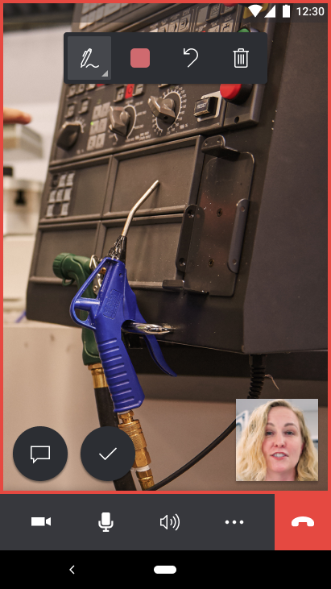
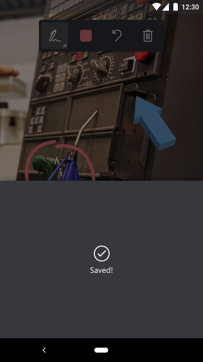
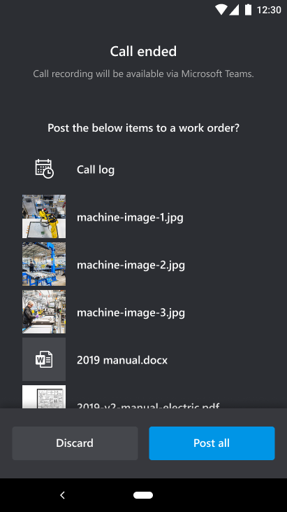

# Capture and annotate snapshots in Dynamics 365 Remote Assist mobile 

Snapshots are critical in situations where a still image might help communicate what a technician is looking at. Hence, the addition of placing 2D annotations on snapshots provides emphasis on specific elements in the technicians' environment. These snapshots can be used later for reference or work validation, and can provide relief in **low-bandwidth scenarios** where live video just isn't cutting it or on **devices without AR support**; learn more about using snapshots in low-bandwidth scenarios [here](./poor-network-connectivity.md) and on devices without AR support [here](./calls-using-devices-without-ar.md). 

Dynamics 365 Remote Assist mobile users can capture and annotate snapshots of their environment during a call. Users can then save or discard the snapshot. Specifically, users can save snapshots to their mobile device's photo gallery, the in-call text chat, or both.

If the technician is a Dynamics 365 Field Service customer, snapshots can also be posted to an associated work order. Learn more [here](./fs-integration.md).

## How it works

1. As the technician using Dynamics 365 Remote Assist mobile, select the **Snapshot** icon to snap your photo. 

2. You'll know you're in snapshot mode when a **red border** appears on your device's screen. The snapshot is automatically shared to the remote collaborator's screen on Microsoft Teams.

3. Both the technician and remote collaborator can place 2D annotations to the snapshot. 

4.	After both the technician and remote collaborator are finished annotating on the snapshot, the technician selects the **Check Mark** to **save** or **discard** the snapshot.  

5.	The technician is prompted with the options to **discard** the snapshot or **save** the snapshot to either the **mobile device's photo gallery**, **Dynamics 365 Remote Assist mobile's text chat**, or **both**. Select your choice and then select **Save.**

1. The technician is notified when the snapshot has been **successfully saved** or **failed**. If the snapshot has not been saved, you can try taking another snapshot and saving it again. 

8. Afterwards, the technician is taken back to the live video call and can select the snapshot icon again to take more snapshots. 
   
>[!NOTE] 
> Annotations added on a snapshot will **not** appear in the technician's environment after it has been saved or discarded. 

1. If the technician successfully saved the snapshot, then the snapshots can be viewed in the **mobile device’s Photo Gallery** and/or **Microsoft Teams text chat** at the end of the call. 

2.  If the technician is a Dynamics 365 Field Service customer and saved their snapshot to the text chat, after the call ends, the technician can post their snapshot(s) to an associated work order and view the snapshot there. Learn more about D365 Field Service integration [here](./fs-integration.md).

[!INCLUDE[footer-include](../../includes/footer-banner.md)]
