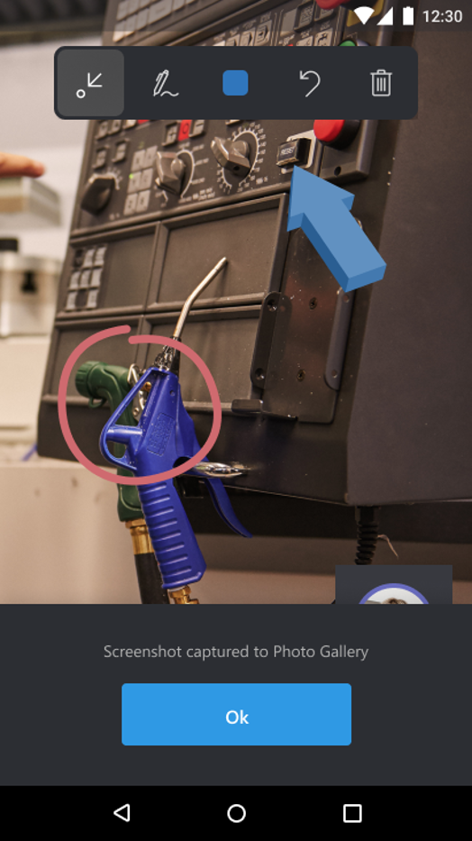

# Capture and Annotate 2D Snapshots 

###
Remote Assist Mobile provides technicians with the ability to capture 2D snapshots and annotate it during a call. Technicians can take a photo of their environment or mixed reality annotations in their environment. 2D snapshots are critical in situations where a still-image might be needed to carefully add annotations to it. These 2D snapshots can be used for reference later or work validation. These 2D snapshots can also be utilized in low bandwidth situations.

## Capture and annotate 2D snapshots customer scenario
1.	During a Remote Assist Mobile call, select the **2D Snapshot** icon to snap your photo. 
###

###
2. The snapshot is shared to the expert's screen on Microsoft Teams.
###

###
3. If the technician wants to capture a snapshot of their environment without annotations, you can skip to Step 5.
4. Both the technician and expert can add annotations to the snapshot. The expert has to select **Start Editing** to add annotations to the snapshot. 
###

###
5.	After both the technician and expert are finished annotating on the snapshot, the technician selects the **Check Mark** to save their snapshot to their mobile device's Photo Gallery.
###

###
6.	The technician is notified that their snapshot is saved to their mobile device's Photo Gallery.
###

###
7. The technician is taken directly back to the live video call and can select the 2D snapshot icon to take more snapshots.
10.	At the end of the call, the technicians can now go to their mobile device’s **Photo Gallery** and view the 2D snapshot. They can share it with others or include it on their Dynamics 365 Field Service work order. 

### See also 
- Learn more about Remote Assist Mobile [here](remote-assist-mobile-overview.md)
- Learn how to use Remote Assist Mobile's tools through a tutorial [here](learn-the-tools.md) 
- Learn how to make calls using Remote Assist Mobile [here](making-calls.md)
- Learn how to annotate your environment on Remote Assist Mobile [here](annotate-your-environment.md)
- Learn how to send chat messages using Remote Assist Mobile [here](send-chat-messages.md)
- Learn how to integrate Remote Assist Mobile with Dynamics 365 Field Service [here](fs-integration.md)
- Learn how to provide the Remote Assist Mobile team with feedback [here](provide-feedback.md)
