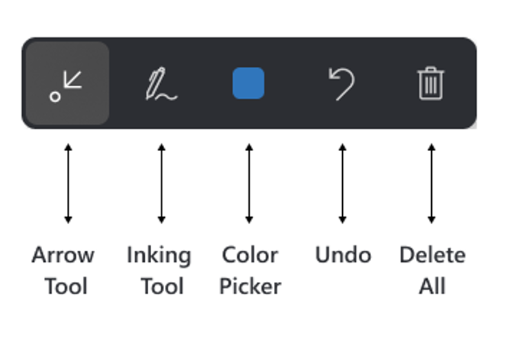
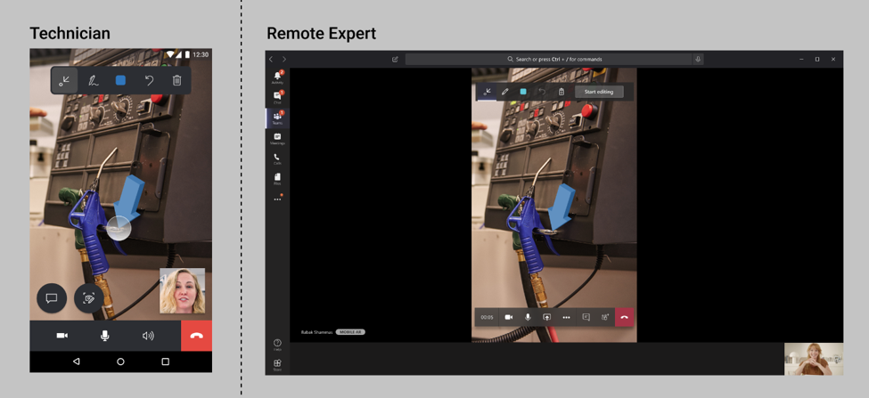
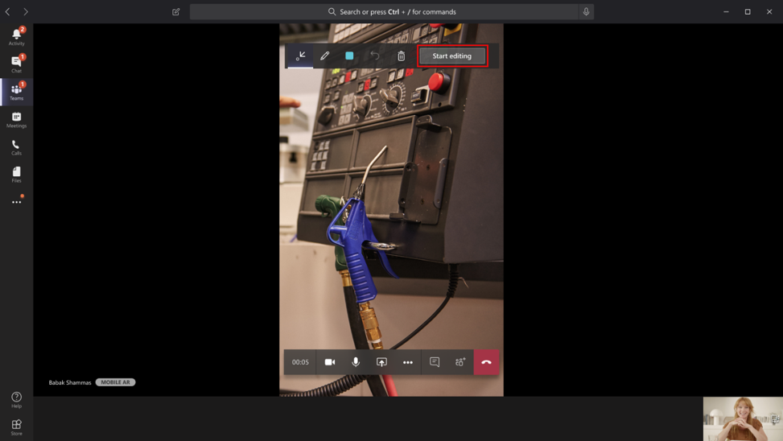
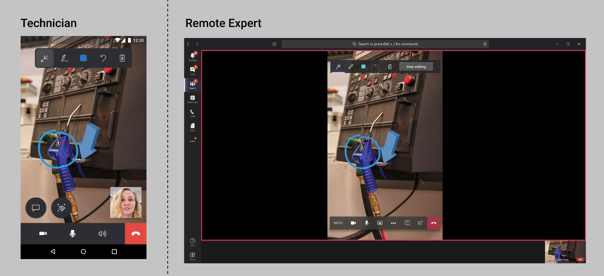
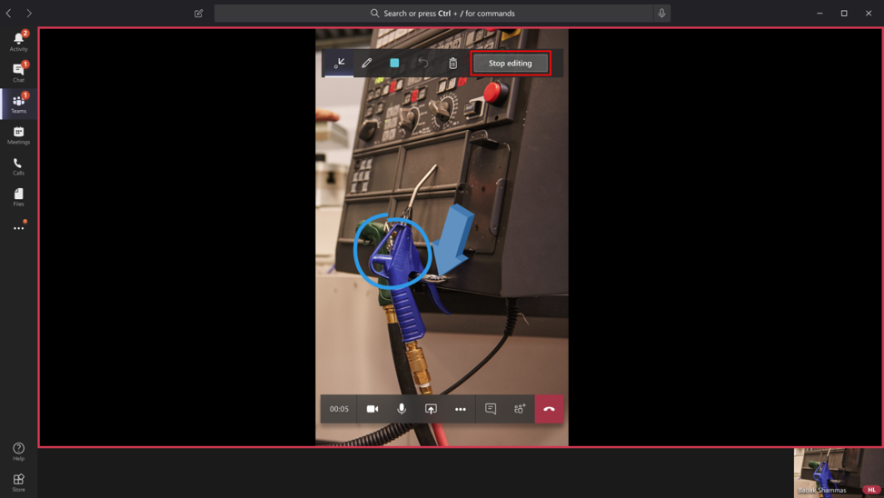

# Annotate your Environment 

Annotations enables technicians and remote experts to easily specify an area or particular asset to look at or manipulate rather than verbally trying to convey this. Both the technician and expert can place annotations to their device's screen to share with each other during a video call. 

## Annotating your environment customer scenario (for technicians only)
1. The annotation toolbar allows technicians to place **Arrows** and **Drawings** into their environment. The **Color picker** changes the color of your annotations. The **Undo** icon allows technicians to remove the last annotation that they placed in their environment. The **Delete All** icon allows technicians to remove all annotations that they placed in their environment (they cannot remove the expert's annotations). 

2. Place your annotations to your environment. The expert will see your annotations in real-time on Microsoft Teams. 
###

###

## Annotating your environment customer scenario (for experts only)

1. The annotation toolbar allows experts to place **Arrows** and **Drawings** into their environment. The **Color Picker** changes the color of your annotations. The **Undo** icon allows experts to remove the last annotation that they placed in their environment. The **Delete All** icon allows experts to remove all annotations that they placed in their environment (they cannot remove the technician’s annotations).
###

###
2. To add annotations, you must click **Start editing**. 
###

###
3. You will enter **2D snapshot mode** and you're able to add annotations to the 2D snapshot of the technician’s environment. Your annotations will be automatically appear on the technician's environment.
###

###
4. To stop adding annotations to the 2D snapshot, you must click **Stop editing**. You will return to the technician's live video feed.
###

###

### See also 
- Learn more about Remote Assist Mobile [here](remote-assist-mobile-overview.md).
- Learn how to use Remote Assist Mobile's tools through a tutorial [here](learn-the-tools.md).
- Learn how to make calls using Remote Assist Mobile [here](making-calls.md).
- Learn how to capture a 2D snapshot and annotate it [here](annotate-snapshot.md).
- Learn how to send chat messages using Remote Assist Mobile [here](send-chat-messages.md).
- Learn how to integrate Remote Assist Mobile with Dynamics 365 Field Service [here](fs-integration.md).
- Learn how to provide the Remote Assist Mobile team with feedback [here](provide-feedback.md).
