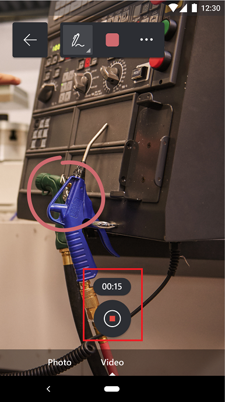

# Capture asset conditions with spatial markup in the Dynamics 365 Remote Assist mobile app

You can use the Dynamics 365 Remote Assist mobile app to capture procedures and defects during jobs such as inspections or repairs. For example, a technician can capture photos or videos of the equipment they're inspecting to highlight defects like wear and corrosion. Stakeholders within the organization, such as a service manager or site superintendent, can then view and download the captures by using the Dynamics 365 Remote Assist model-driven app.

## Prerequisites

To capture and view assets you need:

- Access to the environment that Dynamics 365 Remote Assist is installed in and an active Dynamics 365 Remote Assist license.

- The latest version of the Dynamics 365 Remote Assist mobile app. After downloading from the app store, make sure to select the [correct environment from the app settings](.././asset-capture-add-users.md#select-the-right-environment-on-android-or-ios).

## Capture asset conditions

### View the asset list

- Select the **Assets** tab. The assets (entered through the Dynamics 365 Remote Assist model-driven app) are displayed in descending order by the last-modified date. You can search for assets by using the **Name** field or by selecting the search button.

    > [!NOTE]
    > The **Assets** tab is currently **not** available while you're on a call in the mobile app.

### Capture photos or videos with spatial markup

1. On the **Assets** tab, select an asset from the list. You can also use the search button at the top of the page.

    

2. Once you have selected an asset, you'll see a list of previously captured photos or videos associated with that asset. You can select any of the captures to view photos or to playback videos. You can also delete captures from this list view. To record a new capture, select the **Camera** tool at the bottom of the page.

    

3. While recording a new capture, you can use ink or arrow tools to mark up the asset in your environment. For example, you can circle a defect on an asset. When you're done annotating, select the capture button to take a photo of the asset, which will include the mixed-reality annotations you added.

    

4. You can also switch to the video capture view and tap the capture button to initiate video recording. The capture button will change and show a countdown timer from the maximum video length available. You can add further mixed-reality mark-up during the video capture. Tap the capture button again to stop recording.

    

> [!NOTE]
> Captured photos and videos are saved both locally to the mobile device and to Microsoft Dataverse, where they're viewable from the Dynamics 365 Remote Assist model-driven app.

## Next step

[Review the captured data in the Dynamics 365 Remote Assist model-driven app](./../asset-capture-review.md).

## Troubleshooting

### No assets appear when I select the Assets tab

1. Make sure that the environment you're using has asset records. More information: [Create asset records](./../asset-capture-create-asset.md).

2. If you added the asset records from the model-driven app while the Dynamics 365 Remote Assist app was already open on your mobile device, close the app and reopen it to pull in the latest updates.

### The asset records I see aren't what I expected

The user account might have access to more than one environment with Dynamics 365 Remote Assist installed. If this is the case, you need to select the correct environment.

1. Select **Settings** > **Dynamics 365 environment**.

2. Select the environment you want from the list.

3. Select the **Assets** tab. You might need to select **Retry** if prompted.

[!INCLUDE[footer-include](../../includes/footer-banner.md)]
