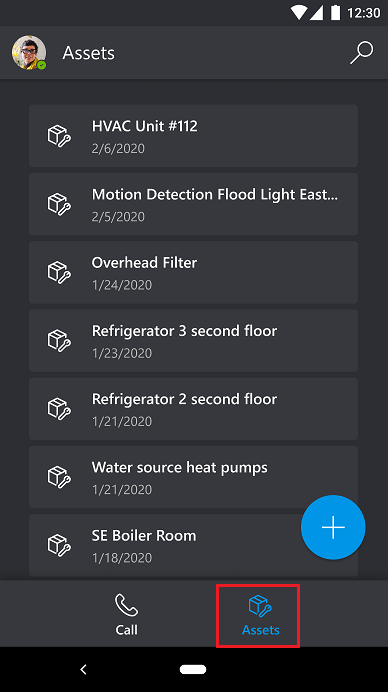
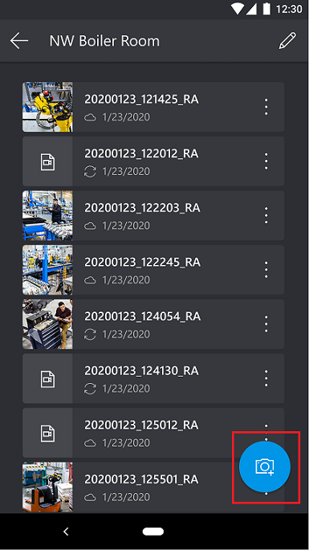

# Capture asset conditions with spatial markup on Mobile devices

You can use Dynamics 365 Remote Assist to capture procedures and defects during jobs such as an inspections or repairs. For example, a technician can use Dynamics 365 Remote Assist on Mobile to capture photos or videos of the equipment they're inspecting, to highlight defects like wear and corrosion. The captures can then be viewed and downloaded from the Dynamics 365 Remote Assist model-driven app by stakeholders within the organization, such as a service manager or site superintendent.

In this tutorial, you'll learn how to use the Mobile app to view asset records created from the Dynamics 365 Remote Assist model-driven app and capture photos and videos of assets with spatial markup.

## Prerequisites

To complete this tutorial, you need:

- **Access to the environment Dynamics 365 Remote Assist is installed in**. The account you used to sign in to Dynamics 365 Remote Assist needs access to the environment created in the first step and an active Dynamics 365 Remote Assist license.
- **Dynamics 365 Remote Assist app on Mobile**. Ensure you have downloaded the latest update to Dynamics 365 Remote Assist through the app Store. Ensure that you've selected the [correct environment from the app settings](.././asset-capture-add-users.md#selecting-the-right-environment-on-android-or-ios).

## Capture asset conditions

### View the asset list

Select the **Assets** tab. The list of assets entered through the Dynamics 365 Remote Assist model-driven app are displayed in descending order by the last-modified date. You can search for assets by using the **Name** field by clicking on the search icon.

> [!NOTE]
> The **Assets** tab is currently **not** accessible during a call in the mobile app.

### Capture photos or videos with spatial markup

1. On the **Assets** tab, select an asset from the list. You can also use the search icon at the top of the app.\

2. Once you have selected an asset, you will a list of previously captured photos or videos associated with that asset. You can click on any of the captures to view photos or playback videos. You can also delete the captures form this list view. To record a new capture, click on the camera tool towards the bottom.\

3. While recording a new capture, you can use ink or arrow tools to mark up the asset in your environment. For example, you can circle an area of defect on an asset. When you're done annotating, you can tap on the capture button to take a photo capture of the asset, which will include the mixed-reality annotations you added.\

4. You can also switch to the video capture view, and tap the capture button to initiate video recording. The capture button will change and show a countdown timer from the maximum video length available. You can add further mixed reality mark-up during the video capture. Tap the capture button again to stop recording.\

> [!NOTE]
> Captured photos and videos are saved both locally to the Mobile device and to Common Data Service, where they're viewable from the Dynamics 365 Remote Assist model-driven app.

## Next step

In this tutorial, you learned how to view assets in the Dynamics 365 Remote Assist Mobile app and capture photos and videos to the asset record with spatial markup. In the next tutorial, you'll learn how to review the captured data from the Dynamics 365 Remote Assist model-driven app.

> [!div class="nextstepaction"]
> [Review asset captures](./../asset-capture-review.md)

## Troubleshooting

### No assets appear when I select the Assets tab

1. Ensure that the environment you're using has asset records created in it. More information: [Create asset records](./../asset-capture-create-asset.md)
2. If you added the asset records from the model-driven app while Dynamics 365 Remote Assist app was already open on your mobile device, close the app and reopen it to pull the latest updates.

### The asset records I see aren't what I expected to see

The user account might have access to more than one environment with Dynamics 365 Remote Assist installed. If this is the case, you need to select the correct environment you want to use.

1. Select **Settings** > **Dynamics 365 environment**.
2. Select the environment you want from the list.
3. Select the **Assets** tab. You might need to select **Retry**, if prompted.
