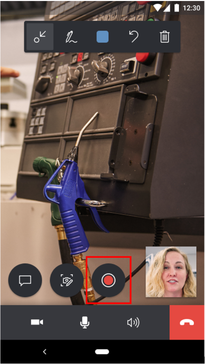
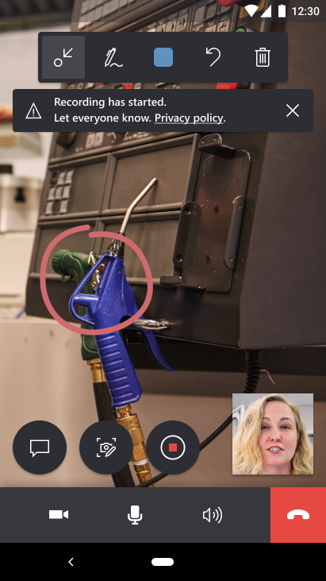
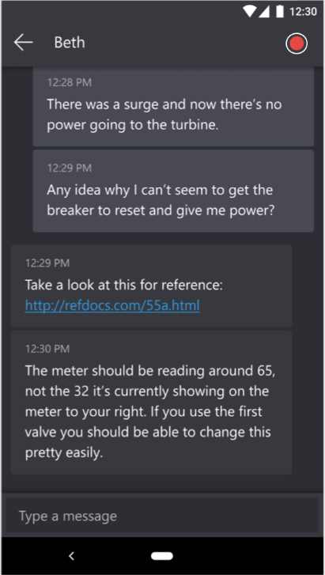

# Capture session history through call recordings 

###
With call recording, technicians can comprehensively document their processes and service calls of their Remote Assist mobile video calls with remote collaborators. For businesses, it's important to keep a record of different incidents that happen on a daily basis. Oftentimes, these records are kept through paper trails or text-based collateral. Taking advantage of the information captured through video in a Dynamics 365 Remote Assist session will allow operations managers, technicians, and business decision makers to refer back to sessions later. Call recordings can be used as reference for follow-up work, validation that the maintenance and repair process was completed correctly, and training material for your workers.

This feature is only available in calls between **two participants** with **Remote Assist mobile and Microsoft Teams desktop**. Only, the Remote Assist mobile user can start and stop a call recording. These call recordings will be uploaded using **Microsoft Stream**, which can be accessed through your Remote Assist mobile call text chat, your Microsoft Teams chat, or your Microsoft Stream webpage. 

## How it works
1.	The technician selects the record button to **start** the call recording. 
###

###
2.	The technician will receive a dismissible privacy notification with Microsoft’s privacy policy and the call recording will be started. 
###

###
3. During all parts of the call, the technician will be aware that the call recording is in progress as seen in the **call recording indicator** in the text chat. 
###

###
4.	The technician can select the record button to **stop** the call recording at any point in their call. Afterwards, both call participants will receive a dismissible notification that the call recording will be available in Microsoft Stream. Once the call recording has been uploaded to Microsoft Stream, both participants can access it through the **Remote Assist mobile call text chat**, **Microsoft Teams text chat**, or on the **Microsoft Stream webpage**. 
###

###
