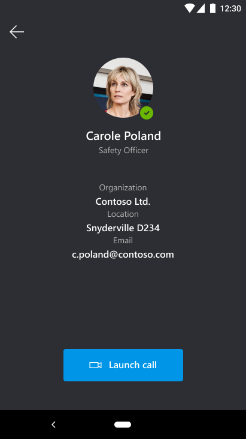
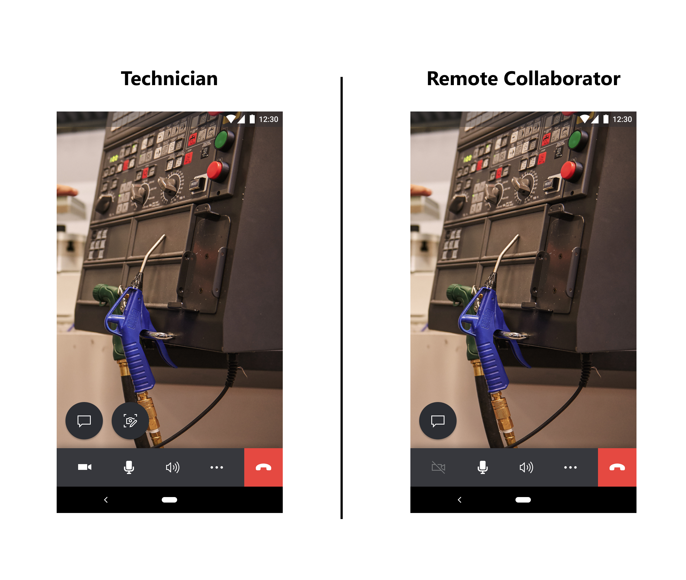
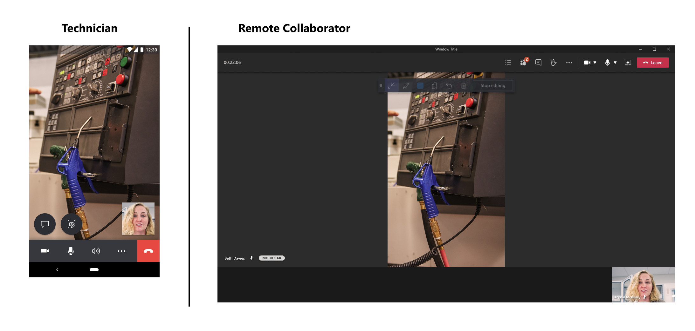
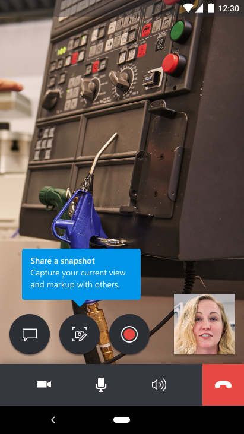
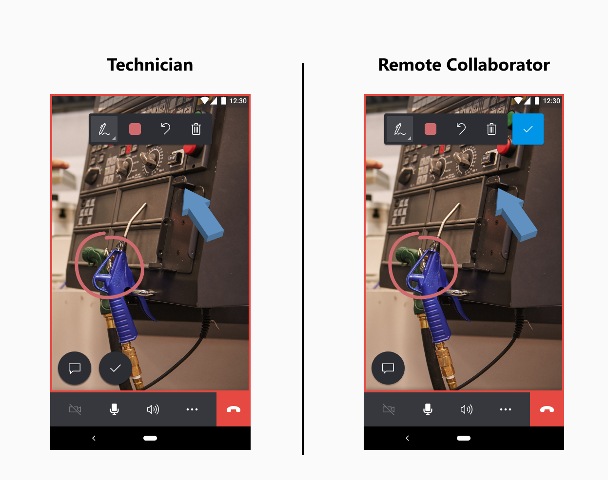
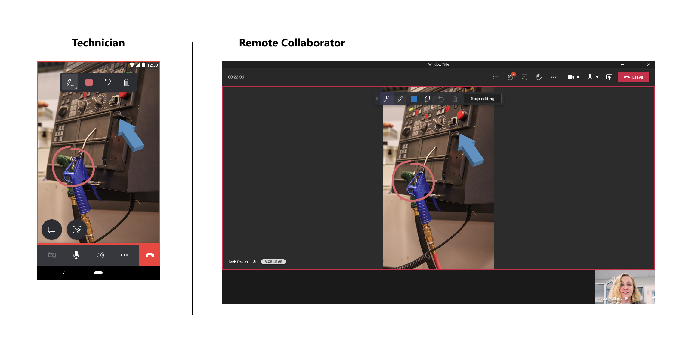
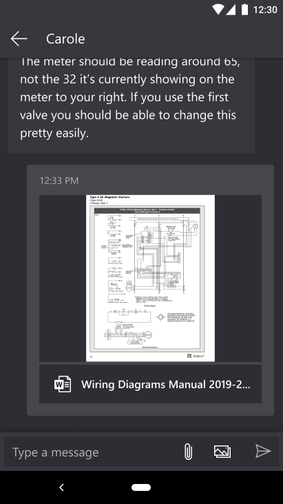
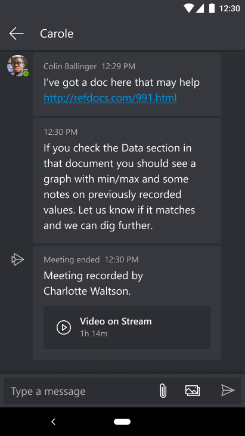

# Dynamics 365 Remote Assist mobile calls on mobile devices without augmented reality support

Remote Assist mobile makes conducting repairs and remote inspections easy by providing technicians with the ability to launch one-to-one and group video calls with remote collaborators inside or outside of their organization, even if either or both users are using mobile devices **without** ARCore or ARKit support.

Due to limitations of mobile devices without ARCore or ARKit support, technicians and remote collaborators are unable to provide instructions using 3D annotations on a live video feed. Instead, technicians can now share their live video feed of their environment and both the technicians and remote collaborators can provide instructions on **snapshots** using 2D annotations. Learn about the [snapshot feature capabilities](./annotate-snapshot.md).

## Prerequisites

- In order to follow along with this guide, you must be using a mobile device without ARCore or ARKit support. Learn about Dynamics 365 Remote Assist's device [requirements](../requirements.md). If your device is *not* listed on the [Android/ARCore supported devices](https://developers.google.com/ar/discover/supported-devices) or [iOS/ARKit supported devices](https://developers.google.com/ar/discover/supported-devices#ios), then your device does not support augmented reality.
- Technicians must have a Dynamics 365 Remote Assist [free trial](../try-remote-assist.md) or [subscription](../buy-remote-assist.md).
- Remote collaborators must have a Dynamics 365 Remote Assist free trial or subscription and Microsoft Teams [free trial or subscription](https://www.microsoft.com/microsoft-365/microsoft-teams/group-chat-software). Learn to set up Remote Assist with [Teams desktop](../teams-pc-all.md) and [Teams mobile](../teams-mobile-all.md).

## How it works

1. Launch and sign into Dynamics 365 Remote Assist on your iOS or Android phone or tablet.

2. After you sign in, you'll receive a notification about using Dynamics 365 Remote Assist on a mobile device without augmented reality support.

3. After dismissing the notification, you'll be taken to the **Contacts** page.

4. Select the remote collaborator's name and **launch a call**.

  > [!NOTE]
  > If the remote collaborator is receiving the call on a mobile device with both Dynamics 365 Remote Assist mobile and Teams mobile installed, the remote collaborator can only answer on Teams mobile. Both users will have the same capabilities.

5. If the remote collaborator answers the call on **Dynamics 365 Remote Assist mobile**, the technician's live video feed will be shared to the remote collaborator's device screen.

> [!NOTE]
> Technicians can't place mixed reality annotations on the live video feed; they can only place annotations on the in-call snapshots.

   If the remote collaborator answers the call on **Teams desktop**, the technician's live video feed will be shared to the remote collaborator's device screen.

> [!NOTE]
> Technicians can't place mixed reality annotations on the live video feed; they can only place annotations on the in-call snapshots.

6. The technician will be directed to use the snapshot feature to add 2D annotations on a frozen video frame of their shared environment.

7. After selecting the **snapshot** icon, the technician will enter snapshot mode, which captures a frozen frame of the technician's environment and shares it to the remote collaborator's screen. If the remote collaborator is using **Dynamics 365 Remote Assist mobile**, then they can both place 2D annotations on the frozen frame of the technician's environment.

> [!NOTE]
> Both the technician and remote collaborator will see the mixed reality toolbar on the frozen frame and can add 2D annotations.

8. After selecting the **snapshot** icon, the technician will enter snapshot mode, which captures a frozen frame of the technician's environment and shares it to the remote collaborator's screen. If the remote collaborator is using **Teams desktop**, then they can both place 2D annotations frozen frame of the technician's environment.

> [!NOTE]
> Both the technician and remote collaborator will see the mixed reality toolbar on the frozen frame and can add 2D annotations.

9. After both the technician and remote collaborator are finished annotating on the snapshot, the technician selects the **check mark** to save or discard the snapshot.

10. The technician is prompted with the options to discard the snapshot or save the snapshot to either the mobile device's Photo Gallery, the text chat, or both. Select your choice and then select **Save**.

11.  If the technician successfully saved the snapshot to the text chat, then the snapshot can be viewed in Dynamics 365 Remote Assist mobile's text chat and Microsoft Teams' text chat.

12.  The technician is then taken back to the live video call and can select the snapshot icon again to take more snapshots.

> [!NOTE]
> Annotations added on a still snapshot will *not* appear in the technician's environment after it has been saved or discarded.

13. Both the technician and remote collaborator can send and receive messages and  files from their local device in the text chat. Learn more about the file sharing feature [here](./file-sharing.md).

14. Both the technician and remote collaborator can record the one-to-one Dynamics 365 Remote Assist call, as long as the remote collaborator is using Microsoft Teams desktop. The recording will be saved to Microsoft Stream and the link to the recording will be sent to the Microsoft Teams text chat. Learn more about the call recording feature [here](./call-recording.md).

15. If the technician is a Dynamics 365 Field Service customer, at the end of the call, the technician can choose to post the call logs, files, and snapshots shared in the text chat to an associated work order. Learn more about Field Service integration [here](./fs-integration.md).

[!INCLUDE[footer-include](../../includes/footer-banner.md)]
