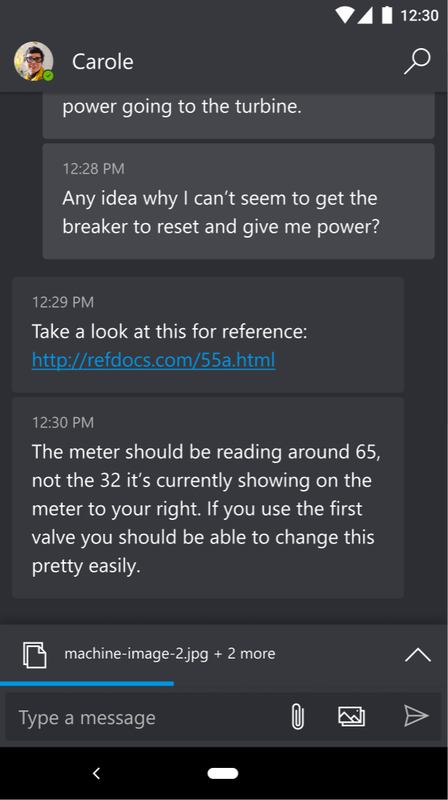
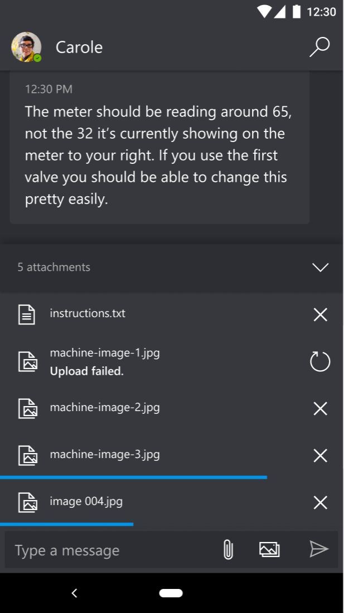

# Share files between technicians and experts to improve collaboration

Remote Assist mobile provides technicians and remote collaborators with document sharing capabilities. Sharing documents promotes seamless collaboration during a call by adding more context and information, such as visual aids and schematics, to the technicians’ environment. This facilitates technicians having richer conversations with remote collaborators and, ultimately, solve their problems quickly and efficiently.  
 
Both the technician and remote collaborators can send **any** file type to each other. This includes, but is not limited to .jpg, .png, .tiff, .mp4, .pdf, .docx, .xlsx, and .txt files. They can upload files and images from their local device or OneDrive. In order for technicians to open and access these different file types, they will need the corresponding app that supports the file type.  

If you're a Dynamics 365 Field Service customer, the files shared during your Remote Assist for mobile call can be linked to your work order, learn more [here](https://docs.microsoft.com/en-us/dynamics365/mixed-reality/remote-assist/mobile-app/fs-integration).

## How it works
### Sending files 
1. The technician must select the **text chat** to start sharing files to the remote collaborator. 

2. In the text chat, the technician is presented with the **Attachment** and **Image** icons. 

3. If the technician selects the **Attachment** icon, the technician is gets the option to choose to **select files** from the mobile device's File chooser or Files app. 
> [!Note]
> For iOS, the technician is presented with the Files app directly. On Android, it can either be a File chooser or a Menu to choose which app to use as a file chooser.

4. If the technician selects the **Image** icon, the technician gets the option to choose to **select images** from the mobile device's Photo Gallery or Files app. 
> [!Note] 
> For iOS, the technician is presented with the Photos app directly. On Android, it can either be a Photo Gallery or a Menu to choose which app to use as your picture chooser.

5. The technician can select up to **5 files or images** at a time to send to the remote collaborator. The technician will see the **uploading progress** until it's ready to be sent.

6. If some of the files or images are not successfully uploaded in the text chat, the technician can select the **retry icon** to upload it again or discard any files or images before sending. 

7. Select the **send icon**.

8. Once sent, the **file link** and **image preview** is sent to the remote collaborator through **OneDrive**, which sets the permission to share the file. Afterwards, the remote collaborator on Microsoft Teams receives a link to the document in OneDrive in the Microsoft Teams text chat. The remote collaborator has full access to the files and images sent. 

### Receiving files 
1. Once the remote collaborator sends a file or image to the technician, the techniciancan select the file's link or image preview to open it and view larger. The file or image is **automatically downloaded** to the mobile device's **Downloads** folder. The technician can view the file in the Downloads folder. 

2. If the technician selects the remote collaborator's **image** preview, the default application will open the image. If there are more than one app that supports this file type, then there will be a menu to choose the application to open the image. 

3. If the technician selects the remote collaborator's **file** and the technician has an app that can open this file type, the default application will open the file. If there are more than one app that supports this file type, then there will be a menu to choose the application to open the image. 
 
If the technician **does not** have an app that can open this file type, the technician cannot view the file. The technician is still prompted on how to open this file and the technician may download the corresponding app to open the file.
