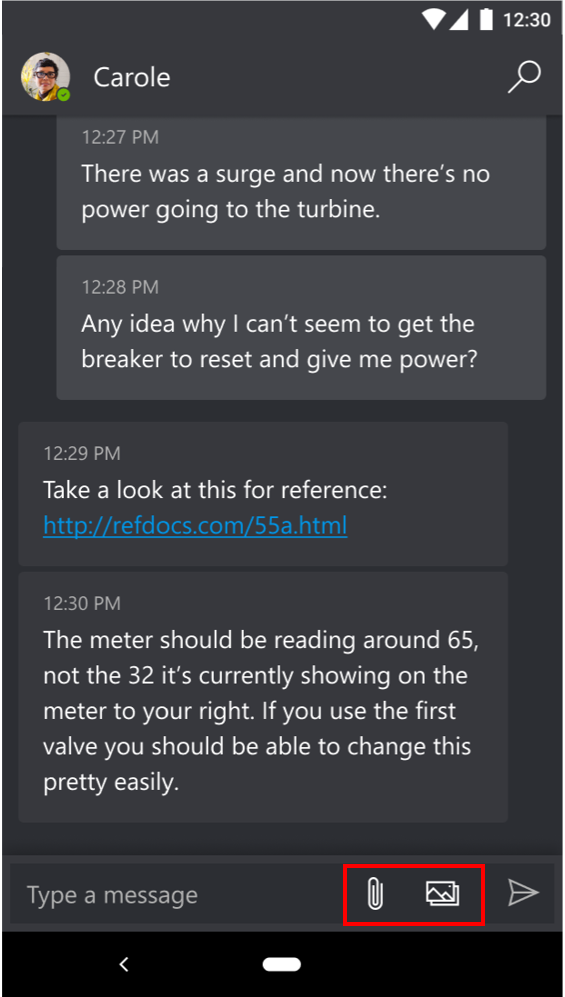

# Share files to improve collaboration in Dynamics 365 Remote Assist mobile

Dynamics 365 Remote Assist mobile provides technicians and remote collaborators with document-sharing capabilities. Sharing documents promotes collaboration during a call by adding more context and information (such as visual aids or schematics) to the technician's environment. Sharing files can help technicians have richer conversations with remote collaborators and solve problems more quickly.  
 
Both the technician and remote collaborators can send *any* file type to each other. File types include, but are not limited to: 

- .jpg 
- .png 
- .tiff 
- .mp4 
- .pdf 
- .docx 
- .xlsx 
- .pptx
- .txt 
 
They can upload files and images from their local device or OneDrive. Once the files and/or images are shared, they will be accessible in the [OneDrive account](https://onedrive.live.com/about/signin/) in the **Files** > **RemoteAssistMobile folder**. Also, once the user selects and opens a file or image, it will be downloaded to the user's local Downloads folder. In order for technicians to open and access these different file types, they will need the corresponding app that supports the file type. In-app previews may be available, depending on the file type and size.

For Dynamics 365 Field Service users, the files shared during the Dynamics 365 Remote Assist mobile call can be linked to a work order. For more information, see [Field Service integration](./fs-integration.md).

## How it works

### Sending files 

1. The technician selects **text chat** to start sharing files with the remote collaborator. 

2. In the text chat, the technician can see the **Attachment** and **Image** icons, as seen in the following screenshot.

   

3. If the technician selects the **Attachment** icon, they'll have the option to **select files** from the mobile device's file chooser or files app. 

   > [!Note]
   > For iOS, the technician is presented with the files app directly. On Android, it can either be a file chooser or a menu to choose which app to use as a file chooser.

4. If the technician selects the **Image** icon, they'll get the option to **select images** from the mobile device's photo gallery or files app. 
   
   > [!Note] 
   > For iOS, the technician is presented with the photos app directly. On Android, it can either be a photo gallery or a menu to choose which app to use as your picture chooser.

5. The technician can select up to **five files or images** at a time to send to the remote collaborator. The technician will see the **uploading progress** until it's ready to be sent.

   

6. If some of the files or images are not successfully uploaded in the text chat, the technician can select the **retry icon** to upload it again or discard any files or images before sending. 

   

7. Select the **send icon**.

8. Once sent, the **file link** and **image preview** are sent to the remote collaborator through **OneDrive**, which sets the permission to share the file. Afterwards, the remote collaborator on Microsoft Teams receives a link to the document in OneDrive in the Microsoft Teams text chat. The remote collaborator has full access to the files and images sent. 

   

### Receiving files 

1. Once the remote collaborator sends a file or image to the technician, the technician can select the file's link or image preview to open it. After selecting and opening the file or image, it is **automatically downloaded** to the mobile device's **Downloads** folder. 

2. If the technician selects the remote collaborator's **image** preview, the default application will open the image. If more than one app supports this file type, there will be a menu to choose the application to open the image. 

3. If the technician selects the remote collaborator's **file** and the technician has an app that can open this file type, the default application will open the file. If more than one app supports this file type, then there will be a menu to choose the application to open the image. 
 
If the technician **does not** have an app that can open this file type, the technician cannot view the file. The technician is still prompted on how to open this file and the technician may download the corresponding app to open the file.

[!INCLUDE[footer-include](../../includes/footer-banner.md)]
